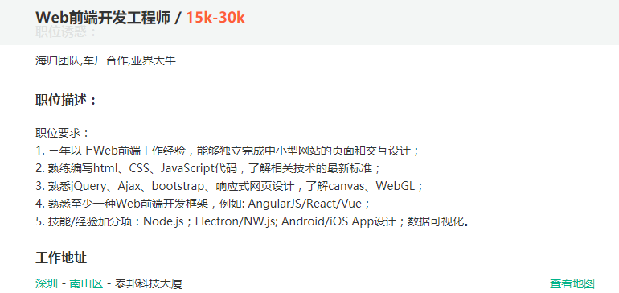
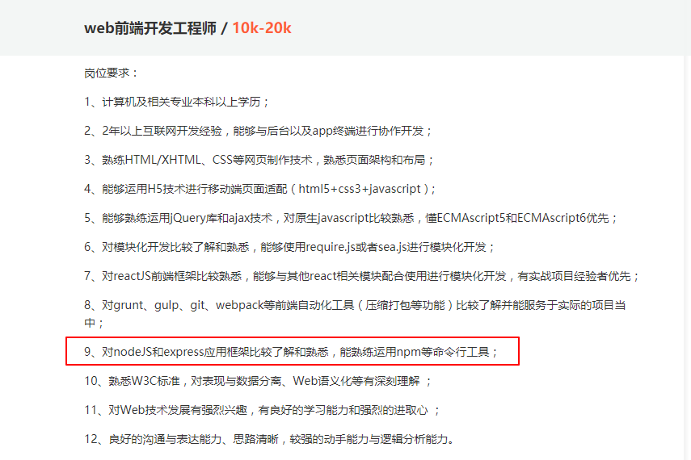
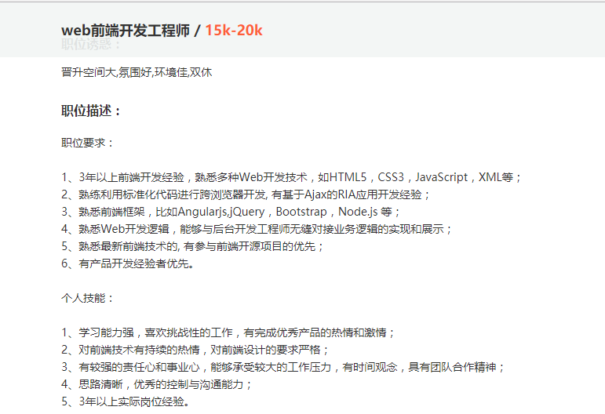

# 01-Node.js简介

* [1.1-为什么要学习Node.js](#1.1)
* [1.2-什么是Node.js](#1.2)
* [1.3-Node.js有什么特点](#1.3)
* [1.4-如何学习Node.js](#1.4)

## <h2 id=1.1>1.1-为什么要学习Node.js</h2>







* 1.互联网行业工种主要分为前端、服务端、客户端
    * 前端：又称为网页端，利用浏览器打开的界面我们都称之为前端（又叫`web`端）
        * 前端属于客户端
        * 前端使用的语言也就是我们之前学习的`HTML`、`CSS`、`javascript`
    * 服务端：又称为后台，主要为前端和客户端提供数据，以及处理产品的核心业务逻辑
        * 服务端使用的语言主要有`php`、`python`、`java`、`.Net`、`ruby`等
    * 客户端：主要分为iOS端和安卓端（还有winPhone端），客户端根据使用设备类型又分为pc端（电脑）和移动端（手机、平板等）
        * 开发语言主要是ios的`oc`和`swift`，以及安卓的`java`和`kotlin`

* 2.前端工程师的职业规划一般都是两条路。
    * （1）做个几钱存点钱做点小买卖
    * （2）前端工程师-》全栈工程师-》架构师
        * ***服务端开发就是前端工程师升级成为全栈工程师的桥梁***

* ***<h2>`3.行走江湖，技多不压身。多一门技术，多一条生路`</h2>***

## <h2 id=1.2>1.2-什么是Node.js</h2>

* 1.Node.js官网地址：<https://nodejs.org/en/>
    * 中文:<http://nodejs.cn/api/>

```javascript

1.Node.js® is a JavaScript runtime built on Chrome's V8 JavaScript engine.
2. Node.js uses an event-driven, non-blocking I/O model that makes it lightweight and efficient.
3. Node.js' package ecosystem, npm, is the largest ecosystem of open source libraries in the world.

```

* ***以上是Node官网对Node的解释，这三句话非常重要，有时候面试的时候面试官喜欢问这个来判断是否会Node***
    * 1.Node 是一个构建于 Chrome V8引擎之上的一个Javascript运行环境
        * (1)node可以向浏览器一样去解析和执行Javascript代码，Chrome V8 引擎是所有浏览器里面解析和执行 JS 代码最快的
        * (2)在 Node 中，没有界面，不再需要关心 HTML、CSS,只需要关注Javascript(ECMAScript)
            * var：变量
            * function：方法
            * Object：对象
            * Date：时间对象
            * Math：算数对象
            * 文件操作
            * 网络操作
            * node让javascript代码具有了服务端编程的能力
            * node中没有window和document
    * 2.Node使用事件驱动、非阻塞IO模型（异步读写）使得它非常的轻量级和高效
        * 类似于ajax一样的异步API
        * 异步的好处就是不会阻塞当前线程，让网页卡顿
        * 异步的体现形式就是回调函数
    * 3.Node中的`NPM`是世界上最大的开源库生态系统
        * npm：node package manager，资源包（开源库）管理。类似于GitHub，`NPM`本质上就是为开发者提供一个服务器平台，让开发者封装开源库上传到平台，这样所有人都可以在`NPM`服务器中下载开源库。
        * nmp目前有35W+第三方库（包）
        * 第三方库可以极大的减轻开发工作量，但是无法解决你的业务逻辑
        * NMP官网:<https://www.npmjs.com>

## <h2 id=1.3>1.3-Node.js有什么特点</h2>

* 1.事件驱动
    * Node.js 是单进程单线程应用程序，但是通过事件和回调支持并发，所以性能非常高。
    * Node.js 的每一个 API 都是异步的，并作为一个独立线程运行，使用异步函数调用，并处理并发。
        * 本身上Node.js还是单线程，这里说到每一个API都是异步独立线程其实是伪线程（等待同步空闲再执行）
    * Node.js 基本上所有的事件机制都是用设计模式中观察者模式实现。
    * 详情可参考:<http://www.runoob.com/nodejs/nodejs-event-loop.html>

* 2.非阻塞IO模型
    * 异步操作IO模型

* 3.单线程
    * ***浏览器的内核是多线程的，一个浏览器一般至少实现三个常驻线程：javascript引擎线程，GUI渲染线程，浏览器事件触发线程。***
        * ***javascript代码都是执行在一个独立的单一线程中***

* 4.轻量高效

* ***如何理解node的特点我们将会随着课程的不断深入逐渐掌握***


## <h2 id=1.4>1.4-如何学习Node.js</h2>

* 1.相关书籍
    * 朴灵：《深入浅出Node.js》
    * 《Node.js 权威指南》：官方API详解

* 2.学习网站
    * JavaScript 标准参考教程（alpha）：<http://javascript.ruanyifeng.com>
    * Node入门:<http://www.nodebeginner.org/index-zh-cn.html>
    * Nodejs菜鸟教程:<http://www.runoob.com/nodejs/nodejs-tutorial.html>
    * 官方API文档:<https://nodejs.org/dist/latest-v6.x/docs/api/>
    * ODE社区：<http://cnodejs.org>
    * CNODE-新手入门：<http://cnodejs.org/getstart>
