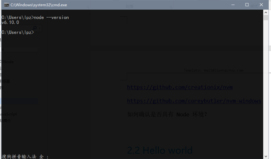
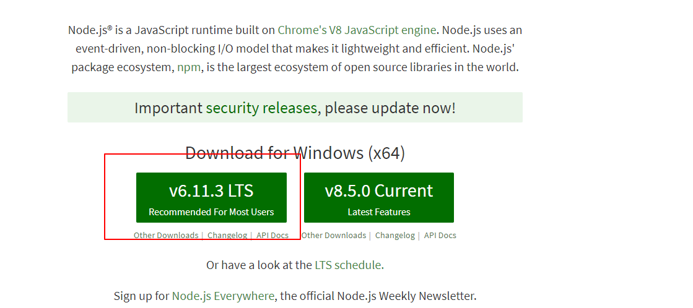
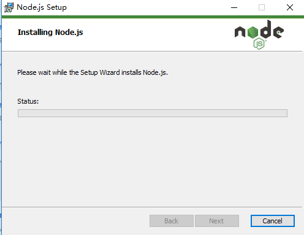

# Node.js环境安装

* [1.1-如何确认当前电脑是否已经安装了Node环境？](#1.1)
* [1.2-常规安装方式](#1.2)
* [1.3-使用NVM（Node Version Manager）安装和管理](#1.3)

## <h2 id=1.1>1.1-如何确认当前电脑是否已经安装了Node环境？</h2>

* 打开终端，输入 `node --version`,如果能看到版本号则说明当前电脑已经安装Node环境，如果提示`Node不是内部或外部命令`，则表示未安装

* ***一旦安装了node，则会自动一并安装`npm`***

## <h2 id=1.2>1.2-常规安装方式</h2>

* 老师已经提前下好放在了课程资料中
    * 安装很简单就双击一直next就可以了，路径的话建议使用默认的C盘路径

* 1.进官网下载Node安装包:<http://nodejs.org>
    * 一般公司中推荐安装`LTS`版本,用户最多而且比较稳定
    * 如果是想看一下新功能，则可以下载最新的`Current`版本

## <h2 id=1.3>1.3-使用NVM（Node Version Manager）安装和管理</h2>

* 1.这种方式主要便于管理多个版本的Node，正常情况下一个版本的就足够了:<https://github.com/coreybutler/nvm-windows>

* 2.也可以通关环境变量来管理多版本Node，可以参考这篇博客:<http://www.runoob.com/w3cnote/node-multi-version.html>