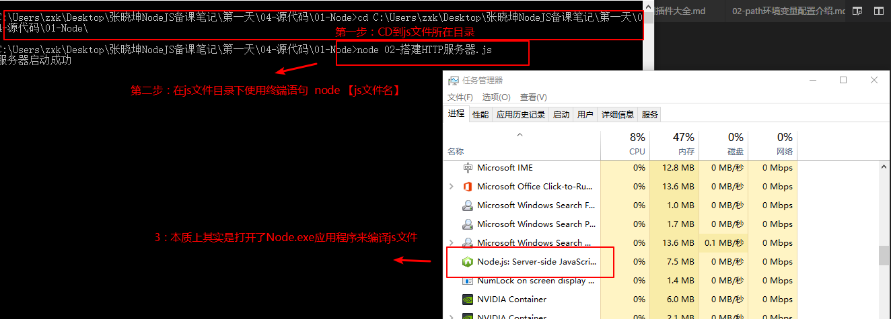

# Node.js服务器搭建

* [1.1-搭建服务器的流程](#1.1)
* [1.2-代码演示](#1.2)
* [1.3-如何运行Node.js程序](#1.3)


## <h2 id=1.1>1.1-搭建服务器的流程</h2>

* 1.导入网络请求`http`模块
    * ***node中所有的功能都是一个独立的模块，这种设计方式是node一大亮点，我们将会在后续的学习中逐渐了解***

```javascript

//返回一个模块对象，所有的关于HTTP的API都是这个对象的方法
var http = require('http')

```

* 2.创建服务器

* 3.服务器添加接收客户端浏览器请求事件

* 3.监听端口号

## <h2 id=1.2>1.2-代码演示</h2>

```javascript

//1.导入http模块
/** require函数
 * 参数：模块名字符串（nodejs官网API中的模块称之为原生模块、内置模块、核心模块）
 * 返回值：是一个对象，所有关于该模块（HTTP）的API都是这个对象的方法
    * 可以理解为类似于实例化一个类对象
 */
var http = require('http');

//2.创建服务器
server = http.createServer();

//3.接收客户端请求
/**Node中几乎所有的API都是异步的（有回调函数）
 * 第一个参数：事件类型  request 表示当接收到客户端浏览器发起的网络请求会调用回调函数的方法
 * 第二个参数：回调函数
 *      * req行参：表示request  客户端请求数据
 *      * res行参：表示response 浏览器响应数据
 */
server.on('request',function(req,res){
    //服务端每接收到一个客户端请求都会执行该回调函数代码
    //通过url链接获取客户端的请求数据
	console.log('客户端请求的数据' + req.url);
});

//4.监听端口号
/** 
 * 第一个参数：端口号，作用：找到这台电脑上的某一个应用程序（一台电脑有很多应用程序，每一个程序对应一个端口号）
 * 第二个参数：ip地址，作用：找到网络中的一台电脑（每台电脑对应一个ip）
 *         * 该参数可以省略，如果省略则表示默认为本机ip地址
 * 第三个参数：监听回调
 */
server.listen(3000,'127.0.0.1',function(err){
    console.log('服务器启动成功');
});

```

## <h2 id=1.3>1.3-如何运行Node.js程序</h2>

* 1.使用终端进入js文件所在目录

* 2.使用终端语句`node [js文件名]`运行Node程序

* 3.`node [js文件名]`本质上其实是通过`Node.exe`应用程序来打开js文件，由于`Node.exe`是一个无界面的控制台程序，所以只能用终端打开
    * ***至于为什么会打开，将会在下一小节介绍***


