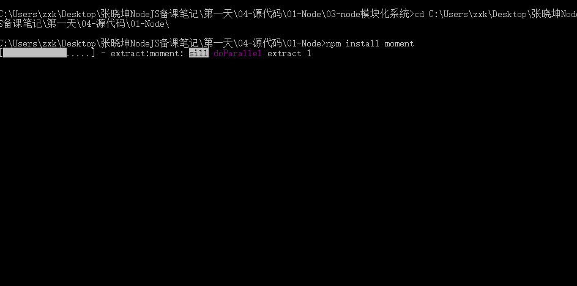

# Node.js的模块化系统

* [1.1-什么是模块化系统](#1.1)
* [1.2-模块化的好处](#1.2)
* [1.3-模块的种类及导入导出方式](#1.3)
* [1.4-代码演示](#1.4)

* node菜鸟教程关于模块的解释:<<http://www.runoob.com/nodejs/nodejs-module-system.html>>
* nodejs官方核心模块API:<<http://nodejs.cn/api/http.html#http_server_listen>>

## <h2 id=1.1>1.1-什么是模块化系统</h2>

* 1.为了让Node.js的文件可以相互调用，Node.js提供了一个简单的模块系统。
    * ***模块是Node.js 应用程序的基本组成部分，文件和模块是一一对应的。换言之，一个 Node.js 文件就是一个模块，这个文件可能是JavaScript 代码、JSON 或者编译过的C/C++ 扩展。***
        `模块的本质就是一个js文件，任何的js文件在node中都可以是模块`

## <h2 id=1.2>1.2-模块化的好处</h2>


* （1）将不同的功能代码进行封装，便于维护
* （2）让node开发变得极其简单
    * ***什么功能对应什么模块***

## <h2 id=1.3>1.3-模块的种类及导入导出方式</h2>

* ***所有的模块导入使用`require()函数`，导出使用`modlue.export`对象***

* 1.我们自己写的js文件
    * ***任何一个js文件在node中都是一个模块***

* 2.node自带的模块
    * ***当我们安装node环境之后，node会自带一些模块，具体的模块使用及导入可以参考nodeAPI官网:<http://nodejs.cn/api/>***

* 3.npm服务器上的第三方模块
    * ***类似于GitHub中的第三方库，与GitHub不同的是，npm只为node服务，GitHub为所有的编程语言服务***
    * ***npm官网：<https://www.npmjs.com/>,一般第三方模块都会有一个document文档教大家怎么使用***

* ***4.每一个js文件都是一个私有的作用域，外部无法访问。如果想要访问则需要导出模块***

## <h2 id=1.4>1.4-代码演示</h2>

* 1.模块的导出

```javascript

//1.默认情况下，一个js文件中的方法很参数都是私有变量，作用域仅限于当前文件，无法被其他文件获取
var name = '黑马程序员';

var fc1 = function(){
	console.log('方法一');
};

var age = 18;

//2.在Node中，一个js文件是一个模块，要想该块中的变量和作用域能够被其他模块访问，可以使用模块导出

/**moudle.exports是node自带的一个对象，一个js文件对应一个module.exports对象
它的作用就是可以让其他的js文件访问本文件的一些数据（字符串、数组、函数等等）*/

module.exports.name = name;
module.exports.fc1 = fc1;

//3.之所以可以通过module.export属性导出该模块，其实可以理解为在每一个js文件的最后面，有这样一行代码

// 这是编译器自动添加，写与不写没有关系，一般不写
/*当外部调用require('模块名或路径')时，可以理解为 require()函数的返回值对象就是该模块return的数据（module.exports）
var mokuai = require('./mokuai.js') = module.exports;
*/
// return module.exports;

```


* 2.第三方模块的导入
    * (1)在npm官网找到想要导入的模块，例如`moment`就是一个时间格式化的第三方模块
    * (2)`cd`到项目文件所在目录，使用`npm install [模块名]`的命令来安装模块
    * (3)安装模块成功之后，项目目录会新增`node_modules`文件夹，我们所有的第三方模块都会下载在这个模块中
    * (4)第三方模块导入及用法与node自带的模块是一样的





* 3.模块的导入及使用

```javascript


/**模块化的好处：1.将不同的功能代码进行封装，便于维护 2.让node开发变得极其简单（什么功能对应什么模块）
 * nodejs中有三种模块：1.核心模块  2.文件模块  3.第三方模块
 */

//第一种模块：内置模块（也有叫核心模块，原生模块）
/**内置模块随着安装node时一起安装
 * 内置模块的使用可以查询nodejs官网官方API:<http://nodejs.cn/api/http.html#http_server_listen> */
var http = require('http');//内置模块使用模块名的方式来导入

//第二种模块：文件模块  详情可查看nodejs教程<http://www.runoob.com/nodejs/nodejs-module-system.html>
/**为了让Node.js的文件可以相互调用，Node.js提供了一个简单的模块系统。
模块是Node.js 应用程序的基本组成部分，文件和模块是一一对应的。
换言之，一个 Node.js 文件就是一个模块，这个文件可能是JavaScript 代码、JSON 或者编译过的C/C++ 扩展 */
var mokuai = require('./mokuai.js');//文件模块使用相对路径的方式来导入 

console.log(mokuai.name);
console.log(mokuai.fc1);

//第三种模块：第三方模块   第三方模块通常在npm官网搜索并下载安装:<https://www.npmjs.com/>
var moment = require('moment');//第三方模块导入与内置模块一致，使用模块名的方式导入

//一般第三方模块的使用我们可以通过模块的官方文档来学习使用,例如moment官方文档:<http://momentjs.cn/>

console.log(moment().format('MMMM Do YYYY, h:mm:ss a')); // 十一月 10日 2017, 11:28:51 晚上
console.log(moment().format('dddd'));// 星期五
console.log(moment().format("MMM Do YY"));              // 11月 10日 17
console.log(moment().format('YYYY [escaped] YYYY'));     // 2017 escaped 2017
console.log(moment().format());                        // 2017-11-10T23:28:51+08:00

```

