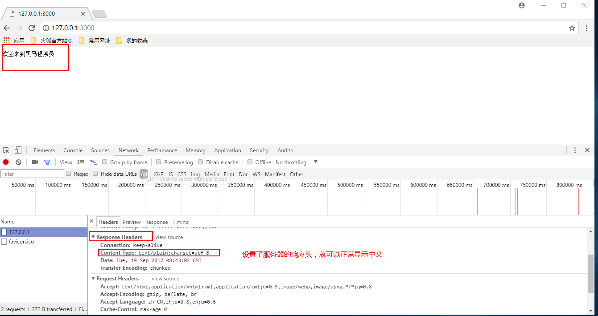
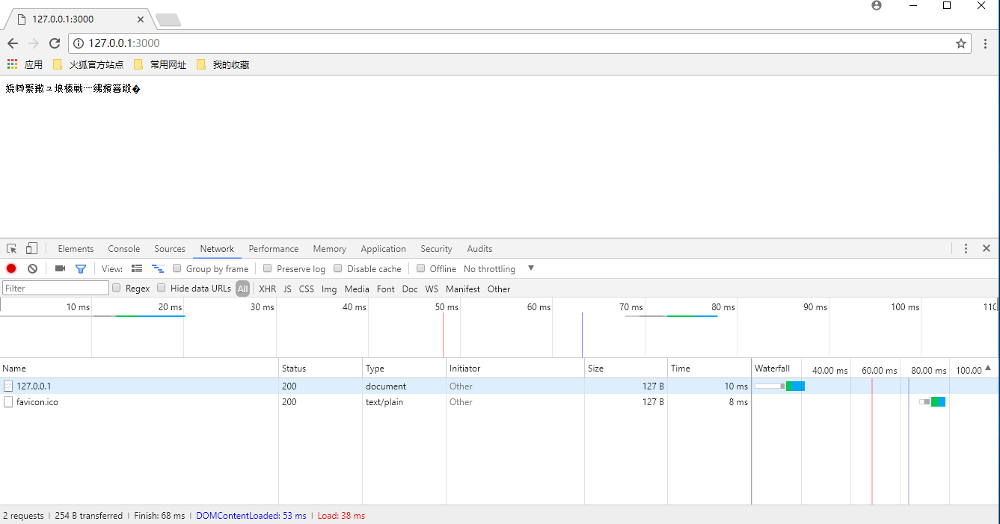
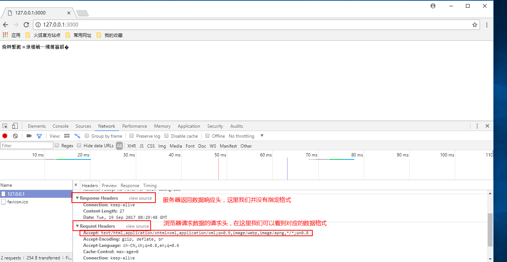
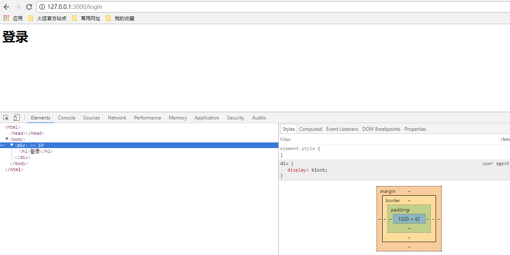

# http模块处理网络请求

* [1.1-服务器响应客户端的请求](#1.1)
* [1.2-根据不同请求路径响应不同内容](#1.2)
* [1.3-设置响应头解决中文乱码问题](#1.3)
* [1.4-response响应头的作用](#1.5)


## <h2 id=1.1>1.1-服务器响应客户端的请求</h2>


```javascript

//1.导入http模块
//返回一个模块对象，所有的关于HTTP的API都是这个对象的方法
var http = require('http')

//2.创建服务器
var service = http.createServer();

//3.服务器设置响应事件
//node中几乎所有的API都是异步操作
/**
第一个参数：表示事件，node是基于事件驱动的  request表示的是当服务器接收到客户端浏览器发送的请求事件
第二参数：回调函数，当服务器检测到有客户端访问时，就会执行该回调。
	* 回调参数中有两个形参，分别是
		* request：客户端请求的数据
		* response：服务端返回的数据

*/
service.on('request',function(req,res){

	//当服务器每一次接收到客户端的请求时，会调用这个回调函数，服务器可以在回调函数中去响应客户端的请求
    
	//(1)服务器响应数据
	res.write('hello world');
	//(2)服务器结束响应（告诉浏览器本次响应结束）
	/**一定要调用res.end(),否则浏览器会认为服务器的响应没有结束，会一直转圈等待响应结束，直到加载超时 */
	res.end();

	// //上面的步骤（1）和步骤（2），也可以简写成一步
	// res.end('hello world');

});

//4.开始监听

/**
第一个参数：服务器监听的端口号hostport、
第二个参数：服务器监听ip地址，如果不写则为本机ip
第三个参数：服务器启动成功回调	
在网络通讯中，ip地址用于找到某台电脑，而端口号则用于找到这台电脑的某一个应用程序
*/
service.listen(3000,function(){
	console.log('服务器启动成功');
});

```

## <h2 id=1.2>1.2-根据不同请求路径响应不同内容</h2>

* ***目前我们的node服务器存在一个问题：无论是浏览器输入什么网址，服务端走的都是`service.on`方法，而我们返回的数据是固定的***
	* ***而一般的网页，像淘宝、京东等，我们每点击网页上一个按钮就会返回不同的界面，而且这些url的地址都是不一样的***

* ***如何根据不同的网址请求来响应不同的数据呢？其实非常简单***
	* ***我们只需要在`service.on`拿到`request`请求的网址`url`，然后根据不同的url返回不同的数据即可***

```javascript

//1.导入http模块
//返回一个模块对象，所有的关于HTTP的API都是这个对象的方法
var http = require('http')

//2.创建服务器
var service = http.createServer();

//3.服务器设置响应事件
//node中几乎所有的API都是异步操作
/**
第一个参数：表示事件，node是基于事件驱动的  request表示的是当服务器接收到客户端浏览器发送的请求事件
第二参数：回调函数，当服务器检测到有客户端访问时，就会执行该回调。
	* 回调参数中有两个形参，分别是
		* request：客户端请求的数据
		* response：服务端返回的数据

*/
service.on('request',function(req,res){

    //当服务器每一次接收到客户端的请求时，会调用这个回调函数，服务器可以在回调函数中去响应客户端的请求
    
    //(1)获取客户端浏览器的请求路径
    var url  = req.url;   //获取到的内容是127.0.0.1:3000之后的内容，url路径通常以'/'开头
    //(2)如果本次请求路径是home，我们返回，welcom to go home
    if(url === '/home'){
        res.end('welcom to go home');
    }
    else if(url === '/blackhorse'){ //如果本次请求路径是blackhorse，我们返回，欢迎来到黑马程序
        res.end('欢迎来到黑马程序员');
    }
    else if(url === '/'){   //如果本次请求路径没有请求路径（127.0.0.1：3000），默认url就只有一个'/'
        res.end('通常没有请求路径，表示的是进入一个网站的首页');
    }

});

//4.开始监听

/**
第一个参数：服务器监听的端口号hostport、
第二个参数：服务器监听ip地址，如果不写则为本机ip
第三个参数：服务器启动成功回调	
在网络通讯中，ip地址用于找到某台电脑，而端口号则用于找到这台电脑的某一个应用程序
*/
service.listen(3000,function(){
	console.log('服务器启动成功');
});

```



## <h2 id=1.3>1.3-设置响应头解决中文乱码问题</h2>

* ***在前面的课程学习中我们知道，一个HTTP请求由三大要素组成***
	* 1.请求行：请求的地址和求方法等信息
	* 2.请求头：编码格式和请求时间等信息
	* 3.请求体：请求的具体参数数据

* ***当服务器返回的是中文字符串时，可以看到浏览器并不能正常显示，而是一堆乱码***



* ***这主要是因为我们并没有设置服务器的响应头，导致浏览器解析乱码***
	* ***一般情况下，如果是中文，服务器返回数据时都会加上对应的响应头***



```javascript

//1.导入http模块
//返回一个模块对象，所有的关于HTTP的API都是这个对象的方法
var http = require('http')

//2.创建服务器
var service = http.createServer();

//3.服务器设置响应事件
//node中几乎所有的API都是异步操作
/**
第一个参数：表示事件，node是基于事件驱动的  request表示的是当服务器接收到客户端浏览器发送的请求事件
第二参数：回调函数，当服务器检测到有客户端访问时，就会执行该回调。
	* 回调参数中有两个形参，分别是
		* request：客户端请求的数据
		* response：服务端返回的数据

*/
service.on('request',function(req,res){

    //当服务器每一次接收到客户端的请求时，会调用这个回调函数，服务器可以在回调函数中去响应客户端的请求

    /**（1）默认情况下，如果服务器响应给客户端的数据包含中文，则浏览器会显示乱码，这是因为浏览器不知道服务器响应回来的数据格式
     * （2）我们可以通过设置响应对象res的响应头来解决中文乱码问题
     * 
     */
    
     //设置服务器的响应头   响应头的作用：服务器告诉客户端浏览器，我响应返回给你的数据是什么类型
     /**
      * 第一个参数：状态码  通常200表示请求成功
      * 第二个参数：响应头数据
      */
    res.writeHead(200,{
        'Content-Type':'text/plain;charset=utf8'//  text/plain：普通文本 
    }) 
     
     //(1)获取客户端浏览器的请求路径
    var url  = req.url;   //获取到的内容是127.0.0.1:3000之后的内容，url路径通常以'/'开头
    //(2)如果本次请求路径是home，我们返回，welcom to go home
    if(url === '/home'){
        res.end('welcom to go home');
    }
    else if(url === '/blackhorse'){ //如果本次请求路径是blackhorse，我们返回，欢迎来到黑马程序
        res.end('欢迎来到黑马程序员');
    }
    else if(url === '/'){   //如果本次请求路径没有请求路径（127.0.0.1：3000），默认url就只有一个'/'
        res.end('通常没有请求路径，表示的是进入一个网站的首页');
    }

});

//4.开始监听

/**
第一个参数：服务器监听的端口号hostport、
第二个参数：服务器监听ip地址，如果不写则为本机ip
第三个参数：服务器启动成功回调	
在网络通讯中，ip地址用于找到某台电脑，而端口号则用于找到这台电脑的某一个应用程序
*/
service.listen(3000,function(){
	console.log('服务器启动成功');
});

```

## <h2 id=1.4>1.4-response响应头的作用</h2>

* 不同的响应数据需要设置不同的响应头，例如：如果响应的是html格式的字符串那么响应头应该设置为html格式的文本，否则浏览器无法渲染html样式

* ***响应头的主要作用有两个***
	* 1.服务端告诉浏览器，我响应给你的是什么数据类型
	* 2.服务端响应给浏览器的数据类型只能是两种：字符串和二进制，通过设置响应头可以告知浏览器这个字符串到底是普通文本还是html标签文本或者是一个JSON对象字符串等，从而可以让浏览器根据不同的情况做出不同的处理



```javascript

//1.导入http模块
//返回一个模块对象，所有的关于HTTP的API都是这个对象的方法
var http = require('http')

//2.创建服务器
var service = http.createServer();

//3.服务器设置响应事件
//node中几乎所有的API都是异步操作
/**
第一个参数：表示事件，node是基于事件驱动的  request表示的是当服务器接收到客户端浏览器发送的请求事件
第二参数：回调函数，当服务器检测到有客户端访问时，就会执行该回调。
	* 回调参数中有两个形参，分别是
		* request：客户端请求的数据
		* response：服务端返回的数据

*/
service.on('request',function(req,res){

    //当服务器每一次接收到客户端的请求时，会调用这个回调函数，服务器可以在回调函数中去响应客户端的请求

     //设置服务器的响应头   响应头的作用：服务器告诉客户端浏览器，我响应返回给你的数据是什么类型
    
    //(1)获取客户端浏览器的请求路径
    var url  = req.url;   //获取到的内容是127.0.0.1:3000之后的内容，url路径通常以'/'开头
    //(2)如果本次请求路径是home，我们返回，welcom to go home
    if(url === '/home'){
        
        /**服务器响应返回的是一个html标签，如果设置响应头为普通文本，则浏览器认为你是普通文本
         * 直接显示'<h1>welcom to go home<h1>' */
        res.writeHead(200,{
            'Content-Type':'text/plain;charset=utf8'//  text/plain：普通文本 
        })

        res.end('<h1>welcom to go home</h1>');
    }
    else if(url === '/blackhorse'){ //如果本次请求路径是blackhorse，我们返回，欢迎来到黑马程序

        /**服务器响应返回的是一个html标签，如果设置响应头为html文本，则浏览器认为你是html文本
        将会渲染该标签显示`欢迎来到黑马程序员`*/
        res.writeHead(200,{
            'Content-Type':'text/html;charset=utf8'//  text/html：html文本 
        })

        res.end('<h1>欢迎来到黑马程序员</h1>');
    }
    else if(url === '/'){   //如果本次请求路径没有请求路径（127.0.0.1：3000），默认url就只有一个'/'

        //浏览器响应给客户端的数据只能是两种数据类型 1：文本  2：二进制  如果不是则会报错
        //响应给客户端是一个json数据则需要转为字符串，否则程序会报错
        res.end(JSON.stringify({
            name:'传智播客'
        }));
    }

});

//4.开始监听

/**
第一个参数：服务器监听的端口号hostport、
第二个参数：服务器监听ip地址，如果不写则为本机ip
第三个参数：服务器启动成功回调	
在网络通讯中，ip地址用于找到某台电脑，而端口号则用于找到这台电脑的某一个应用程序
*/
service.listen(3000,function(){
	console.log('服务器启动成功');
});

```


