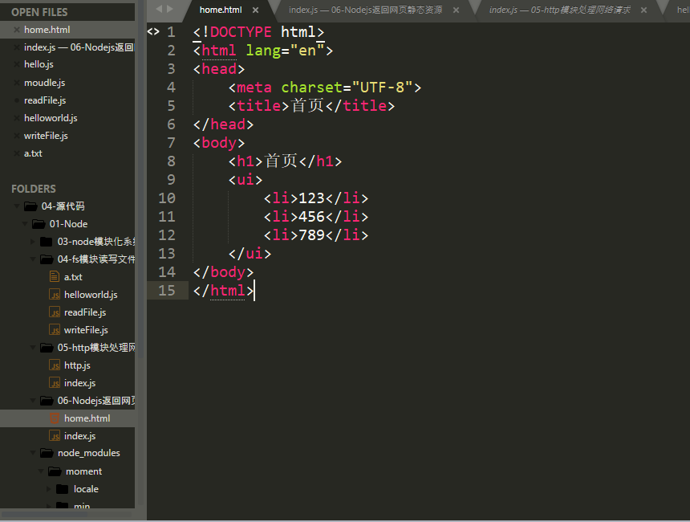
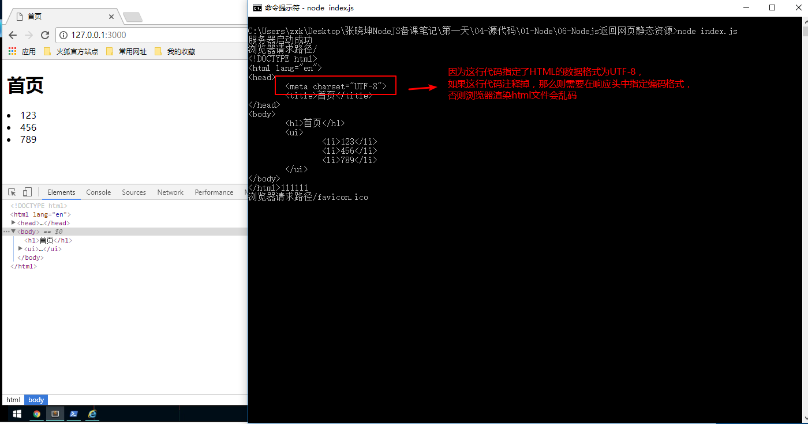

# Node.js加载网页静态资源

* ***在上一小节中我们演示的是服务端返回字符串，本小节我们结合`http`模块和`fs`模块，实现服务端直接返回一个`html`文件交给浏览器渲染***
	* 静态资源：通常指的是一个文件，这文件可以是txt文档，也可以是html文件，也可以是图片jpg文件等

* [1.1-服务端响应返回html文件](#1.1)
* [1.2-效果演示](#1.2)


## <h2 id=1.1>1.1-服务端响应返回html文件</h2>

* 1.首先我们快速的写一个简短的html文件
    * ***本阶段的学习重点在于服务器开发***



* 2.搭建服务器，并且在响应时使用`fs`文件模块，来读取html文件给浏览器

```javascript

//1.导入http模块
var http = require('http')
//导入fs模块
var fs = require('fs');

//2.创建服务器
var service = http.createServer();

//3.服务器设置响应事件
service.on('request',function(req,res){

	//（1）获取浏览器请求的网址，根据不同的网址返回不同的数据
	console.log('浏览器请求路径' + req.url);
	var url = req.url;
	// (2) 所有的网址其实都是在域名的后面 加上 '/'来区分路径
	if (url === '/') {
		//(3)使用fs文件模块来读取本地资源（html文件）
		fs.readFile('./home.html', function(err,data){
			if(err){
				//抛出异常，node程序终止运行
				throw err;
			}
			else{
                //如果没有指定读取文件的编码类型则默认为二进制
				console.log(data.toString());
                //响应数据给客户端
                /**这里之所以不需要设置响应头是因为html文本中已经设置了文件的编码类型为utf8，浏览器能够识别 */
				res.end(data);
			}
		});
    }
    
});

//4.开始监听

/**
第一个参数：服务器监听的端口号hostport、
第二个参数：服务器监听ip地址，如果不写则为本机ip
第三个参数：服务器启动成功回调	
在网络通讯中，ip地址用于找到某台电脑，而端口号则用于找到这台电脑的某一个应用程序
*/
service.listen(3000,function(){
	console.log('服务器启动成功');
});

```

## <h2 id=1.2>1.2-效果演示</h2>

* ***思考问题：为什么我们没有指定返回数据的响应头，浏览器能够解析html文件和中文？***



