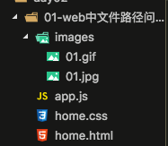
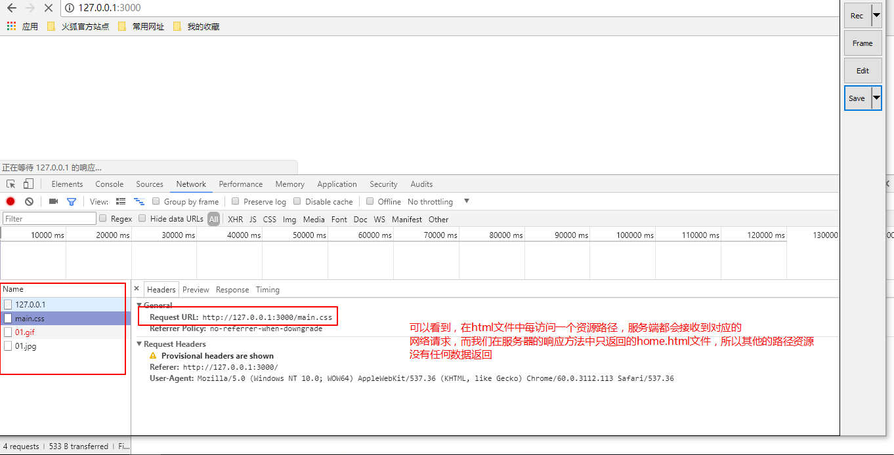
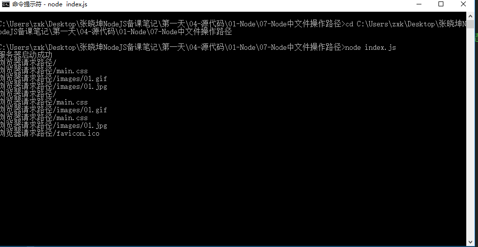

# Web中文件路径问题

* [1.1-准备工作](#1.1)
* [1.2-HTML中文件操作路径](#1.2)
* [1.3-node中文件操作路径](#1.3)
* [1.4-node实现输入文件路径自动查找功能](#1.4)


* ***在上一小节中我们讲解了利用node的`fs`文件读写模块和`http`模块，可以在服务端直接返回给浏览器一个`HTML`文件来渲染加载***
    * ***在这个过程中我们可以体会到，node本身不负责界面渲染只负责数据传输，浏览器负责渲染***

* ***那么当node返回的`HTML`文件中也需要加载其他外部资源时，此时node能否加载到呢？***

## 1.1-准备工作

* 为了更加全面的演示我们的问题，本小节我们准备了五个文件，他们分别是
    * （1）index.js:负责node的服务器和响应home.html文件
    * （2）home.html:负责显示首页，其中加载了一个外部的CSS文件、html文件、图片资源
    * （3）main.css:给html文件显示样式
    * （4）images文件夹下图片



* ***index.js文件代码***

```javascript

//1.导入http模块和fs模块
//返回一个模块对象，所有的关于HTTP的API都是这个对象的方法
var http = require('http')
//导入fs模块
var fs = require('fs');

//2.创建服务器
var service = http.createServer();

//3.服务器设置响应事件
service.on('request',function(req,res){
	
	//（1）获取浏览器请求的网址，根据不同的网址返回不同的数据
	console.log('浏览器请求路径' + req.url);
	var url = req.url;//获取的是ip+端口号（127.0.0.1:3000）之后的内容
	// (2) 所有的网址其实都是在域名的后面 加上 '/'来区分路径
	if (url === '/') {
		//(3)使用fs文件模块来读取本地资源（html文件）
		fs.readFile('./home.html', function(err,data){
			if(err){
				//抛出异常
				throw err;
			}
			else{
				res.end(data);
			}
		});
	}
});

//4.开始监听
service.listen(3000,function(){
	console.log('服务器启动成功');
});

```

* ***home.html文件代码***

```html

<!DOCTYPE html>
<html lang="en">
<head>
	<meta charset="UTF-8">
	<title>Document</title>
	<!-- //浏览器中所有的路径服务器都认为你是真实的具名资源（所有的链接都会变成网络请求） -->
	<link rel="stylesheet" type="text/css" href="./a/b/home.css">
</head>
<body>
	
	

	<p>web中导入的所有的文件路径都会变成服务器的请求，服务器接收到的请求路径就是导入的路径</p>
</body>
</html>

```

* ***main.css文件代码***

```css

body{
	background-color : hotpink;/*骚红色*/
}

```

## 1.2-HTML中文件操作路径

* 1.直接使用浏览器打开HTML文件
	* ***现在假设不使用Node，直接使用浏览器打开`home.html`文件，可以看到，使用传统的`./`或者`../`等是可以访问到文件路径的***
	* 这种方式访问资源属于file协议:<http://www.99mww.com/tech/content-47-27483-1.html>
	* ***此时HTML文件中的相对路径是相对于本文件的所在路径

* 2.使用`127.0.0.1:3000/`的形式访问服务器上的HTML文件
	* ***此时HTML文件中的相对路径是相对于该HTML文件在url中的路径***
		* 例如：一个html文件的请求路径为`127.0.0.1:3000/a/b/c/d`,假如这个html文件中有一个资源的路径为`./1.jpg`,那么服务器获取到的该资源路径为`127.0.0.1:3000/a/b/c/1.jpg`

* 3.一般在开发时，为了避免由于文件url路径所造成的一些困扰，我们一般不使用相对路径去导入一个外部资源`./1.jpg`，而是在服务端会有一个专门的文件夹去存放网页的静态资源（将html文件路径和外部资源路径区分开），例如`/public/image/1.jpg`
	* 服务端会将一些静态资源，如图片等让入一个专门的文件夹，我们通过这个文件夹的绝对路径去获取对于的静态资源

## 1.3-node中文件操作路径

* ***在node中任何的文件去加载一个路径时，都会响应服务器的`service.on`方法***
	* 也就是说如果一个HTML界面中导入了外部资源，此时客户端会向服务端请求该资源路径，如果服务端没有响应该请求，则无法加载

* ***如何解决这个问题呢？非常简单，我们只需要在服务端返回对应数据格式的文件即可***





## 1.4-node实现输入文件路径自动查找功能

* ***在上一小节中，虽然我们解决了node的文件路径的问题，但是这样的代码非常的冗余，我们可以获取`url`路径，手动拼接拼接本地路径来查找资源***

```javascript

service.on('request',function(req,res){

	//（1）获取浏览器请求的网址，根据不同的网址返回不同的数据
	console.log('浏览器请求路径' + req.url);
	var url = req.url;//获取的是ip+端口号（127.0.0.1:3000）之后的内容
	// (2) 所有的网址其实都是在域名的后面 加上 '/'来区分路径
	var path = '.' + url;//注意：本地资源路径是"./"，而url路径是从"/"开始，所以这里要加"."
	fs.readFile(path, function(err,data){
		if (err) {
			throw err;
		}
		else{
			res.end(data);
		}
	});
});

```


