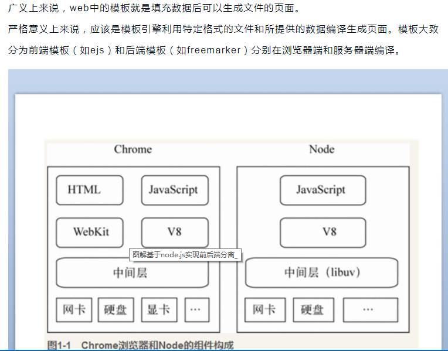
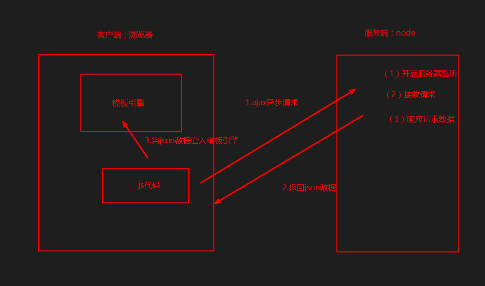
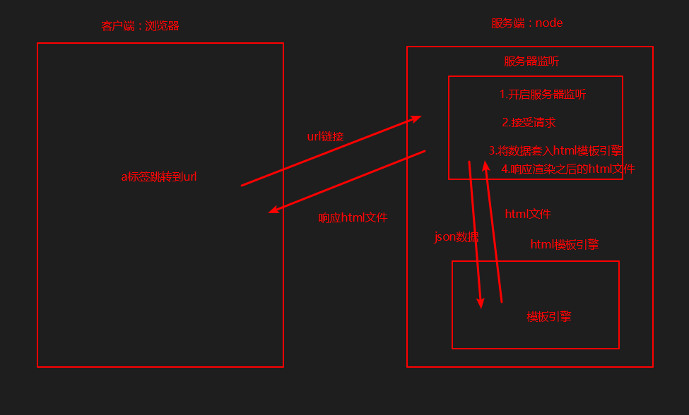
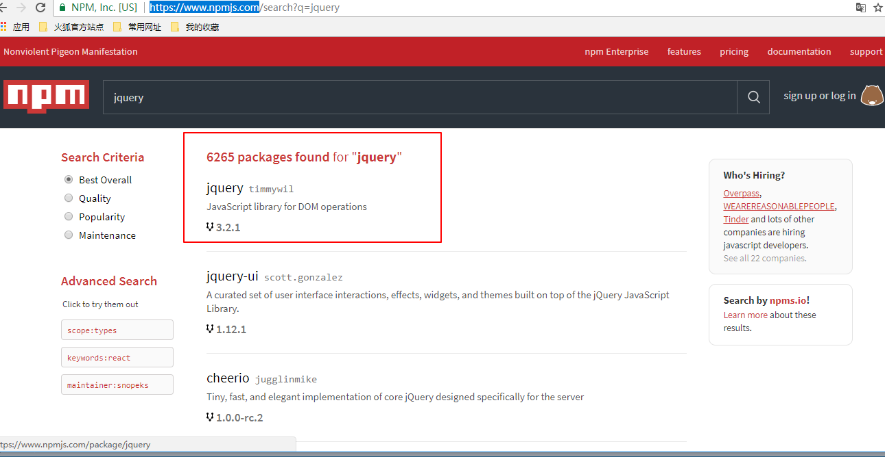
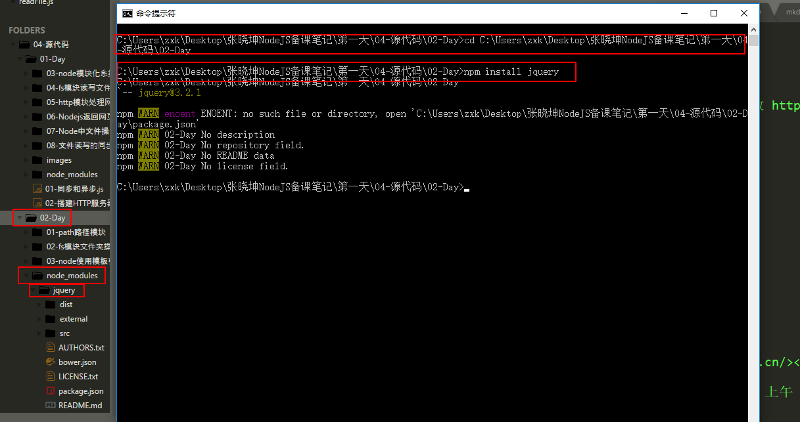
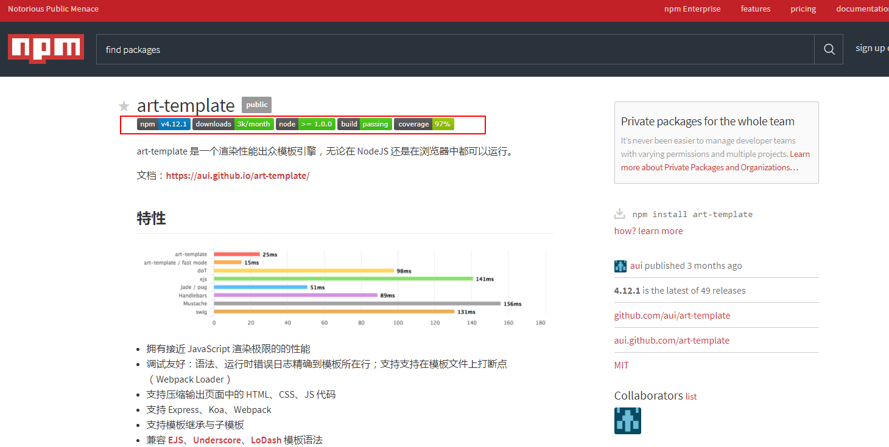
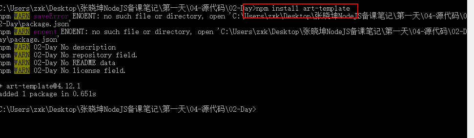
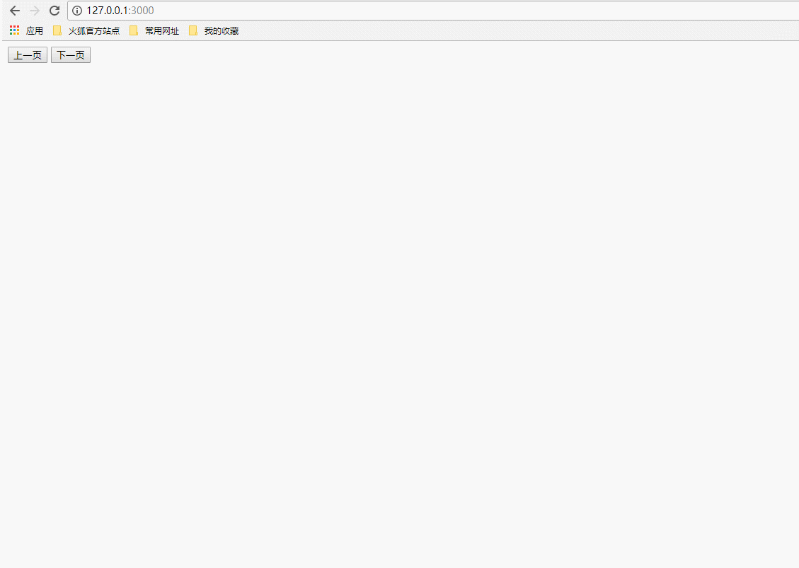
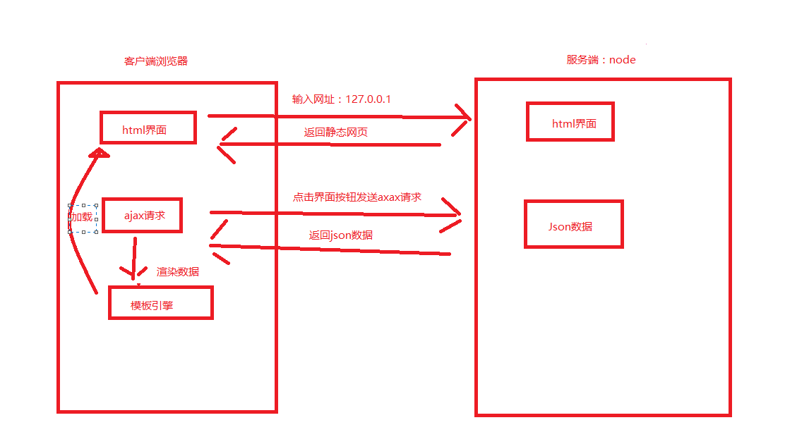
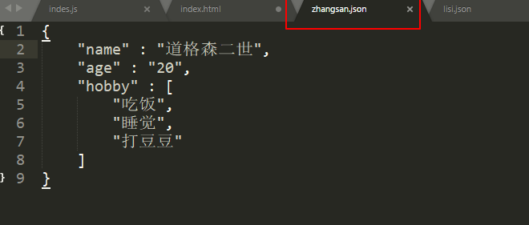

# node使用模板引擎实现客户端渲染

* [1.1-使用npm安装jquary模块](#1.1)
* [1.2-使用npm安装`art-template`模板引擎模块](#1.2)
* [1.3-模拟实例准备工作](#1.3)
* [1.4-客户端代码](#1.4)
* [1.5-服务端代码](#1.5)


* ***接下来的两个小节，我们一起来探讨一个较为深沉的话题，同时也是node在实际开发中非常常见的使用环境：客户端渲染和服务端渲染***



* 客户端渲染：服务端只返回界面的数据，由客户端进行嵌套模板引擎进行渲染
    * 1.模板引擎在客户端
    * 2.客户端使用axjx向服务端发送异步请求
    * 3.服务端只返回界面数据，没有`html`标签



* 服务端渲染：服务端返回一个html文件，客户端直接加载
    * 1.模板引擎在服务端
    * 2.客户端无需axjx异步请求，直接访问url链接
    * 3.服务端将数据渲染成`html`文件，直接返回给客户端



## <h2 id=1.1>1.1-使用npm安装jquary模块</h2>

* 1.进入npm官网`<https://www.npmjs.com>`搜索jquery第三方模块



* 2.cd到项目目录，终端使用`npm install jquery`安装`jquery`第三方模块
    * ***jquery模块用法与我们之前学习的jquery框架一致，它们同是js语言下操作Dom的第三方包***



## <h2 id=1.2>1.2-使用npm安装`art-template`模板引擎模块</h2>

* ***下载的时候注意：一般在界面的上方会显示当前模块所需要的node版本和npm的版本，如果npm版本过低则需要升级npm***
    * ***使用`npm install -g npm`来升级你的npm，其中`-g`值得是全局的，这样的话只需要升级一次所有项目都可以用***

* 1.进入npm官网`<https://www.npmjs.com>`搜索`art-template`第三方模块



* 2.cd到项目目录，终端使用`npm install art-template`安装`art-template`第三方模块
    * ***jquery模块用法与我们之前学习的jquery框架一致，它们同是js语言下操作Dom的第三方包***



## <h2 id=1.3>1.3-模拟实例准备工作</h2>

* ***我们主要模拟以下场景，html界面是一个固定的模板，我们点击上一页和下一页来从服务器请求数据然后使用模板引擎渲染***



* ***整体架构如下***



## <h2 id=1.4>1.4-客户端代码</h2>

* ***index.html***

```html

<!DOCTYPE html>
<html lang="en">

<head>
	<meta charset="UTF-8">
	<title>Document</title>
	<!-- 导包，注意：客户端的src在服务端都是网络请求，这里需要服务端响应返回实际路径的文件 -->
	<script src="/node_modules/jquery/dist/jquery.js"></script>
	<!-- art-template既支持服务端模板引擎也支持客户端，如果是客户端则使用template-web.js -->
	<script src="/node_modules/art-template/lib/template-web.js"></script>
</head>

<body>

	<!-- 未渲染的空的div -->
	<div id="div"></div>

	<!-- 模板 -->
	<script type="text/html" id="template">
		<p>姓名： {{ name }} </p>
		<p>年龄： {{ age }} </p>
		爱好：
		<ul>
			{{ each hobby }}
			<li>{{ $value }}</li>
			{{ /each }}
		</ul>
	</script>

	<!-- 界面交互按钮 -->
	<div>
		<button id="last">上一页</button>
		<button id="next">下一页</button>
	</div>

	<script type="text/javascript">
		//载入成功之后开始绑定按钮点击事件
		$(document).ready(function () {
			// 点击按钮使用jquery自带的ajax发送网络请求
			$('#last').click(function (event) {
				$.ajax({
					url: 'last', //这里会自动加上127.0.0.1:3000
					type: 'get',
					success: function (data) {
						console.log('服务器返回数据' + data);
						//1.使用art-template将字符串渲染成hrml标签
						//第一个参数：模板引擎js的id  第二个参数L要渲染的数据
						var html = template('template', data);
						console.log(html);
						//2.将渲染好的html标签加载到div中
						$('#div').html(html);
					}
				});
			});
			$("#next").click(function (event) {
				$.ajax({
					url: 'next', //这里会自动加上127.0.0.1:3000
					type: 'get',
					success: function (data) {
						console.log('服务器返回数据' + data);
						var html = template('template', data);
						console.log(html);
						$('#div').html(html);
					}
				});
			});
		});
	</script>
</body>

</html>

```

## <h2 id=1.5>1.5-服务端代码</h2>

* 后台服务器的json数据



* 服务端`index.js`代码

```javascript

//1.导入http模块
var http = require('http');
//导入fs模块
var fs = require('fs');

//2.创建服务器
var service = http.createServer();

//3.服务器设置响应事件
service.on('request',function(req,res){

	//***如果是中文，要在响应头中加入 Content-Type 指定 charset
	//第一个参数是状态码，200表示请求成功  第二个参数设置请求头
	res.writeHead(200,{
		'Content-Type':'text/plain;charset=utf-8' //普通文本
	});
	console.log(req.url);

	//默认返回静态html界面
	if(req.url === '/')
	{
		//设置响应头
		res.writeHead(200,{
			'Content-Type' : 'text/html;charset=utf8'
		})
		fs.readFile('./index.html', function(err,data){
			if(err){
				throw err;
			}
			else{
				res.end(data);
			}
		});
	}
	if(req.url === '/node_modules/jquery/dist/jquery.js')//返回jquery文件，因为html中的路径都是网络请求
	{
		fs.readFile('./node_modules/jquery/dist/jquery.js', function(err,data){
			if(err){
				throw err;
			}
			else{
				res.end(data);
			}
		});
	}
	if(req.url === '/node_modules/art-template/lib/template-web.js')//返回客户端浏览器专用的art-tempate文件
	{
		fs.readFile('./node_modules/art-template/lib/template-web.js', function(err,data){
			if(err){
				throw err;
			}
			else{
				res.end(data);
			}
		});
	}
	if(req.url === '/last')//上一页按钮
	{
		//设置响应头
		res.writeHead(200,{
			//这里指定响应头为json，则客户端接收到的数据就是json对象，不指定json则客户端接收到的就是json格式字符串
			'Content-Type' : 'text/json;charset=utf8'
		})
		//读取本地json文件
		fs.readFile('./zhangsan.json', function(err,data){
			if(err){
				throw err;
			}
			else{
				//文件读取到的数据只有两种：二进制和字符串  这里是字符串
				res.end(data);
			}
		});
	}

	if(req.url === '/next')//下一页
	{
		//设置响应头
		res.writeHead(200,{
			'Content-Type' : 'text/json;charset=utf8'
		})
		//读取对应的json数据
		fs.readFile('./lisi.json', function(err,data){
			if(err){
				throw err;
			}
			else{
				res.end(data);
			}
		});
	}
});

//4.开始监听
service.listen(3000,function(){
	console.log('服务器启动成功');
});

```
