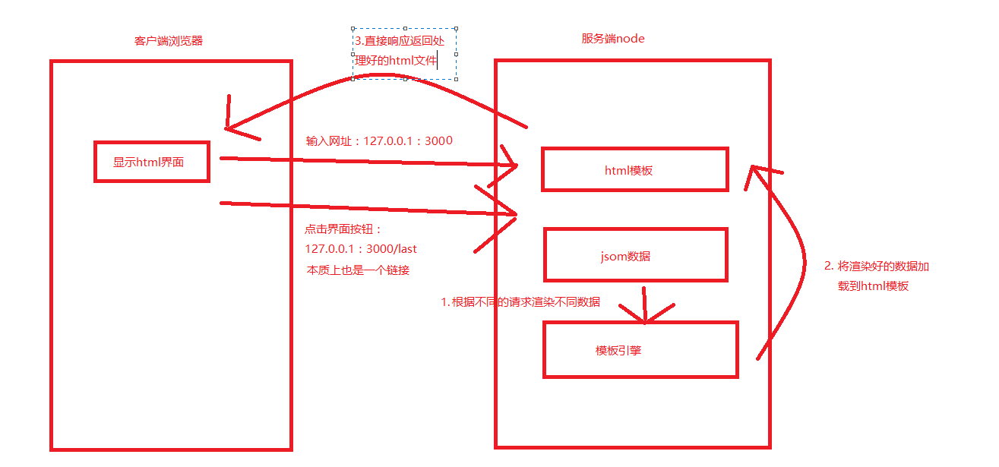
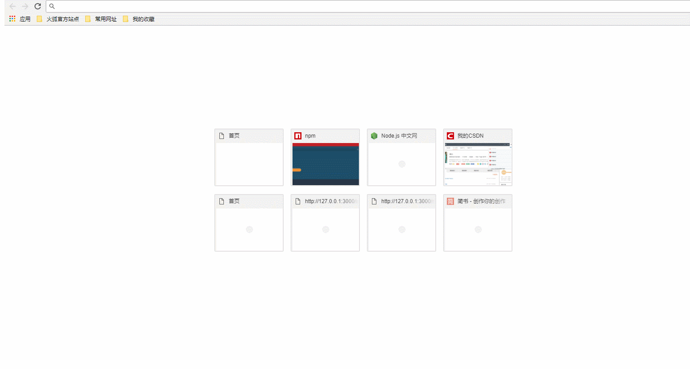

# node使用模板引擎实现服务端渲染

* [1.1-客户端浏览器代码](#1.1)
* [1.2-服务端代码](#1.2)
* [1.3-效果演示](#1.3)


* ***服务端渲染与客户端渲染一个明显的区别就是服务端不再返回客户端数据，而是直接返回一个已经渲染好的`html`界面***




## <h2 id=1.1>1.1-客户端浏览器代码</h2>

* ***此时浏览器本质上就是显示服务端返回的html文件***

* ***index.html***

```html

<!-- 模板html -->
<!DOCTYPE html>
<html lang="en">
<head>
	<meta charset="UTF-8">
	<title>Document</title>
</head>
<body>

<!-- 浏览器只负责显示该html界面，具体的模板引擎渲染在服务端实现
	* 这里为了更好的看到效果，在没有点击界面按钮时直接看到模板，没有做默认数据渲染
 -->
<p>姓名： {{ name }} </p>
<p>年龄： {{ age }} </p>
爱好：
<ui>
	{{ each hobby }}
	<li>{{ $value }}</li>
	{{ /each }}

</ui>

<!-- 当数据在服务端渲染时，客户端无需对数据做任何处理，只需要点击按钮展示界面即可
	* 客户端不需要ajax请求数据处理，只需要直接访问网络链接即可
	* 这里  onclick="window.location.href = '/last'表示的是在当前界面跳转   '/last'默认会添加127.0.0.1：3000变成127.0.0.1：3000/last网络请求
	* 如果不想在当前界面跳转，直接 onclick="window.open('/last')"即可，根据具体业务需求而定
 -->
<div>
		<button id="last" onclick="window.location.href = '/last'">上一页</button>
		<button id="next" onclick="window.location.href = '/next'">下一页</button>
</div>
	
</body>
</html>

```

## <h2 id=1.2>1.2-服务端代码</h2>

* ***此时服务实际上要做三件事***
    * （1）根据客户端请求，读取不同的数据和html模板
    * （2）使用模板引擎将数据渲染到模板中
    * （3）将渲染之后的html文本响应给客户端显示

* ***json数据与上一小节相同，这里就不截图了***

* ***index.js***

```javascript

//1.导入http模块
var http = require('http');

//导入模板引擎模板
var template = require('art-template');

var fs = require('fs');

//2.创建服务器
var service = http.createServer();

//3.服务器设置响应事件
service.on('request', function (req, res) {
	console.log(req.url);
	if (req.url === '/') //默认返回空模板
	{
		fs.readFile('./index.html', function (err, data) {
			if (err) {
				throw err;
			} else {
				res.end(data);
			}
		});
	}
	if (req.url === '/last' || req.url === '/next') //或运算
	{
		//1.先读取模板html
		//***注意，默认情况文件读取到的二进制，这里我们需要制定编码格式为utf8得到html文本
		fs.readFile('./index.html', 'utf8', function (err, tplData) {
			if (err) {
				throw err;
			}
			console.log(tplData);
			//三目运算
			var jsonName = req.url === '/last' ?
				'./zhangsan.json' :
				'./lisi.json';
			//2.读取成功之后，再读取数据 (第一步和第二步没有顺序要求)
			fs.readFile(jsonName, 'utf8', function (err, jsonData) {
				if (err) {
					throw err;
				}
				console.log(jsonData);
				/*由于我们读取json文件得到的并不是json的对象而是一个字符串，所以这里需要
					将字符串转换成json对象*/
				var data = JSON.parse(jsonData);
				console.log(data);
				//3.模板引擎渲染数据到模板
				//3.1 解析替换渲染    
				/*template.compile(tplData):该方法返回值是一个渲染函数
				相当于 var render = template.compile(tplData)
				render(data)：调用函数变量的方法，该方法返回值是渲染好的html文本
				*/
				var htmlStr = template.compile(tplData)(data);
				console.log(htmlStr);
				//4.响应返回渲染好的html文本
				res.end(htmlStr);
			});
		});
	}
});

//4.开始监听
service.listen(3000, function () {
	console.log('服务器启动成功');
});

```

## <h2 id=1.3>1.3-效果演示</h2>

* ***<h2>注意：仔细分析一下客户端渲染和服务端渲染，在浏览器体验中有没有什么明显不同的地方？</h2>***
    


