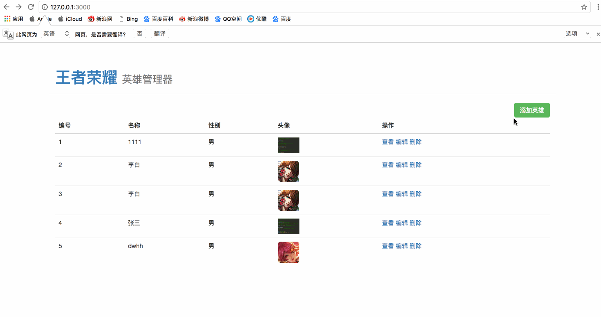
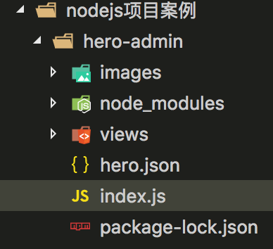

# node案例-王者荣耀英雄管理器

* 在了解了nodejs中常用的核心模块以及服务器与客户端的网络通讯流程之后，接下来的的阶段学习中，我们通过一个综合的小项目案例来学习使用nodejs实现CRUD功能
    * C：create添加
    * R：retrieve查询
    * U：update更新
    * D：delet删除

* 需求预览



* [1.1-开发需求及实现思路分析](#1.1)
* [1.2-搭建项目目录](#1.2)
* [1.3-设计路由](#1.3)

## <h2 id=1.1>开发需求及实现思路分析</h2>

* 1.查询英雄列表
    * 客户端
        * 请求网址
    * 服务端
        * （1）接收客户端请求
        * （2）处理请求
            * 读取html模板
            * 查询数据库（暂时使用json文件代替）
            * 模板引擎渲染
        *  (3)响应请求返回渲染好的html模板

* 2.添加英雄
    * 客户端
        * form表单post提交表单数据
    * 服务端
        * （1）接收post提交数据
        * （2）将数据保存到数据库
        *  (3)响应请求

* 3.查询英雄
    * 客户端
        * 使用get请求将英雄id传给服务器
    * 服务端
        * （1）接收get请求参数
        * （2）通过应用id查询数据库
        *  (3) 将查询结果的数据通过模板引擎渲染到html文本
        * （4）响应英雄详情html文本

* 4.编辑英雄
    * 客户端
        * 使用get请求将英雄id传给服务器
    * 服务端
        * （1）接收get请求参数
        * （2）通过应用id查询数据库
        *  (3) 将查询结果的数据通过模板引擎渲染到html文本
        * （4）响应英雄详情html文本

* 5.提交编辑英雄表单
    * 客户端
        * form表单post提交表单数据
    * 服务端
        * （1）接收post提交数据
        * （2）更新数据库
        *  (3)响应请求

* 6.删除英雄
    * 客户端
        * 使用get请求将英雄id传给服务器
    * 服务端
        * （1）接收get请求参数
        * （2）通过应用id删除数据库英雄数据
        * （3）响应英雄详情html文本

## <h2 id=1.2>搭建项目目录</h2>

* 1.创建项目目录
    * views文件夹：用于显示的html文件
    * images文件夹：网页图片静态资源
    * node-modules：用到的第三方模块
    * index.js:服务端node入口文件
    * hero.json:英雄数据（这里暂时使用json文件替代数据库）



## <h2 id=1.3>设计路由</h2>

* 在网站开发实际工作中，通常后台会给我们一个接口文档，告诉我们每一个功能所对应的请求路径、请求方法、传递参数等***
    * 通常我们将这种设计整个项目接口的过程称之为设计路由
        * 路由的作用：根据不同的请求做出不同的业务处理

```javascript

//1.导入模块
//返回一个模块对象，所有的关于HTTP的API都是这个对象的方法
var http = require('http');

//导入模板引擎模板
var template = require('art-template');
//文件模块
var fs = require('fs');
//路径模块
var path  =require('path');

//2.创建服务器
var service = http.createServer();

//3.服务器设置响应事件
service.on('request',function(req,res){

//请求url
var url = req.url;
//请求方式（GET/POST）
var method = req.method;
console.log(req.url);
console.log(method);
//默认method是大写，可以转成小写（根据个人习惯）
var method = req.method.toLowerCase();

if (method === 'get' && pathname === '/') {
//展示首页html界面
} else if (method === 'get' && pathname === '/heroAdd') {
//展示添加英雄界面
} else if (method === 'post' && pathname === '/heroAdd') {
//添加英雄到数据库
} else if (method === 'get' && pathname.indexOf('/node_modules') === 0 || pathname.indexOf('/images') === 0) {
//返回指定路径的静态资源
}
else if (method === 'get' && pathname === '/heroInfo')
{
//查询英雄详细信息
}
else if (method === 'get' && pathname === '/heroEdit')
{
//展示编辑英雄界面
}
else if (method === 'post' && pathname === '/heroEdit')
{
//修改英雄数据
}
else if (method === 'get' && pathname === '/heroDelet')
{
//删除英雄
}

});

//4.开始监听
service.listen(3000,function(){
	console.log('服务器启动成功');
});

```