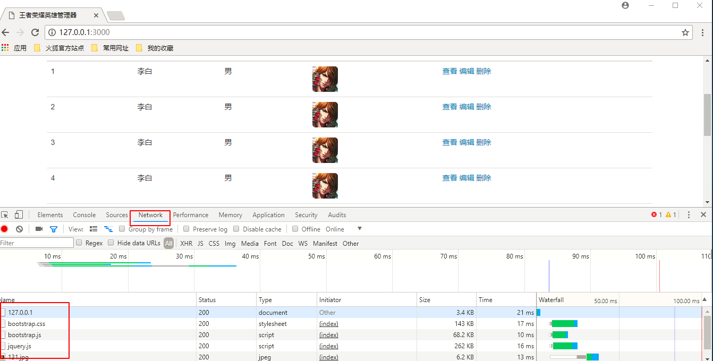

# 使用模板引擎渲染首页英雄列表

* [1.1-思路分析](#1.1)
* [1.2-完整代码](#1.2)
* [1.3-效果演示](#1.3)

## <h2 id=1.1>1.1-思路分析</h2>

* ***课堂上我们使用服务端渲染***
    * ***课后大家可以尝试一下客户端渲染***

* 1.搭建服务端服务器

* 2.首页列表html模板
    * ***为了节省课堂时间，我们使用`bootstrap`来快速布局***

* 3.服务端监听到客户端浏览器请求之后开始使用模板引擎渲染
    * （1）读取模板html字符串
    * （2）读取数据
    * （3）解析替换渲染

* 4.服务端响应渲染后的html文本给客户端浏览器展示

## <h2 id=1.2>1.2-完整代码</h2>

* ***细节注意：html文件中，所有的导入路径都会变成服务器的请求，需要在服务器中处理，否则浏览器会一直转圈等待服务器处理，直到请求超时***

* 1.搭建服务端服务器

```javascript

//1.导入模块
//返回一个模块对象，所有的关于HTTP的API都是这个对象的方法
var http = require('http');

//导入模板引擎模板
var template = require('art-template');
//文件模块
var fs = require('fs');
//路径模块
var path  =require('path');

//2.创建服务器
var service = http.createServer();

//3.服务器设置响应事件
service.on('request',function(req,res){

	//请求url
	var url = req.url;
	//请求方式（GET/POST）
	var method = req.method;
	console.log(req.url);
    console.log(method);

});

//4.开始监听
service.listen(3000,function(){
	console.log('服务器启动成功');
});

```

* 2.首页列表html模板

```html

<!DOCTYPE html>
<html lang="en">
<head>
	<meta charset="UTF-8">
	<!-- 导入jquery -->
	<script src="/node_modules/jquery/dist/jquery.js"></script>
	<!-- 导入bootstrap -->
	<link rel="stylesheet" href="/node_modules/bootstrap/dist/css/bootstrap.css">
    <script src="/node_modules/bootstrap/dist/js/bootstrap.js"></script>
	<title>王者荣耀英雄管理器</title>
</head>
<body>
	<header>
		<div class="page-header container">
		  <h1><a href="/">王者荣耀</a> <small>英雄管理器</small></h1>
		</div>
	</header>
	<div class="container hero-list">
		<a class="btn btn-success pull-right" href="/add">添加英雄</a>
		<table class="table table-hover">
			<thead>
			<th>编号</th>
			<th>名称</th>
			<th>性别</th>
			<th>头像</th>
			<th>操作</th>
			</thead>
			<tbody>
				<!-- 模板引擎 -->
				{{ each heros }}
				<tr>
					<td>{{ $value.id }}</td>
					<td>{{ $value.name }}</td>
					<td>{{ $value.gender }}</td>
					<td></td>
					<td>
						<a href="">查看</a>
						<a href="">编辑</a>
						<a href="">删除</a>
					</td>
				</tr>
				{{ /each heros }}
			</tbody>
		</table>
	</div>
	
</body>
</html>

```


* 3.服务端渲染

```javascript

service.on('request',function(req,res){

	//请求url
	var url = req.url;
	//请求方式（GET/POST）
	var method = req.method;
	console.log(req.url);
	
	if (method === 'get' && pathname === '/') {
	//展示首页html界面
	//设置响应头为html文本
	res.writeHead(200,{
		'Content-Type' : 'text/html;charset=utf8'
	});
	//（1）读取html模板 
	fs.readFile( './views/heroList.html','utf8',function(err,tplData){
		if(err){
			throw err;
		}
		else{
			//（2）读取json数据
			fs.readFile('./hero.json','utf8', function(err,jsonData){

				//将字符串转为json对象
				var data = JSON.parse(jsonData);

				console.log(typeof data);

				console.log(tplData);
				console.log(data);

				//(3).解析替换渲染
				var htmlStr = template.compile(tplData)(data);

				console.log(htmlStr);
				//4.服务端响应渲染之后的数据
				res.end(htmlStr);
			});
		}
	});

} else if (method === 'get' && pathname === '/heroAdd') {
//展示添加英雄界面
} else if (method === 'post' && pathname === '/heroAdd') {
//添加英雄到数据库
} else if (method === 'get' && pathname.indexOf('/node_modules') === 0 || pathname.indexOf('/images') === 0) {
	//返回指定路径的静态资源
	var filePath = path.join(__dirname,url);
	fs.readFile(path, function(err,data){
		if (err) {
			throw err;
		}
		else{
			res.end(data);
		}
	});

}
else if (method === 'get' && pathname === '/heroInfo')
{
//查询英雄详细信息
}
else if (method === 'get' && pathname === '/heroEdit')
{
//展示编辑英雄界面
}
else if (method === 'post' && pathname === '/heroEdit')
{
//修改英雄数据
}
else if (method === 'get' && pathname === '/heroDelet')
{
//删除英雄
}
});

```

## <h2 id=1.3>1.3-效果演示</h2>



