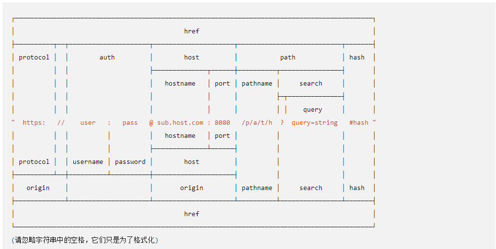

# nodejs接收get请求参数

* [1.1-浏览器向服务器发送get请求参数的两种方式](#1.1)
* [1.2-服务端使用url模块解析get请求参数](#1.2)

* 在http协议中，一个完整的url路径如下图
    * 通过下图我们可以得知，get请求的参数是直接在url路径中显示。
    * get的请求参数在path资源路径的后面添加，以`?`表示参数的开始，以`key=value`表示参数的键值对，多个参数以`&`符号分割
        * hash部分表示的是资源定位符（滚动网页可视区域），由浏览器自动解析处理，它的作用是跳转到对应id的标签的位置



## <h2 id=1.1>1.1-浏览器向服务器发送get请求参数的两种方式</h2>

* ***浏览器向服务端发送get请求主要有两种方式，一种是使用href跳转，url拼接参数 
    * ***一种是ajax请求发送参数 这两种在服务端都是一样处理，没有任何区别***

```html

<button type="submit" class="btn btn-success" onclick="window.location.href='/get?name=张三&age=18'">点击发送一个带参数的get请求</button>
<a href="/get?name=张三&age=18">不管是a标签还是按钮，只要是href路径都可以</a>

```

```html

<script>
  $('#form').on('submit', function (e) {
    //禁用表单默认提交事件
    e.preventDefault();
    $.ajax({
      url: 'heroAdd',
      type: 'get',
      dataType: 'json',
      data: $(this).serialize(),
      success: function (data) {
      }
    });
  });
</script>

```

* ***完整代码***

```html

<!DOCTYPE html>
<html lang="en">

<head>
  <meta charset="UTF-8">
  <title>Hero - Admin</title>
  <!-- 导入jquery -->
  <script src="/node_modules/jquery/dist/jquery.js"></script>
  <!-- bootstrap布局 -->
  <link rel="stylesheet" href="/node_modules/bootstrap/dist/css/bootstrap.css">
  <script src="/node_modules/bootstrap/dist/js/bootstrap.js"></script>
  <style>
    .hero-list img {
      width: 50px;
    }
  </style>
</head>

<body>
  <header>
    <div class="page-header container">
      <h1>
        <a href="/">王者荣耀</a>
        <small>英雄管理器</small>
      </h1>
    </div>
  </header>
  <div class="container hero-list">
    <form id="form">
      <div class="form-group">
        <label for="exampleInputEmail1">英雄名称</label>
        <input type="text" name="name" class="form-control" id="exampleInputEmail1" placeholder="请输入英雄名称">
      </div>
      <div class="form-group">
        <label for="exampleInputPassword1">英雄性别</label>
        <div class="radio">
          <label>
            <input type="radio" name="gender" id="optionsRadios1" value="男" checked>男
          </label>
          <label>
            <input type="radio" name="gender" id="optionsRadios1" value="女" checked>女
          </label>
        </div>
      </div>
      <div class="form-group">
        <label for="exampleInputFile">英雄图片</label>
        <!-- <input type="file" id="exampleInputFile"> -->
        <p class="help-block">请上传英雄图片.</p>
      </div>
      <button type="submit" class="btn btn-success">点击保存</button>
    </form>
    <!-- 浏览器向服务端发送get请求主要有两种方式，一种是使用href跳转，url拼接参数 
       一种是ajax请求发送参数 这两种在服务端都是一样处理，没有任何区别 -->
    <button type="submit" class="btn btn-success" onclick="window.location.href='/get?name=张三&age=18'">点击发送一个带参数的get请求</button>
    <a href="/get?name=张三&age=18">不管是a标签还是按钮，只要是href路径都可以</a>
  </div>
</body>

<script>
  $('#form').on('submit', function (e) {
    //禁用表单默认提交事件
    e.preventDefault();
    $.ajax({
      url: 'heroAdd',
      type: 'get',
      dataType: 'json',
      data: $(this).serialize(),
      success: function (data) {
      }
    });
  });
</script>

</html>

```

## <h2 id=1.2>1.2-服务端使用url模块解析get请求参数</h2>

* ***当http网络网络请求为`GET`方式时，如果有参数，则参数会在url路径的后面通过键值对的方式来进行拼接，并且会对url进行编码处理，看起来就像这样***
    * `/heroAdd?name=%E5%BC%A0%E4%B8%89&gender=%E7%94%B7`：`?`用于url与参数之间的分隔符，？前面是url路径，后面是参数
        * ***如果是多个参数，则以`&`符号来进行分割***

* ***客户端`GET`请求传参，服务端想要解析到具体的参数比较麻烦，先要对请求进行解码，然后使用特定字符`?`和`&`来分割字符，极其不方便***
    * ***nodejs中有一个专用于解析url请求的模块，这就是`url`模块:<http://nodejs.cn/api/url.html>***


* ***url模块的使用很简单，API不多***

```javascript

//导入url模块
var url = require('url');

//1.默认情况下，如果url路径中有中文，则会对中文进行URI编码，所以服务端要想获取中文需要对url进行URI解码
console.log(encodeURI(req.url));

// 2.url.parse 方法可以将一个 URL 路径解析为一个方便操作的对象
// 将第二个可选参数指定为 true， 表示将结果中的 query 解析为一个对象
var parseObj = url.parse(req.url, true);
console.log(parseObj);

var pathname = parseObj.pathname; //相当于无参数的url路径
console.log(pathname);
// 这里将解析拿到的查询字符串对象作为一个属性挂载给 req 对象，这样的话在后续的代码中就可以直接通过 req.query 来获取查询字符串了
req.query = parseObj.query;
console.log(req.query);

```

* ***打印结果如下，下方这张图可以很好的解释每一个字段的含义***
    * ***这里很多null的原因是我们客户端请求没有写完整的路径，直接是斜杠加路径，省略了我们的ip和端口号***

```javascript

Url {
  protocol: null,
  slashes: null,
  auth: null,
  host: null,
  port: null,
  hostname: null,
  hash: null,//让浏览器滚动到指定id的标签位置
  search: '?name=%E5%BC%A0%E4%B8%89&age=18',
  query: { name: '张三', age: '18' },
  pathname: '/get',
  path: '/get?name=%E5%BC%A0%E4%B8%89&age=18',
  href: '/get?name=%E5%BC%A0%E4%B8%89&age=18' }

```

* ***完整代码***

```javascript

//1.导入http模块
var http = require('http');
//导入文件模块
var fs = require('fs');
//导入路径模块
var path = require('path');
//导入url模块
var url = require('url');
//2.创建服务器
var app = http.createServer();

//3.添加响应事件
app.on('request', function (req, res) {

    //1.默认情况下，如果url路径中有中文，则会对中文进行URI编码，所以服务端要想获取中文需要对url进行URI解码
    console.log(encodeURI(req.url));
    // 2.url.parse 方法可以将一个 URL 路径解析为一个方便操作的对象
    // 将第二个可选参数指定为 true， 表示将结果中的 query 解析为一个对象
    var parseObj = url.parse(req.url, true);
    console.log(parseObj);
    var pathname = parseObj.pathname; //相当于无参数的url路径
    console.log(pathname);
    // 这里将解析拿到的查询字符串对象作为一个属性挂载给 req 对象，这样的话在后续的代码中就可以直接通过 req.query 来获取查询字符串了
    req.query = parseObj.query;
    console.log(req.query);
    if (pathname === '/heroAdd') {
        fs.readFile('./heroAdd.html', function (err, data) {
            if (err) {
                throw err;
            }
            res.end(data);
        });
    } else if (pathname.indexOf('/node_modules') === 0) {
        fs.readFile(__dirname + pathname, function (err, data) {
            if (err) {
                throw err;
            } else {
                console.log(data);
                res.end(data);
            }
        });
    } else {
        res.end('请求路径： ' + req.url);
    }
});

//4.监听端口号
app.listen(3000, function () {
    console.log('欢迎来到王者荣耀英雄管理器');
});

```

