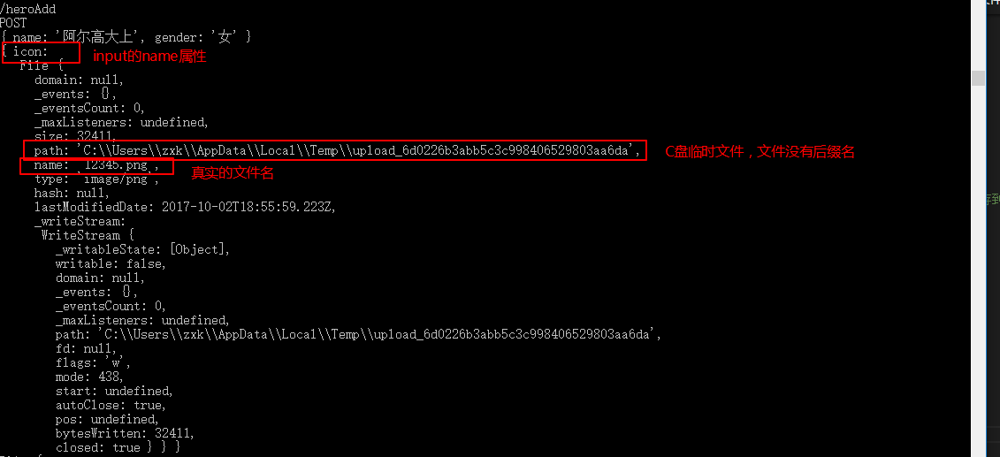
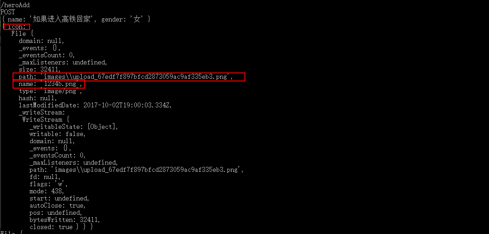

# nodejs接收文件数据

* ***文件上传通常都是post请求，因为get请求参数有大小的限制，无法使用get请求上传一个文件***

## 1.1-客户端post请求发送文件数据

* ***默认情况下，虽然form表单可以获取文件数据，但是ajax的post请求无法发送文件数***

* ***js原生API提供了一个`FormData`对象，我们可以使用它来发送文件数据***

* ***注意：`files`类型的`<input>`标签需要指定`name`属性，否则服务器获取不到***

```html

<!-- `files`类型的`<input>`标签需要指定`name`属性，否则服务器获取不到 -->
<input type="file" id="exampleInputFile" name="icon">

```

* `FormData()`函数属于js原生API，详情可以参考MDN官网:<https://developer.mozilla.org/zh-CN/docs/Web/API/FormData/FormData>
    * ***FromData()属于XMLHttpRequest2的新特性:<https://dvcs.w3.org/hg/xhr/raw-file/tip/Overview.html>***
    * ***实际开发中也可以使用jquery的插件来实现文件上传`jQuery File Upload`***

```html

<!DOCTYPE html>
<html lang="en">

<head>
  <meta charset="UTF-8">
  <title>Hero - Admin</title>
  <!-- 导入jquery -->
  <script src="/node_modules/jquery/dist/jquery.js"></script>
  <!-- bootstrap布局 -->
  <link rel="stylesheet" href="/node_modules/bootstrap/dist/css/bootstrap.css">
  <script src="/node_modules/bootstrap/dist/js/bootstrap.js"></script>
  <style>
    .hero-list img {
      width: 50px;
    }

  </style>
</head>

<body>
  <header>
    <div class="page-header container">
      <h1><a href="/">王者荣耀</a> <small>英雄管理器</small></h1>
    </div>
  </header>
  <div class="container hero-list">
    <form id="form" >
      <div class="form-group">
        <label for="exampleInputEmail1">英雄名称</label>
        <input type="text" name="name" class="form-control" id="exampleInputEmail1" placeholder="请输入英雄名称">
      </div>
      <div class="form-group">
        <label for="exampleInputPassword1">英雄性别</label>
        <div class="radio">
          <label>
            <input type="radio" name="gender" id="optionsRadios1" value="男" checked>男
          </label>
          <label>
            <input type="radio" name="gender" id="optionsRadios1" value="女" checked>女
          </label>
        </div>
      </div>
      <div class="form-group">
        <label for="exampleInputFile">英雄图片</label>
        <!-- `files`类型的`<input>`标签需要指定`name`属性，否则服务器获取不到 -->
        <input type="file" id="exampleInputFile" name="icon">
        <p class="help-block">请上传英雄图片.</p>
      </div>
      <button type="submit" class="btn btn-success">点击保存</button>
    </form>
  </div>
</body>

<script>
    //点击保存按钮，使用ajax异步发送表单数据到服务器
    //1.构建formdata
    //var formData = new formData();
    //2.添加参数（既可以是普通字符串也可以是文件）  第一个参数是键 第二个参数是值
    // formData.append('name',document.getElementById("name").value);
    // var list = document.getElementsByName("gender");
    // var gender = list[0].checked === true?'男':'女';
    // formData.append('gender',gender);
    // formData.append('icon',document.getElementById("icon").files[0]);

    //也可以直接对整个表单进行序列化(类似于$('#form').serialize()但是支持文件，后面的[0]是以为jquery获取的是一个数组，而参数是一个HTMLElement类型的数据)
    //var formData = new FormData($('#form')[0]);

    $('#form').on('submit', function (e) {
      //***注意，需要在点击提交时才获取，否则获取不到
      var formData = new FormData($('#form')[0]);
      // 1.禁用表单的默认提交行为
      e.preventDefault();
      //2.发送数据到服务器
      $.ajax({
        url: '/heroAdd',
        type: 'post',
        data: formData,
        /**
        *必须false才会自动加上正确的Content-Type
        */
        contentType: false,
        /**
        * 必须false才会避开jQuery对 formdata 的默认处理
        * XMLHttpRequest会对 formdata 进行正确的处理
        */
        processData: false,
        dataType: 'json',
        success: function (data) {
        }
      });
    });
</script>

</html>

```

## 1.2-服务端接收post文件数据

* ***默认情况下，使用nodejs原生的接收post数据，如果是文件则是一串很长的乱码，处理起来非常的复杂和麻烦，实际开发中一般使用第三方模块来完成文件数据的接收和解析***

* ***`formidable`是node的npm社区一个比较好用的处理表单数据的第三方模块***

* formidable的npm地址:<https://www.npmjs.com/package/formidable>
    * 有导入教程和使用教程

* formidable的github地址:<https://github.com/felixge/node-formidable>

* ***使用npm安装formidable***
    * npm i -S formidable
        * i：install简写，表示安装
        * -S：-save简写，save 会把依赖包名称添加到 package.json 文件 dependencies 键下
            * 其实我们不写 -save也是在这个dependencies键下

* 第三方模块的使用很简单，基本上所有的第三方模块的学习方式都是一样的，学习能力是衡量一个程序员综合成立的重要指标
    * （1）进官网
    * （2）看官方文档：一般第三方都会在官网写一个代码实例教开发者如何使用
    * （3）复制粘贴官方代码

* ***使用formidable获取表单文件***
    * ***使用前需要导入模块***

```javascript

//1.导入http模块
var http = require('http');
//导入文件模块
var fs = require('fs');
//导入路径模块
var path = require('path');
//导入formidable模块（解析post请求文件数据）
var formidable = require('formidable');

//2.创建服务器
var app = http.createServer();

//3.添加响应事件
app.on('request', function (req, res) {

    console.log(req.method);

    //通过判断url路径和请求方式来判断是否是表单提交
    if (req.url === '/heroAdd' && req.method === 'POST') {
        /*****formidable获取表单数据 *****/
        //1.创建一个formidable对象
        var form = new formidable.IncomingForm();
        //2.配置文件的上传路径 （默认在系统临时文件，需要我们来制定将文件放入到哪一个路径）
        form.uploadDir = "./images/";
        //3.配置保持文件拓展名（默认为false去除了）
        form.keepExtensions = true;

        //4.开始解析表单数据
        /*第一个参数：req，客户端请求
        第二个参数：解析完成回调
            err：错误信息
            fields：表单中普通文本的json对象（无需我们去反序列化url，内部已经帮我们处理）
            files：表单中文件信息，包含文件大小、路径、时间等信息（默认情况下formidable会将我们的文件保存到操作系统的临时文件中,b并且将文件进行了改名和去除拓展名，目的是为了防止同名文件被覆盖）
        */
        form.parse(req, function (err, fields, files) {
            console.log(fields); //普通数据json对象
            console.log(files); //文件信息
            console.log(files.icon);
            //5.修改form.uploadDir中的文件名为真实的文件名（默认formidable会修改我们的文件名）
            fs.rename(files.icon.path, form.uploadDir + files.icon.name);
        });
    }

    if (req.url === '/heroAdd' && req.method === 'POST') {
        fs.readFile('./heroAdd.html', function (err, data) {
            if (err) {
                throw err;
            }
            res.end(data);
        });
    } else if (req.url.indexOf('/node_modules') === 0) {
        fs.readFile(__dirname + req.url, function (err, data) {
            if (err) {
                throw err;
            } else {
                res.end(data);
            }
        });
    } else {
        res.end('请求路径： ' + req.url);
    }
});

//4.监听端口号
app.listen(3000, function () {
    console.log('欢迎来到王者荣耀英雄管理器');
});

````

* ***formidable默认配置***
    * （1）files的对象中键为文件上传`input`的name属性
    * （2）默认文件保存到系统磁盘临时文件，并且修改了文件名，而且没有文件后缀
        * 文件路径在path属性中
    * （3）真实的文件名在name属性中



* ***处理后的配置***

