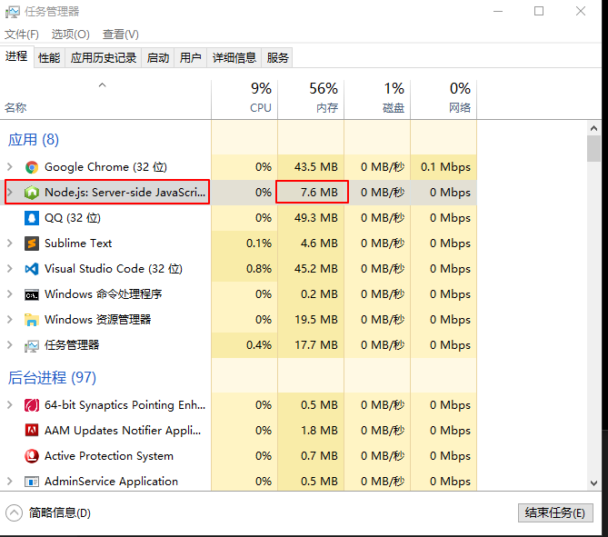
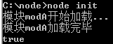

# Node中模块加载缓存机制

* [1.1-模块加载机制](#1.1)
    * [1.1.1-加载内置模块(又叫核心模块或者原生模块)](#1.1.1)
    * [1.1.2-文件模块](#1.1.2)
    * [1.1.3-第三方模块（自定义模块）](#1.1.3)
* [1.2-模块缓存机制](#1.2)
* [1.3-文件模块带文件拓展名和不带的区别](#1.3)
* [1.4-模块加载总结及注意点](#1.4)


## <h2 id=1.1>1.1-模块加载机制</h2>

## <h3 id=1.1.1>1.1.1-加载内置模块(又叫核心模块或者原生模块)</h3>

* 1.Node的内置模块被编译为二进制形式，引用时直接使用名字而非文件路径。当第三方的模块和内置模块同名时，内置模块将覆盖第三方同名模块。因此命名时需要注意不要和内置模块同名。如获取一个http模块`var http = require('http')`
    * (1)内置模块加载优先级最高，（如果第三方模块与内置模块重名，将会加载内置模块）
        * 自定义文件模块不存在这个问题，因为是通过路径来加载的`require('./xxxx')`
    * (2)内置模块的加载速度最快，因为内置模块随着node安装而一直安装，在内部被编译成了二进制文件

* ***内置模块的二进制文件放在node.exe包中，当我们启动`node`时会发现这个应用程序占用了一定的内存，其中这个内存主要就是加载node内置的模块***



## <h3 id=1.1.2>1.1.2-文件模块</h3>

* 1.在nodejs中，我们自己写的每一个js文件都是一个模块
    * .js文件
    * .json文件
    * .node文件（C++编写）

* 2.与内置模块和第三方模块不同的是，文件模块是通过路径来加载，其他两个是通过模块名来加载的

* 3.文件模块既可以通过相对路径来加载，也可以通过绝对路径来加载
    * 文件模块后面的拓展名`js`，可以省略不写，node会帮我们自动加上

```javascript

//绝对路径
var myMod = require('/home/base/my_mod')
//相对路径
var myMod = require('./my_mod')
//省略js文件拓展名也可以
var myMod = require('./my_mod')

```

## <h3 id=1.1.3>1.1.3-第三方模块（自定义模块）</h3>

* 1.当`require()`参数中的模块名不是路径，也不是内置模块的时候，node会试图去当前目录的`node_modules`文件夹中搜索对应的文件夹名称，如果当前目录的`node_modules`文件夹中没有找到，Node会从父目录的`node_modules`里搜索，这样递归下去直到根目录

* 2.当node找到该模块名文件夹folder时，会首先找到包定义文件`package.json`,如果该folder中没有包含`package.json`文件，node会默认加载`index.js`文件。如果连`index.js`文件也不存在，则会加载失败

* 3.node找到`package.json`文件之后，会找出该json文件中`main`键所对应的值（是一个js文件名）,该js文件则是这个文件夹模块的入口
    * ***第三方模块其实就是一个自定义文件夹模块***

## <h2 id=1.2>1.2-模块缓存机制</h2>

* 1.加载模块时，node会首先从缓存中查找，如果缓存中存在则从缓存中读取，如果不存在则读取并且放入缓存

* 2.也就是说，一个模块在第一次导入时会被node放入缓存中，第二次再导入不会重新加载而是从缓存中读取
    * （1）避免的重复导入模块的资源浪费
    * （2）从缓存中读取模块速度更快

```javascript

console.log('模块modA开始加载...')
exports = function() {
    console.log('hello world')
}
console.log('模块modA加载完毕')

```

```javascript

var mod1 = require('./modA')
var mod2 = require('./modA')
console.log(mod1 === mod2)

```



## <h2 id=1.3>1.3-文件模块带文件拓展名和不带的区别</h2>

* 1.如果文件模块带了拓展名，则node直接加载对应路径的文件名，如果没有则加载报错
    * 例如:`require('./index.js')`

* 2.如果文件模块省略了拓展名，例如:`require('./index')`
    * (1)先在对应路径文件夹下查找是否有`index.js`文件，如果有则直接加载返回，如果没有则进行下一步
    * (2)在对应路径文件夹下查找是否有`index.json`文件，如果有则直接加载返回，如果没有则进行下一步
    * (3)在对应路径文件夹下查找是否有`index.node`文件，如果有则直接加载返回，如果没有则进行下一步
    * (3)在对应路径文件夹下查找是否有`index`文件夹，如果有，则后面的步骤与第三方文件夹模块加载步骤一致，如果没有则加载报错


## <h2 id=1.4>1.4-模块加载总结及注意点</h2>

* 1.nodejs中共有三种模块：核心模块、文件模块、第三方模块
    * 核心模块又叫做内置模块、原生模块
    * 文件模块支持js、json、node拓展名，每一个文件都是一个模块
    * 第三方模块实际上就是文件夹模块（加载整个文件夹）

* 2.所有模块在第一次加载时都会执行一次，下一次加载直接从缓存获取

* 3.核心模块在安装node时已经被编译成二进制执行文件，所以加载速度最快（效率仅次于缓存加载）

* 4.核心模块只能通过`模块名称`来加载，如果使用路径方式`require(./http)`，这样子是无法加载核心模块的
    * 但是可以加载文件模块

* 5.试图加载一个和`核心模块`同名的`第三方模块`是不会成功的
    * 要么名字不要与核心模块一致
    * 要么使用路径的方式加载

* 6.require()加载文件模块时使用`./`相对路径时相对当前模块，不受node执行命令的路径影响
