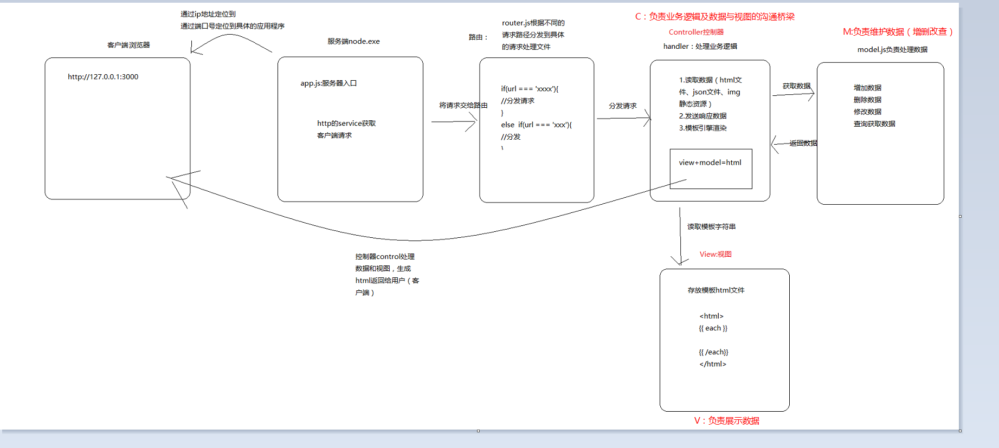
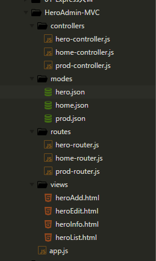

# NodeJS中MVC架构介绍

* [1.1-前端设计模式MVC、MVP、MVVM介绍](#1.1)
    * [1.1.1-MVC](#1.1.1)
    * [1.1.2-MVP](#1.1.2)
    * [1.1.3-MVVM](#1.1.3)
* [1.2-NodeJS中的MVC](#1.2)
* [1.3-实际开发中MVC架构的项目目录结构](#1.3)

## <h2 id=1.1>1.1-前端设计模式MVC、MVP、MVVM介绍</h2>

* 其实MVC、MVP、MVVM不属于设计模式，他们属于框架模式，只是叫的人多了，大家都习惯了

* 目前主流的设计模式主要有三种MVC、MVP、MVVM，设计模式并不是前端所独有的，它适用于所有的面向对象语言

* 关于三种设计模式的定义和理解，大家在课后可以看下这几篇博客:<https://www.zhihu.com/question/20148405>、<http://www.cnblogs.com/jinguangguo/p/3534422.html>

* ***由于网上关于这三种设计模式的讨论实在是多到数不清，并且目前互联网的水军也比较多，有的人说的比较中肯，有的人说的比较精辟，也有的人半年左右的开发经验也开始侃侃而谈，接下来本人根据自己的近十年开发经验聊聊我的个人见解***

* 1.几乎所有的应用程序都是由两部分组成：界面和界面背后的代码

* 2，所有的设计模式的意义都是为了让代码具有更高的可维护性和拓展性
    * 如果不是为了自己的代码更好的维护和后期的拓展，我们还考虑什么设计模式，直接怼就可以了

* 3.所有的设计模式的本质（定义）都是为了约束代码的行为，类似于制定一个交通规则
    * 设计模式的本身只是一个思想，并不是具体的代码实现

### <h3 id=1.1.1>1.1.1-MVC</h3>

* M：Model模型数据
    * 职责：负责维护数据（增删改查）
    * 体现：json数据、文件数据等

* V：View视图
    * 职责：（1）负责展示数据 （2）负责用户的交互
    * 体现：html、css、javascript（主要指模板）

* C：控制器
    * 职责：（1）负责M与V之间的沟通和协调 （2）负责处理业务逻辑：把哪一个数据交给哪一个试图来展示
    * 体现：客户端主要是js代码

### <h3 id=1.1.2>1.1.2-MVP</h3>

* MVP与MVC唯一的区别就是，P（Presenter，相当于MVC中的C）切断了M与V之间的联系，V要想获取展示数据只能从P来获取
    * ***可以理解为，如果MVC中，M与V不能直接沟通，就等同于MVP***

### <h3 id=1.1.3>1.1.3-MVVM</h3>

* M：Model模型数据
    * 职责：负责维护数据（增删改查）
    * 体现：json数据、文件数据等

* V：View试图
    * 职责：（1）负责展示数据 （2）负责用户的交互
    * 体现：html、css、javascript（主要指模板）

* VM：试图模型
    * 职责：负责将试图V和模型M进行绑定（模型数据改变，视图自动改变；反之一样）

## <h2 id=1.2>1.2-NodeJS中的MVC</h2>

* 1.在服务端，由于我们无需关心界面，所有首先可以肯定的是MVVM模型不适合服务端开发
    * （1）网络成本太高，试想一下：当后台数据发生变化，用户怎样刷新自己的数据？无时无刻的发给客户端新的数据？
        * 并不是所有的人用的都是电信，还有的人用的移动或者4G网络
        
    * （2）开发成本高
        * 就算你代码写得再漂亮，自动刷新机制做的再好，用户还是会选择`F5`刷新
            * 我们最多写一个`window.location.reload()`就可以了

* 2.通过MVP的定义来看，它主要是针对客户端的，跟只关心数据不关心界面的服务端没有任何关系

* 3.服务端的设计模式主要是MVC模式

* ***我们目前的项目对MVC模型的体现如下图***

* ***为什么应用程序的开发需要有MVC模式，或者说在MVC模式中为什么视图不与数据直接沟通，而是通过controller控制器来进行沟通？***
    * 主要原因是数据和视图具有通用性：视图可以展示任何数据，数据可以展示在任何数据上，一旦绑定则增加了耦合度

## <h2 id=1.3>1.3-实际开发中MVC架构的项目目录结构</h2>

* 项目名称
    * app.js:服务器入口，负责监听网络ip和端口号
    * Controllers文件夹：负责根据不同请求处理不同业务逻辑，类似于我们的handler
        * hero-controller.js:实际开发中，会有很多的网页上百个网络请求，我们不可能在一个文件处理所有的请求，往往是不同的功能划分到不同的文件，这样便于维护
    * Views文件夹：html模板
    * routes文件夹：路由文件夹
        * 实际开发中一个网站会有很多个网络请求，如果只在一个`router.js`文件中分发所有的请求，代码将会变得臃肿，和controllers文件夹一样，不同的功能放到不同的路由分发
    * modes：数据文件夹
        * 一个文件只负责某一个数据的处理

