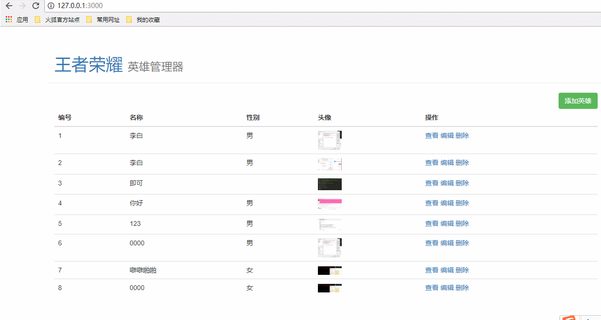

# 完成查看信息界面功能

* [1.1-思路分析](#1.1)
* [1.2-根据思路代码实现功能](#1.3)
* [1.3-客户端代码](#1.4)
* [1.4-效果演示](#1.5)

## <h2 id=1.1>1.1-思路分析</h2>

* 1.客户端浏览器点击查看按钮，向服务端发送请求
    * 每一个对象都有一个唯一的标识符`id`，客户端需要将`id`发送给服务端

* 2.服务端接收客户端请求参数，通过`id`查询到对象
    * (1) 路由模块`routerjs`分发请求到业务处理模块`handler.js`
    * (2) 业务处理模块`handler.js`通过请求req的id从数据模块`model.js`获取对象
    * (3) 数据模块`model.js`增加通过`id`查询对象功能

* 3.服务端将查询到的对象渲染到html模板返回给客户端
    * (1) 业务处理模块`handler.js`通过渲染模块`render.js`将对象数据渲染到html模板
    * (2) 业务处理模块`handler.js`返回客户端渲染好的html模板

* 4.客户端展示服务端响应返回的html文本

## <h2 id=1.4>1.4-根据思路代码实现功能</h2>

* ***1.heroInfo.html***

```html

<!DOCTYPE html>
<html lang="en">

<head>
  <meta charset="UTF-8">
  <title>Hero - Admin</title>

  <script src="/node_modules/jquery/dist/jquery.js"></script>
  <link rel="stylesheet" href="/node_modules/bootstrap/dist/css/bootstrap.css">
</head>

<body>
  <header>
    <div class="page-header container">
      <h1><a href="/">王者荣耀</a> <small>英雄管理器</small></h1>
    </div>
  </header>
  <div class="container hero-list">
    <p>ID：{{ hero.id }}</p>
    <p>英雄名称：{{ hero.name }}</p>
    <p>英雄性别：{{ hero.gender }}</p>
    <p>英雄图片：</p>
    
  </div>
</body>

</html>

```

* ***2.路由模块`router.js`添加网络请求分发***

* ***3.`handler.js`模块处理业务逻辑***


```javascript

//7.通过id获取信息界面
handler.getHeroInfo = function (req, res) {
    //默认get请求参数是字符串
    var id = req.query.id;
    console.log(typeof id);
    //使用数据模块通过id查询数据
    model.fetchHeroById(id, function (err, hero) {
        if (err) {
            console.log('查询失败' + err);
            res.end(JSON.stringify({
                err_code: 500,
                message: err.message
            }));
        } else {
            console.log('查询成功' + hero);
            res.render('heroInfo', {
                hero: hero //键值对，左边表示的是html模板中的占位字符，右边表示对象
            });
        }
    });
};

```

* ***4.数据模块`model.js`添加查询数据API（函数）***

```javascript

//3.通过id获取数据
/**
 * 
 * @param {*} id 英雄id，字符串
 * @param {*} callback function(err,hero){};  hero:查询到的英雄对象
 */
model.fetchHeroById = function (id, callback) {
    //url中默认参数是字符串，这里需要根据实际情况转换类型
    id = parseInt(id);
    //1.取出所有数据
    getAllData(function (err, data) {
        if (err) {
            callback(err);
        }
        console.log(data);
        var heros = data.heros;
        //some循环：无需遍历数组中每一个对象，一旦找到想要的对象，返回true，循环立即终止
        //forEach循环：一旦开始不会停止
        //filter循环：也会遍历数组中所有对象，找到满足条件的对象
        heros.some(function (hero) {
            if (hero.id === id) {
                console.log(hero);
                callback(null, hero);
                return true;
            }
        });
    });
};

```

## <h2 id=1.5>1.5-效果演示</h2>


