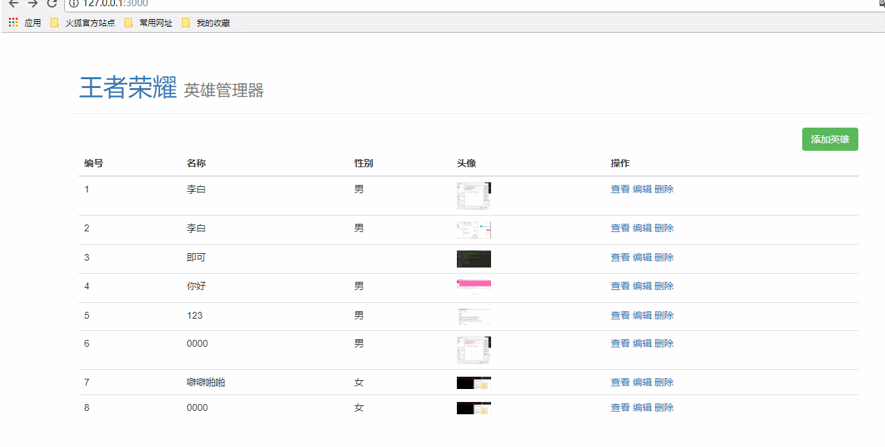

# 完成编辑信息界面功能

* [1.1-思路分析](#1.1)
* [1.2-根据思路代码实现功能](#1.2)
* [1.3-效果演示](#1.3)

## <h2 id=1.1>1.1-思路分析</h2>

* ***一：获取编辑界面***

* 1.客户端浏览器点击编辑按钮，向服务端发送请求
    * 客户端将`id`发送给服务端

* 2.服务端接收客户端请求参数，通过`id`查询到对象
    * (1) 路由模块`routerjs`分发请求到业务处理模块`handler.js`
    * (2) 业务处理模块`handler.js`通过请求req的id从数据模块`model.js`获取对象
    * (3) 数据模块`model.js`增加通过`id`查询对象功能

* 3.服务端将查询到的对象渲染到html模板返回给客户端
    * (1) 业务处理模块`handler.js`通过渲染模块`render.js`将对象数据渲染到html模板
    * (2) 业务处理模块`handler.js`返回客户端渲染好的html模板

* 4.客户端展示服务端响应返回的html文本

* ***二：提交编辑表单***

* 1.客户端提交表单数据

* 2.服务端接收表单数据

* 3.服务端完成数据更新
    * ***需要注意当用户只修改了文本数据，没有修改文件（图像）时应当如何处理？***

* 4.服务端返回给客户端数据更新结果


## <h2 id=1.2>1.2-根据思路代码实现功能</h2>

* ***1.heroEdit.html***

```html

<!DOCTYPE html>
<html lang="en">

<head>
  <meta charset="UTF-8">
  <title>Hero - Admin</title>

  <script src="/node_modules/jquery/dist/jquery.js"></script>
  <link rel="stylesheet" href="/node_modules/bootstrap/dist/css/bootstrap.css">
  <style>
    .hero-list img {
      width: 50px;
    }

  </style>
</head>

<body>
  <header>
    <div class="page-header container">
      <h1>王者荣耀 <small>英雄管理器</small></h1>
    </div>
  </header>
  <div class="container hero-list">
    <form id="form">
      <input type="hidden" name="id" value="{{ hero.id }}">
      <input type="hidden" name="origin_icon" value="{{ hero.icon }}">
      <div class="form-group">
        <label for="inputEmail3" class="col-sm-2 control-label">英雄名称</label>
        <div class="col-sm-10">
          <input type="text" name="name" class="form-control" id="inputEmail3" placeholder="Email" value="{{ hero.name }}">
        </div>
      </div>
      <div class="form-group">
        <label for="inputPassword3" class="col-sm-2 control-label">性别</label>
        <div class="col-sm-10">
          {{ if hero.gender === "男" }}
          <label class="radio-inline">
            <input type="radio" name="gender" checked id="inlineRadio1" value="男"> 男
          </label>
          <label class="radio-inline">
            <input type="radio" name="gender" id="inlineRadio2" value="女"> 女
          </label>
          {{ else }}
          <label class="radio-inline">
            <input type="radio" name="gender" id="inlineRadio1" value="男"> 男
          </label>
          <label class="radio-inline">
            <input type="radio" name="gender" checked id="inlineRadio2" value="女"> 女
          </label>
          {{ /if }}
        </div>
      </div>
      <div class="form-group">
        <label for="inputPassword3" class="col-sm-2 control-label">头像</label>
        <div class="col-sm-10">
          
          <input type="file" name="icon" id="exampleInputFile">
        </div>
      </div>
      <div class="form-group">
        <div class="col-sm-offset-2 col-sm-10">
          <button type="submit" class="btn btn-default">保存修改</button>
        </div>
      </div>
    </form>
  </div>
  
  <script>
    $('#form').on('submit', function (e) {
      //禁用表单默认事件
      e.preventDefault();
      //点击按钮获取表单数据
      var formData = new FormData($('#form')[0]);
      $.ajax({
        url: '/heroEdit',
        type: 'post',
        data: formData,
        processData: false, // 告诉 jQuery 不要去处理 data 数据
        contentType: false, // 默认 jQuery 把 Content-Type 设置成了 application/xxx 指定 false 就是不让它设置，使用 multipart/form-data
        dataType: 'json',
        success: function (data) {
          if (data.err_code === 0) {
            //返回列表界面
            window.location.href = '/';
          }
        }
      });
    });

  </script>
</body>

</html>

```

* ***2.路由模块`router.js`添加网络请求分发***

```javascript

else if (method === 'get' && pathname === '/heroEdit')
  {
    handler.getHeroEdit(req,res);
  }
  else if (method === 'post' && pathname === '/heroEdit')
  {
    handler.editHero(req,res);
  }

```

* ***3.`handler.js`模块处理业务逻辑***


```javascript


//8.通过id获取编辑界面
handler.getHeroEdit = function(req,res){

	//默认是字符串
	var id = req.query.id;
	console.log(typeof id);

	model.fetchHeroById(id,function(err,hero){

		if (err) {

			console.log('查询失败' + err);

			res.end(JSON.stringify({
				err_code : 500,
				message : err.message
			}));
		}
		else
		{
			console.log('查询成功' + hero);
			res.render('heroEdit',{
				hero : hero  //键值对，左边表示的是html模板中的占位字符，右边表示对象

			});
		}

	});

};

//9.修改表单数据


handler.editHero = function(req,res){

	/*****formidable获取表单数据 *****/
	//1.创建一个formidable对象
	var form = new formidable.IncomingForm();
	//2.配置文件的上传路径 （默认在系统临时文件，需要我们来制定将文件放入到哪一个路径）
	form.uploadDir = "./images/";
	//3.配置保持拓展名（默认为false去除了）
	form.keepExtensions = true;

	//4.开始解析表单数据
	/*第一个参数：req，客户端请求
	第二个参数：解析完成回调
		err：错误信息
		fields：表单中普通文本的json对象（无需我们去反序列化url，内部已经帮我们处理）
		files：表单中文件信息，包含文件大小、路径、时间等信息（默认情况下formidable会将我们的文件保存到操作系统的临时文件中,b并且将文件进行了改名和去除拓展名，目的是为了防止同名文件被覆盖）
	*/
	form.parse(req, function(err, fields, files) {
 	    console.log(fields);//普通数据json对象
	    console.log(files);//文件信息
	    
	     var dataObject = fields;
	     //设置对象的图片路径
	     dataObject.icon =  form.uploadDir + files.icon.name;
	     //去掉路径前面的 ./
	     dataObject.icon = dataObject.icon.substring(2);

	     //如果用户没有上传图片，则不修改文件名
	     if (files.icon.size === 0) {
	     	//删除空的临时文件
	     	fs.unlink(files.icon.path);
	     	//设置对象的图片为原始图片
	     	dataObject.icon = fields.origin_icon;
	     }
	     else{
	     	//将上传图片的临时文件改为真实文件名
	     	 fs.rename(files.icon.path, form.uploadDir + files.icon.name);
	     	 //删除之前的图片(此处会产生一个bug，加入其它英雄也是同样的图片则会被删除，实际开发中一般图片名会加上一个唯一的id标识)
	     	 //fs.unlink(fields.origin_icon);
	     }

	     //将id字符串改为int类型
	     dataObject.id = parseInt(dataObject.id);

	     //添加数据模块添加英雄数据
		model.updateHeroByHero(dataObject,function(err){
			if (err) {
				res.end(JSON.stringify({
					err_code : 500,
					message : err.message
				}));
			}
			else
			{
				res.end(JSON.stringify({
					err_code : 0
				}));
			}
		});

	});
	
};

```

* ***4.数据模块`model.js`添加修改数据API（函数）***

```javascript

//4.通过id来修改数据
model.updateHeroByHero = function(hero,callback){

	//1.取出所有数据
	getAllData(function(err,data){
		if(err){
			callback(err);
		}
		//通过下标获取id，这里-1是因为数据的下标从开始，数组的下标从0开始
		var index = parseInt(hero.id) - 1;
		//2.修改数组元素 index:从那个下标开始  1：删除1个元素  hero：在当前位置添加对象
		data.heros.splice(index,1,hero);

		//3.修改完成之后需要重新写入文件
		saveData(data,function(err){
			callback(err);
		});
	});  

};

```

## <h2 id=1.3>1.3-效果演示</h2>


