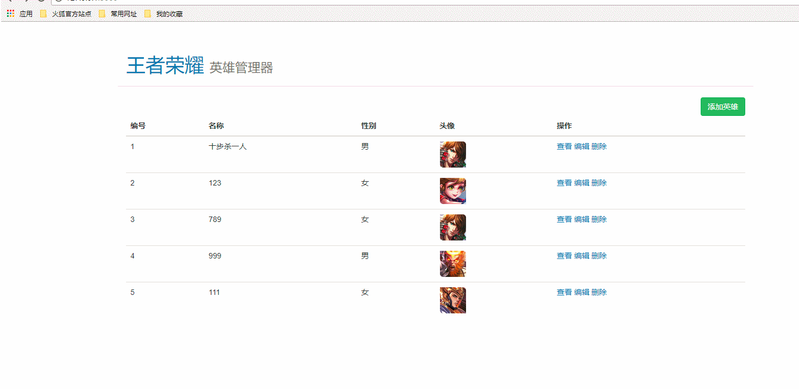

# 完成删除英雄功能

* [1.1-思路分析](#1.1)
* [1.2-根据思路代码实现功能](#1.2)
* [1.3-效果演示](#1.3)

## <h2 id=1.1>1.1-思路分析</h2>

* 思路分析
    * 1.客户端浏览器发起删除请求
        * 使用ajax的get请求
        * 传给服务端英雄id
    * 2.服务端接收请求，删除数据
        * 路由分发`router`、
        * 业务处理`handler`
        * 数据删除`model`
    * 3.服务端返回删除结果，客户端重新刷新界面
        * self.location.reload()
            * 类似于重新访问了`127.0.0.1/`这个地址(本质上还是服务端渲染)，可以减少服务端的逻辑处理

## <h2 id=1.2>1.2-根据思路代码实现功能</h2>

* ***heroList.html***

```html

<!DOCTYPE html>
<html lang="en">
<head>
	<meta charset="UTF-8">
	<!-- 导入jquery -->
	<script src="/node_modules/jquery/dist/jquery.js"></script>
	<!-- 导入bootstrap -->
	<link rel="stylesheet" href="/node_modules/bootstrap/dist/css/bootstrap.css">
	<script src="/node_modules/bootstrap/dist/js/bootstrap.js"></script>
	

	<!-- 图片宽高 -->
	<style>
    .hero-list img {
      width: 50px;
    }

  </style>

	<title>王者荣耀英雄管理器</title>
</head>
<body>
	<header>
		<div class="page-header container">
		  <h1><a href="/">王者荣耀</a> <small>英雄管理器</small></h1>
		</div>
	</header>
	<div class="container hero-list">
		<a class="btn btn-success pull-right" href="/heroAdd">添加英雄</a>
		<table class="table table-hover">
			<thead>
			<th>编号</th>
			<th>名称</th>
			<th>性别</th>
			<th>头像</th>
			<th>操作</th>
			</thead>
			<tbody>
				<!-- 模板引擎 -->
				{{ each heros }}
				<tr>
					<td>{{ $value.id }}</td>
					<td>{{ $value.name }}</td>
					<td>{{ $value.gender }}</td>
					<td></td>
					<td>
						<a href="/heroInfo?id= {{ $value.id }}">查看</a>
						<a href="/heroEdit?id= {{ $value.id }}">编辑</a>
						<a class="delet" href="/heroDelet?id= {{ $value.id }}">删除</a>
					</td>
				</tr>
				{{ /each heros }}
			</tbody>
		</table>
	</div>
	<script type="text/javascript">
		$('.delet').on('click',function(e){
			//1.禁用默认事件(无视a标签的href属性)
			e.preventDefault();
			//2.弹窗提示
			if(window.confirm('are you sure?')){
				//3.使用ajax发送请求
				$.ajax({
					url : $(this).attr('href'),//获取删除标签的href属性的值
					type : 'get',
					dataType : 'json',
					success : function(data){
						if(data.err_code == 0){
							//重新刷新当前界面，相当于重新执行了访问首页的请求(self是window的只读引用)
							self.location.reload();
						}
						else{
							alert(data.message);
							console.log(err);
						}
					}
				});
			}
		});
	</script>
	
</body>
</html>

```

* ***2.路由模块`router.js`添加网络请求分发***

```javascript

else if (method === 'get' && pathname === '/heroDelet') {
        //删除英雄
        handler.deletHero(req, res);
    }

```

* ***3.`handler.js`模块处理业务逻辑***

```javascript

//10 删除数据
handler.deletHero = function (req, res) {
    //1.获取get请求参数id
    var id = req.query.id;
    //2.删除数据
    model.deletHeroById(id, function (err) {
        if (err) {
            res.end(JSON.stringify({
                err_code: 500,
                message: err.message
            }));
        } else {
            res.end(JSON.stringify({
                err_code: 0
            }));
        }
    });
};

```

* ***4.数据模块`model.js`添加删除数据API（函数）***

```javascript

//5.通过id来删除数据
/**

 * @param {*} id 英雄id
 * @param {*} callback  function(err,data){};  data:删除之后，json文件中所有的数据
 */
model.deletHeroById = function (id, callback) {
    //1.取出所有数据
    getAllData(function (err, data) {
        if (err) {
            callback(err, data);
        }
        var heros = data.heros;
        //2.删除数据
        id = parseInt(id);
        //删除数据 (不能在循环内部去改变数组的元素数量，否则循环次数会有问题)
        heros.splice(id - 1, 1);
        //some循环：无需遍历数组中每一个对象，一旦找到想要的对象，返回true，循环立即终止
        //forEach循环：一旦开始不会停止
        //filter循环：也会遍历数组中所有对象，找到满足条件的对象
        heros.forEach(function (hero) {
            // Todo...
            console.log(hero.name + hero.id);
            //将删除的数据后面的数据id提前
            if (hero.id > id) {
                hero.id = hero.id - 1;
            }
        });
        //注意：并不是所有的服务端数据的id都是有序的，有的是随机生成的id，这种方式的话只能使用遍历方式来找出对象
        //将url参数中的字符串转成int类型，这里-1是因为数据的下标从开始，数组的下标从0开始
        // var index = parseInt(id) -1;
        // heros.splice(index,1);
        //3.修改完成之后需要重新写入文件
        saveData(data, function (err) {
            callback(err, data);
        });
    });
};

```

## <h2 id=1.3>1.3-效果演示</h2>


