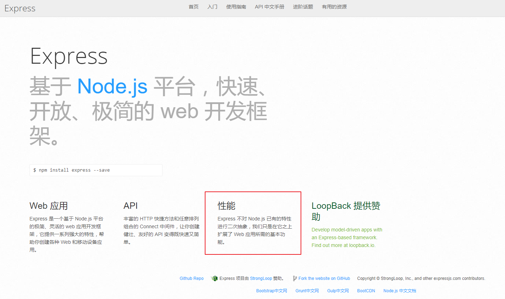

# Express框架介绍

* Express是NodeJS开发中一个非常重量级的第三方框架，它对于NodeJS服务端就相当于Jquery对于HTML客户端。
    * ***如果连Express都不会用，基本上都不好意思跟别人说你会NodeJS***

## Express介绍

* Express官网：<http://www.expressjs.com.cn/>,<http://expressjs.com/>
    * ***一般我们学习一个新的技术，都是去官网文档查看它的API，然后多多尝试，熟能生巧***
* Express的github地址:<https://github.com/expressjs/express>
    * Express的原作者TJ在node社区非常的有名，他写过200多个框架，目前他已经将Express交给了朋友维护，宣布不再维护NodeJS框架，转向Go语言<https://github.com/tj>

* Express官网是这样介绍自己的:基于 Node.js 平台，快速、开放、极简的 web 开发框架。
    * ***Express一个非常重要的亮点就是它没有改变nodejs已有的特性，而是在它的基础上进行了拓展***
        * ***也就是说，使用Express你既可以使用nodejs原生的任何API，也能使用Express的API***



## Express的四大特性

* 1.中间件。Express有一个中间件栈，这是一个高效的函数数组
    * 这是Express最强大之处，我们将会在后期学习数据库时见识它的魅力
        * 可以通过这篇博客简单了解下express特性:<http://blog.csdn.net/weixin_37610328/article/details/70174542>
        * ***重点（暂时只需有个印象）：一个Express应用本质上就是调用各种中间件***
* 2.路由。类似中间件，但只有当使用特定的HTTP方法访问一个指定的URL时，该函数才被调用。
    * Express自带路由功能，让Node服务端开发变得极其简单
* 3.扩展(extensions)。Express扩展了request和response对象，向这些对象增加了新的方法和属性，以利用开发。
    * Express在响应客户端时，我们无需设置响应头也能支持中文
    * Express支持链式语法，让你的代码变得更加的优美简洁
* 4.视图(views)。使用视图，可以动态地渲染HTML。
    * Express支持对模板引擎的配置，一旦配置好你的模板引擎，只需两三行代码，就能够自动渲染`Views`文件夹下的模板文件

## Express基本使用

* 1.使用npm安装express:`npm install express`

```javascript

//1.导入express模块

var express = require('express');

//2.创建服务器
//express()相当于http模块的http.cirateService(),返回的就是服务器实例对象 app相当于之前的service
var app = express();

//3.处理网络请求  当请求路径为'/'，请求方式为'get'时会调用该方法
/**（1）express最大的特点就是自带路由功能，我们无需在service.on()方法中处理所有请求
（2）在express中，每一个请求都可以是一个单独的方法
*/
app.get('/',function(req,res){

	//服务器响应  send方法相当于服务器响应客户端end方法
	//使用send方法我们无需担心中文乱码问题，因为内部帮我们设置了响应头
	res.send('欢迎来到黑马程序员');

	//上面那行代码相当于以下代码
	// res.writeHead(200,{
	// 	'Content-Type':'text/html;charset=utf-8'
	// });

	// res.end('欢迎来到黑马程序员');

});


//4.服务器监听网络端口号

app.listen(3000,function(){

	console.log('服务器启动成功');
});

```