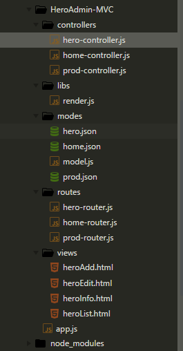
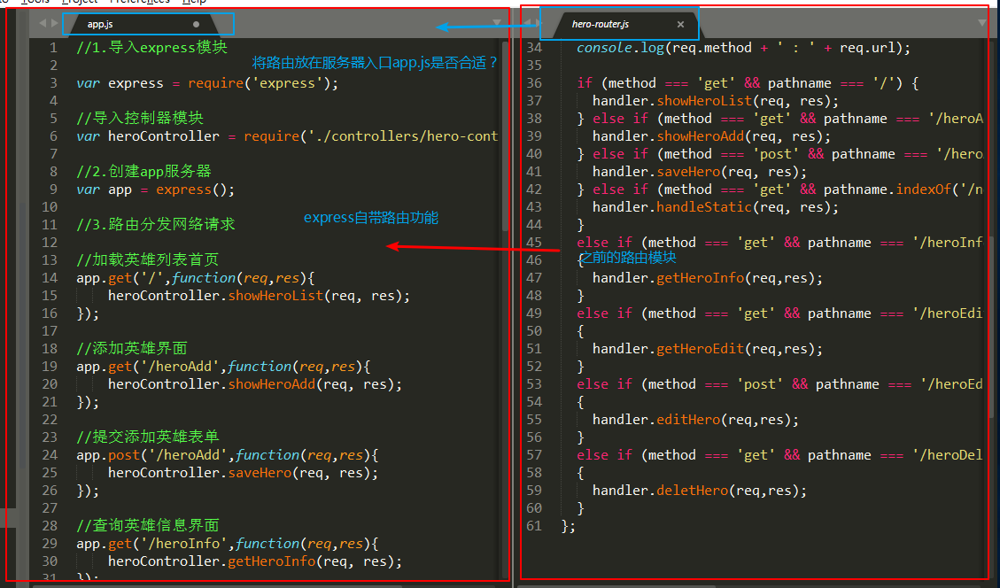
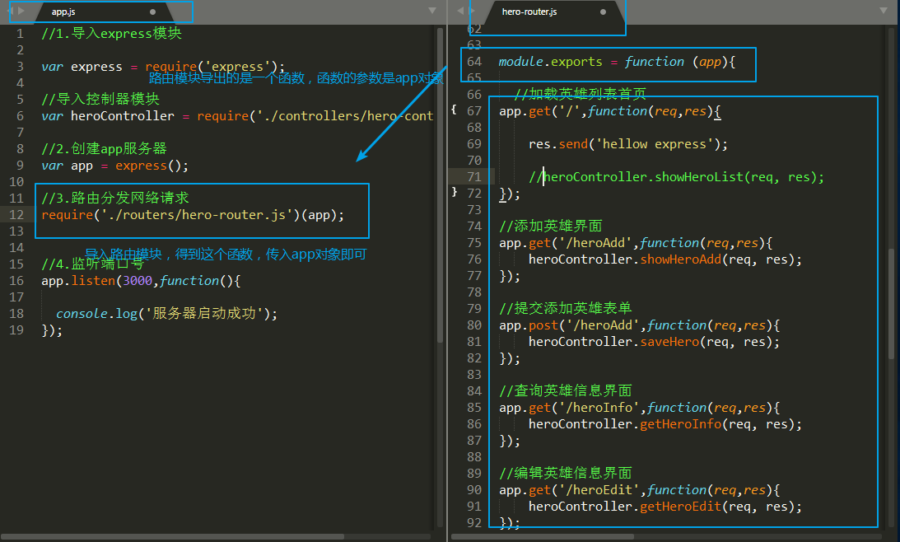
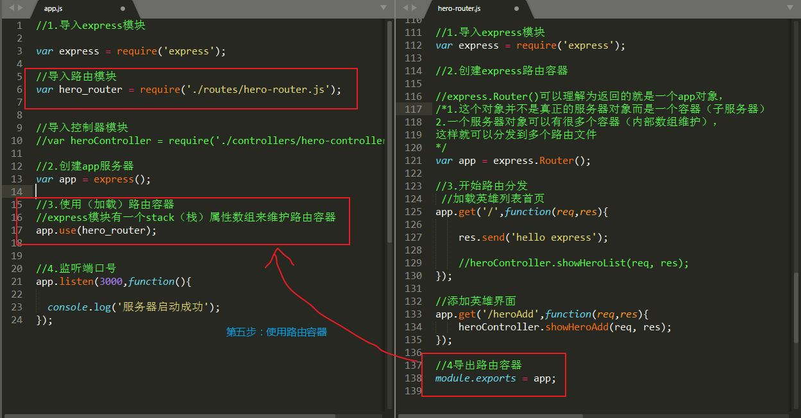
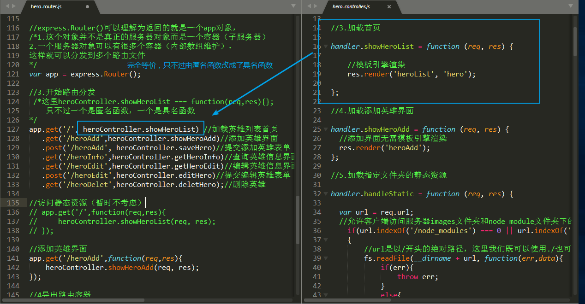

# 使用Express重构项目案例

* ***本小节我们通过使用`Express`来重构我们的项目案例综合学习`Express`在实际项目中的用法以及了解`Express`的强大之处***

* [1.1-使用MVC设计模式重构项目目录](#1.1)
* [1.2-Express自带路由功能](#1.2)
* [1.3-Express实现路由分发](#1.3)
* [1.4-Express路由容器用法](#1.4)
* [1.5-Express的链式语法](#1.5)
* [1.6-Express访问静态资源](#1.6)
* [1.7-完整代码](#1.7)

## <h2 id=1.1>1.1-使用MVC设计模式重构项目目录</h2>

* HeroAdmin-MVC
    * app.js:服务器入口，负责监听网络ip和端口号
    * Controllers文件夹：负责根据不同请求处理不同业务逻辑，类似于我们的handler
        * hero-controller.js:实际开发中，会有很多的网页上百个网络请求，我们不可能在一个文件处理所有的请求，往往是不同的功能划分到不同的文件，这样便于维护
    * Views文件夹：html模板
        * heroList：首页英雄列表
        * heroAdd：添加英雄界面
        * heroInfo：查询英雄信息界面
        * heroEdit：编辑英雄信息界面
    * routes文件夹：路由文件夹
        * 实际开发中一个网站会有很多个网络请求，如果只在一个`router.js`文件中分发所有的请求，代码将会变得臃肿，和controllers文件夹一样，不同的功能放到不同的路由分发
    * modes：数据文件夹
        * model.js:封装数据处理模块
        * model.json:数据存放json文件
    * libs：工具类文件夹（通常工具类主要是辅助控制器完成职责）
        * render.js:服务端模板引擎渲染



## <h2 id=1.2>1.2-Express自带路由功能</h2>

* 之前的项目：我们有专门的路由模块来负责分发网络请求，app.js只负责将网络请求交给路由模块分发
* 使用Express：app.js模块就可以完成路由的分发



## <h2 id=1.3>1.3-Express实现路由分发</h2>

* 如何将Express自带的路由功能分发到项目的路由`router.js`模块呢？
    * Express自带的路由功能指的是服务器`app`获取的每一个请求都是一个单独的方法
    * 我们只需要将`app`这个对象作为参数传入我们的路由模块`router.js`即可
        * 路由模块导出的是一个函数，这个函数的参数是`app`服务器
        * 在`app.js`中导入路由模块得到函数，然后将`app`传入该函数即可



## <h2 id=1.4>1.4-Express路由容器用法</h2>

* ***Express模块提供了一种能让代码更为优雅的方式来实现路由分发的功能，这就是express模块的路由容器`Router`属性***

* 使用步骤
    * 1.在路由文件中导入`express`
    * 2.创建路由容器`var subApp = express.Router()`
        * 此时相当于app获取了`express()`的引用，并且`express()`将app添加到了数组
            * express()：相当于服务器app
            * 可以理解为`express.Router()`函数返回的是一个子app，subApp
				* 实际上这是一个中间件
    * 3.在路由文件中实现路由分发
        * 此时路由文件中的`subApp`就相当于服务器入口文件`app.js`中的`app`
    * 4.在路由模块中导出subApp:`module.exports = subApp`
    * 5.在服务器入口文件`app.js`中导入路由文件
    * 6.express加载路由容器:app.use()



## <h2 id=1.5>1.5-Express的链式语法</h2>

* ***通过Express的链式语法的支持，我们的代码将会变得具有艺术观赏性***



## <h2 id=1.6>1.6-Express访问静态资源</h2>

* ***express有一个托管服务端静态资源的方法`express.static()`,该方法的参数则是想要托管的姿态资源文件夹路径***、
    * ***静态资源托管表示如果客户端浏览器访问的是该文件夹下的资源，则express会自动帮你读取文件返回，我们无需编写任何代码***

```javascript

// 使用 Express 内置的功能开放静态资源

//第一个参数：表示客户端的虚拟路径（浏览器映射路径：可以随便定义浏览器的网址路径，如果不写则默认为真实路径） 
//如果设置为：app.use('/a', express.static( '../node_modules')) 则客户端浏览器对应的路径为：http://127.0.0.1:3000/a/bootstrap/dist/css/bootstrap.css
//  第二个参数：表示服务端的文件路径  (这里我使用的是相对路径，最好使用绝对路径)
app.use('/node_modules', express.static( '../node_modules'));
app.use('/images', express.static('./images'));

```

## <h2 id=1.7>1.7-完整代码</h2>

* ***html文件中代码完全不变***

* ***其他文件代码，除了注意express框架的用法之外，还需要注意项目目录的变化对读取文件路径的影响***

* ***app.js文件（应用程序入口）***
    * 1.express路由容器使用
    * 2.express拓宽静态文件使用

```javascript

//1.导入express模块

var express = require('express');

//导入路由模块
var hero_router = require('./routes/hero-router.js');


//导入控制器模块
//var heroController = require('./controllers/hero-controller.js');

//2.创建app服务器
var app = express();

// 使用 Express 内置的功能开放静态资源

//第一个参数：表示客户端的虚拟路径（浏览器映射路径：可以随便定义浏览器的网址路径，如果不写则默认为真实路径） 
//如果设置为：app.use('/a', express.static( '../node_modules')) 则客户端浏览器对应的路径为：http://127.0.0.1:3000/a/bootstrap/dist/css/bootstrap.css
//  第二个参数：表示服务端的文件路径  
app.use('/node_modules', express.static( '../node_modules'));
app.use('/images', express.static('./images'));

//3.使用（加载）路由容器
//express模块有一个stack（栈堆）属性数组来维护路由容器
app.use(hero_router);


//4.监听端口号
app.listen(3000,function(){

	console.log('服务器启动成功');
});

```

* ***hero-router.js文件（路由文件）***
    * 1.express路由容器使用
    * 2.express链式语法使用
    * 3.将匿名函数替换成具名函数使代码更加简洁直观

```javascript


//1.导入express模块
var express = require('express');

var heroController = require('../controllers/hero-controller.js');

//2.创建express路由容器

//express.Router()可以理解为返回的就是一个app对象，
/*1.这个对象并不是真正的服务器对象而是一个容器（子服务器）
2.一个服务器对象可以有很多个容器（内部数组维护），
这样就可以分发到多个路由文件
*/
var app = express.Router();

//3.开始路由分发
 /*这里heroController.showHeroList === function(req,res){};
	只不过一个是匿名函数，一个是具名函数
*/
app.get('/', heroController.showHeroList) //加载英雄列表首页
   .get('/heroAdd',heroController.showHeroAdd)//添加英雄界面
   .post('/heroAdd', heroController.saveHero)//提交添加英雄表单
   .get('/heroInfo',heroController.getHeroInfo)//查询英雄信息界面
   .get('/heroEdit',heroController.getHeroEdit)//编辑英雄信息界面
   .post('/heroEdit',heroController.editHero)//提交编辑英雄表单
   .get('/heroDelet',heroController.deletHero);//删除英雄
//4导出路由容器
module.exports = app;

```

* ***hero-controller.js文件（控制器：业务处理）***
    * ***主要变化是文件路径的变化以及我们需要在函数中单独调用`render(res)`网络请求动态添加模板引擎渲染函数***

* ***model.js文件（维护模型数据）***
    * ***只有文件路径改变，其他代码不变***


