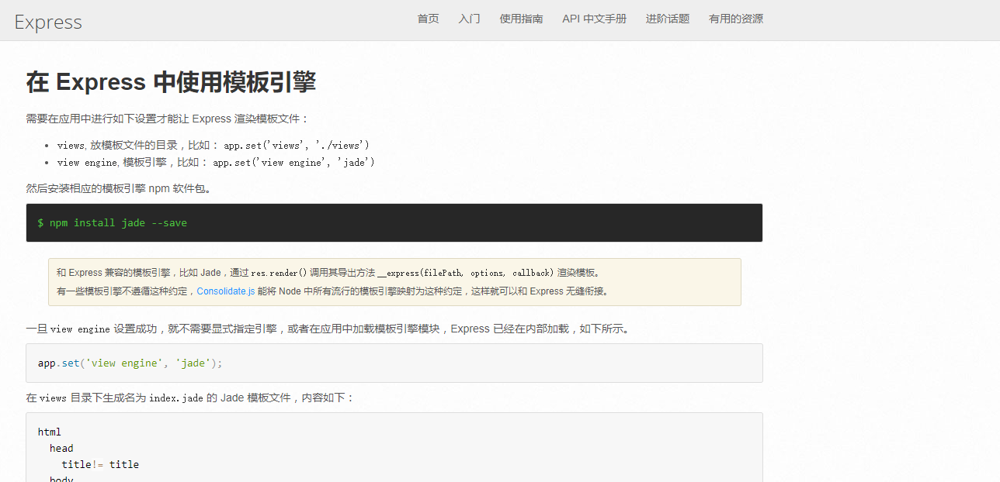
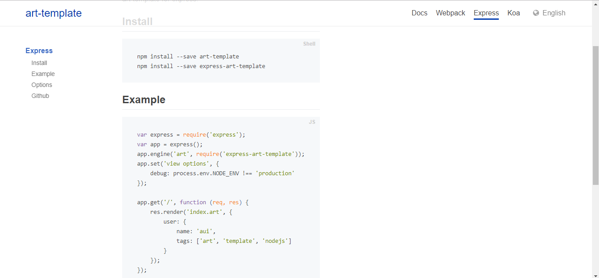

# Express使用模板引擎

* ***Express中没有属于自己默认的模板引擎，要想在express中使用模板引擎，需要我们单独配置***
    * 实际上在上一小节中，我们没有配置express的模板引擎，仍旧使用之前的`art-template`也是可行的，只是需要在每一个路由方法中都调用`render(req)`比较麻烦而已
    * express本质上只不过是帮我们去维护第三方模板引擎而已，我们将第三方模板引擎加载到express之后就无需再导入第三方模板引擎模块了

* ***本小节我们主要来学习一下如何在express中配置使用模板引擎***
    * express模板引擎配置官方文档:http://www.expressjs.com.cn/guide/using-template-engines.html



* ***并不是所有的模板引擎都支持express，所有支持express的模板引擎的配置方法也不一定是完全一样的，具体的如何配置我们需要查看模板引擎的官方文档***

* [1.1-express配置art-template](#1.1)
* [1.2-express使用模板引擎](#1.2)

## <h2 id=1.1>1.1-express配置art-template</h2>

* ***目前nodejs开发中比较流行的模板引擎一般都支持express，当然也包括我们在课堂上所学习的art-template***
    * art-template官网文档地址：<https://aui.github.io/art-template/>
    * art-template官方配置express地址:<https://aui.github.io/art-template/express/>

* ***express配置模板引擎可以制定模板文件的后缀名（我们之前都是html文件）***
    * （1）模板文件数据本质上是一个字符串，所以叫什么文件名都可以
    * （2）之所以可以自定义文件名，主要可以区分哪些文件需要模板引擎渲染，哪些不需要模板引擎渲染
    * （3）某些特定后缀的文件名，有的编辑器可以对模板语法进行高亮显示



```javascript

//3.express配置art-template模板引擎
//官网代码copy
/**
//第一个参数：模板文件的后缀名   第二个参数：express-art-template模板引擎模块
app.engine('art', require('express-art-template'));
//第一个参数:视图配置  engine表示模板引擎  第二个参数：必须要与app.engine（）的第一个参数一致
app.set('view options', {
    debug: process.env.NODE_ENV !== 'production'
});
*/

//1.配置模板引擎
//第一个参数：模板文件的后缀名   第二个参数：express-art-template模板引擎模块
/**文件后缀名可以随便写，但是一定要与模板的文件后缀名一致，否则无法加载模板
（1）模板文件数据本质上是一个字符串，所以叫什么文件名都可以
（2）之所以可以自定义文件名，主要可以区分哪些文件需要模板引擎渲染，哪些不需要模板引擎渲染
*/
app.engine('html', require('express-art-template'));

//2.加载模板引擎配置
//第一个参数:视图配置  engine表示模板引擎  第二个参数：必须要与app.engine（）的第一个参数一致
app.set('view engine','html');

```

## <h2 id=1.2>1.2-express使用模板引擎</h2>

* ***注意***
    * 1.res.render为express自动配置的渲染方法，不是我们之前封装的render，它的第二个参数是模板数据而不是模板文件名
        * 从这里可以看到我们之前的封装思想与知名的第三方是一致的
    * ***2.模板文件只能存放在`views`文件夹下，否则会找不到模板文件***
        * ***views文件夹可以创建多个子文件夹，如果模板是放在子文件夹下，则在调用`res.render()`渲染时需要加上子文件夹的路径才能被正确加载***


```javascript

//3.加载首页

handler.showHeroList = function (req, res) {
    //模板引擎渲染(model.js需要将读取所有数据的API导出)
    model.getAllData(function(err,data){
    	//第一个参数：模板文件名   第二个参数：数据
    	 res.render('heroList', data);
    });
};

```