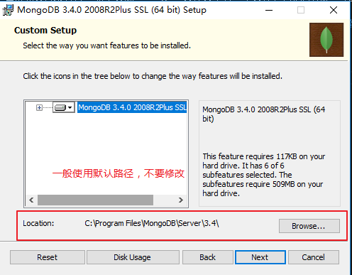
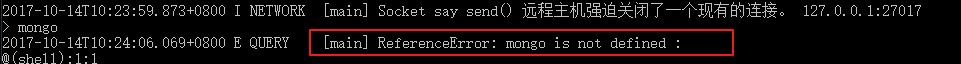
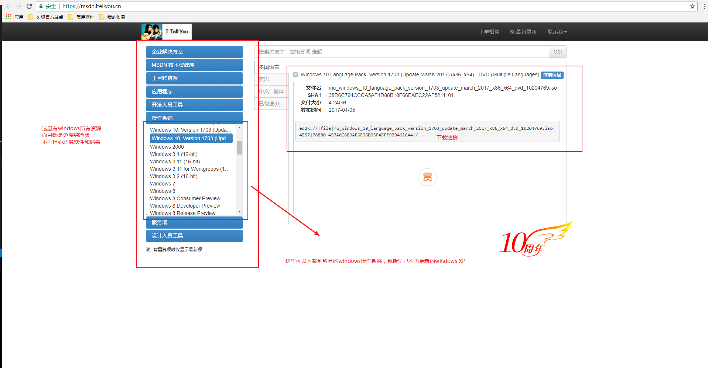

# MongoDB数据库环境搭建

* [1.1-MongoDB数据库环境安装](#1.1)
* [1.2-启动及连接数据库](#1.3)
* [1.3-32位系统报错解决方案](#1.4)
* [1.4-mongodb文件夹可执行文件作用介绍](#1.5)

## <h2 id=1.1>1.1-MongoDB数据库环境安装</h2>

* 在备课资料第五天->教学资源->mongodb文件夹中有三个文件，它们分别是32位操作系统安装包、64位操作系统安装包、windows系统补充插件
    * ***1.也可以去官网下载最新版本（需要注册）***
    * ***2.mongodb已经停止了32位操作系统的更新，32位与64位差别不大，这并不影响我们学习使用***

* 1.根据自己的电脑系统架构安装安装包
    * 选择快速安装和自定义安装都可以，选择自定义安装主要是查看mongodb默认安装路径，一般在C盘的profime文件夹下，不建议大家修改

* 2.在终端执行命令`mongod`查看是否安装完成
    * ***注意，这里是`mongod`，没有`b`***

* ***出现以下情况则表示未安装好***

* 3.进入`momgodb`查看安装包:C:\Program Files\MongoDB\Server\3.4\bin
    * ***大家可以发现该目录下有非常多的可执行exe文件，其中最重要的主要是两个`mongo.exe`和`mongod.exe`***
        * mongod.exe:开启这台计算机的数据库服务
            * 可以理解为数据库是一个单独的服务器，这个文件作用是开启服务器
        * mongo.exe:启动数据库服务
            * 这个文件作用是连接数据库，可以理解为连接服务器

* ***其他文件作用可以参考本小节末尾`mongodb文件夹可执行文件作用介绍`***
    * ***一般用不上，不用去记，有个印象即可***

## <h2 id=1.3>1.2-启动及连接数据库</h2>

* ***<h3>启动数据库</h3>***

* ***1.cd到mongodb安装路径`C:\Program Files\MongoDB\Server\3.4\bin`，再一次打开终端输入`mongod`***
    * `mongod --version`可以查看当前mongodb数据库版本

* ***如果出现以下提示，则表示启动数据库错误` MongoDB starting : pid=10772 port=27017 dbpath=C:\data\db\ 64-bit host=DESKTOP-ILJSSDC`***
    * 报错原因：默认情况下，开启mongodb数据库会在你的当前启动命令所在盘符（这里是C盘）寻找`data`文件夹下的`db`文件夹，如果没有则会报错

* ***解决方案：手动在C盘下创建`data\db`文件夹***

* ***当然，我们也可以随便指定自己的路径，不过一般不建议这么做，有点吃饱了撑着没事干的感觉***
    * ***如果想要开启指定的文件夹则需要使用终端命令:`mongod --dbpath [文件夹绝对路径]`***
        * 32位使用这个命令:`mongod --dbpath [文件夹绝对路径] --journal --storageEngine=mmapv1`
            * 如果不加 --dbpath, mongod 会自动使用 执行命令所属磁盘根目录/data/db 目录作为自己的数据存储路径，所以，如果当前磁盘已经有了 磁盘根路径\data\db 目录了，可以省略 --dbpath。

* ***2.再一次使用终端命令`mongod`启动数据库，当出现等待连接27107的端口时，表示此时数据库服务开启成功`waiting for connections on port 27017`***

* ***</3>连接数据库</h3>***

* ***1.当数据库服务开启之后，我们可以通过终端命令`mongo`来连接数据库***
    * ***一定要确保数据库服务是开启状态***
    * 实际上mongo命令是这行命令的简写：mongo --host 127.0.0.1 --port 27017

* ***2.如果没有开启`mongod`数据库服务，直接使用命令`mongo`连接数据库是会报错的***
    * ***`nongod`开启的那个终端面板不能关闭，只能最小化***

* ***</4>连接数据库</h3>***

* 与NodeJS一样使用`ctrl + c`命令关闭数据库

## <h2 id=1.4>1.3-32位系统报错解决方案</h2>

* ***一般windows8以上没有什么，win7版本下某一个版本之前会丢失一个补丁导致无法安装，如果出现该报错则安装课程资料中的`redist.x64.exe`即可***

* ***如果安装之后还报错，说明你的电脑系统版本实在过低，建议升级一下电脑系统，这里本人提供一个非常好用的网址***
    * 我告诉你:<https://msdn.itellyou.cn/>
        * 可下载windows所有资源：系统（所有的版本，包含不更新的XP）、应用程序、工具资源等
        * 均为免费纯净版，不用担心恶意软件和病毒

## <h2 id=1.5>1.4-mongodb文件夹可执行文件作用介绍</h2>

* bsondump.exe
    * 用于将导出的BSON文件格式转换为JSON格式mongo.exe mongoDB的客户端

* mongod.exe
    * 用于启动mongoDB的Server

* mongodump.exe
    * 用于从mongodb数据库中导出BSON格式的文件，类似于mysql的dump工具mysqldump

* mongoexport.exe
    * 用于将mongodb中的数据库，导出为JSON,CSV或TSV的格式。
    * 使用示例：mongoexport --host mongodb1.example.net --port 37017 --username user --password pass --collection contacts

* mongofiles.exe
    * 用于和mongoDB的GridFS文件系统交互的命令，并可操作其中的文件，它提供了我们本地系统与GridFS文件系统之间的存储对象接口。
    * 使用示例：mongofiles --hostname db1.example.net --port 37017 -d records list

* mongoimport.exe 用于将JSON,CSV或TSV等文件格式，导入到mongoDB数据库中。
    * 使用示例：mongoimport --db users --collection contacts --type csv --file /opt/backups/contacts.csv

* mongooplog.exe
    * 用于从运行的mongod服务中拷贝运行日志到指定的服务器，主要用于增量备份。
    * 使用示例：mongooplog --from mongodb0.example.net --host mongodb1.example.net，备份还可以参看一下这篇BLOG：https://www.ttlsa.com/html/2052.html

* mongoperf.exe 用于独立检查mongoDB的I/O性能的工具。
    * 使用示例：mongoperf.exe < testPrefJson.txt （注：testPrefJson.txt存放测试的参数，以json格式，如：{nThreads:16,fileSizeMB:1000,r:true}，更多参数参看该命令的帮助），在linux上配置iostat命令观察写入的效果

* mongorestore.exe
    * 用于恢复导出的BSON文件到mongodb数据库中

* mongos.exe
    * 用于注册系统处理

* mongostat.exe
    * 当前mongod状态监控工具，像linux中监控linux的vmstat

* mongotop.exe
    * 提供了一个跟踪mongod数据库花费在读写数据的时间，为每个collection都会记录，默认记录时间是按秒记录。

* mongosniff (linux及unix有此工具)用于监控连接到mongodb的TCP/IP连接，类似于tcpdump。应用可以查看这篇BLOG：https://blog.nosqlfan.com/html/521.html

