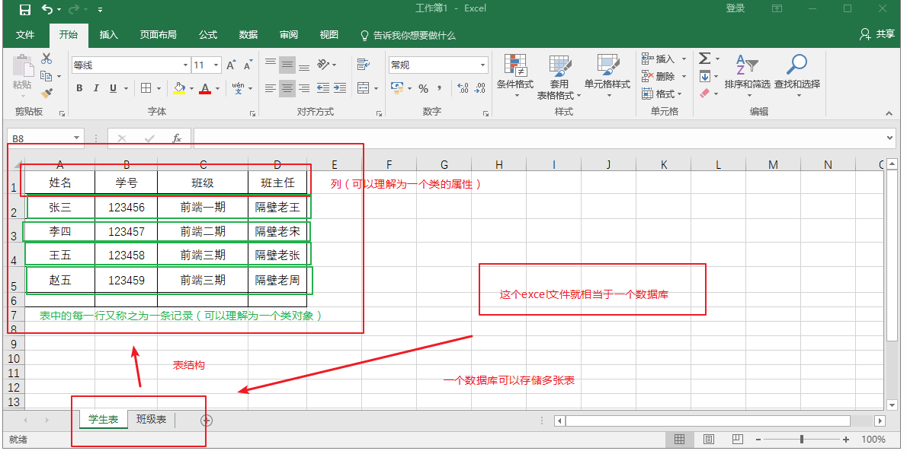
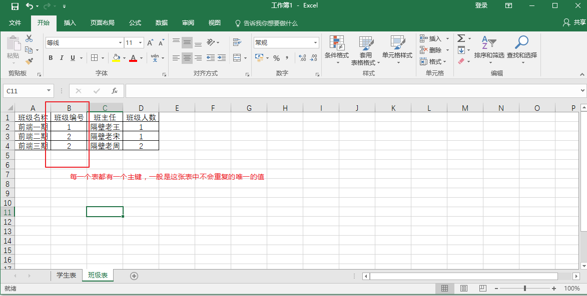
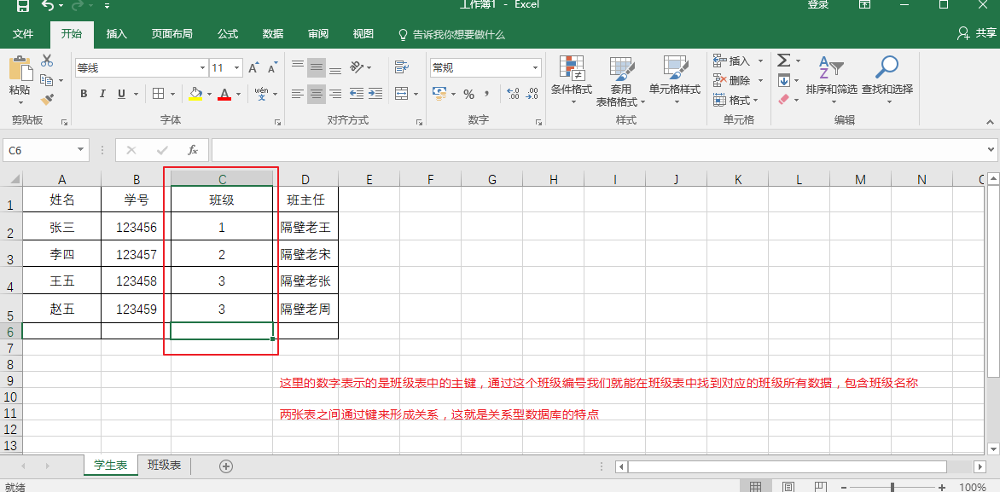
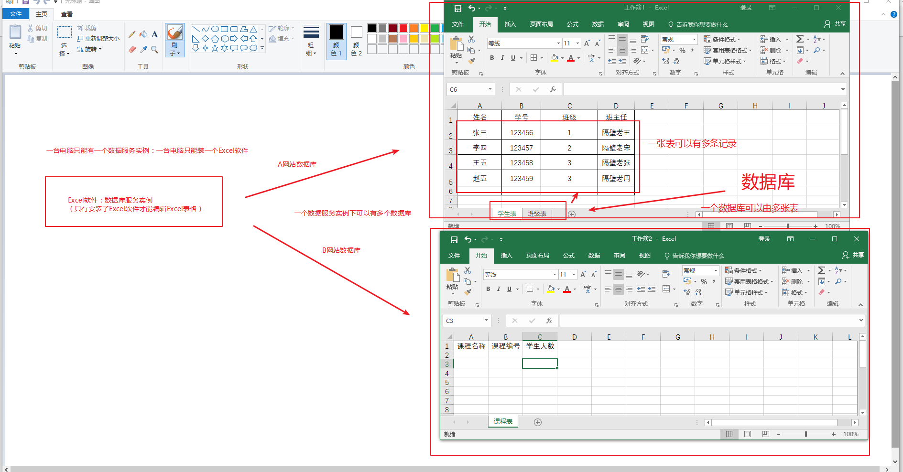

# MongoDB数据存储结构介绍

* [1.1-传统关系型数据库存储结构](#1.1)
* [1.2-MongoDB数据存储结构](#1.2)

## <h2 id=1.1>1.1-传统关系型数据库存储结构</h2>

- 传统的关系型数据库中存储结构
  - 一个机器上安装数据库其实就是安装了一个数据服务实例
  - 一个数据服务实例上可以有多个数据库
    - a 网站的用户
    - b 网站的用户
    - a 网站的用户表、b 网站的用户表
  - 一个数据库中可以有多张表
  - 一张表中可以存储多条记录数据
- 数据服务实例 -> 数据库 -> 表 -> 记录


* 关系型数据库存储结构通常称为二维表格形式
    * ***我们最常见的`excel`表格的数据格式其实就是关系型数据库结构***

* 例如：这里有一个excel文件，实际上这个文件就相当于一个数据库
    * 数据库(database)
        * 两张表(table)
            * 学生表
                * 四个列（column）
                    * 四条记录
            * 班级表
                * 四个列
                    * 三条记录



* 关系型数据库是如何建立关联的，主要是通过主键（primy key）
    * 主键由设计表的人来绝对，通常是这张表中不会重复的具有唯一性的值



* 一旦确定了主键，当其他表中用到了该表中的某一个列数据的时候，我们只需要用主键来表示即可
    * 利用键来让两张或多张表形成一定的关系，这就是关系型数据库的特点




* 通过以上对于关系型数据库二维表格形式存储结构的了解，我们再通过下面这张图来了解一下数据服务（mongod）与数据库（mongo）之间的关系



## <h2 id=1.2>1.2-MongoDB数据存储结构</h2>

* ***非关系型数据库和关系型数据库的存储结构基本一致，只不过是同样的东西叫法不一样而已***

- 在一个数据服务中可以有多个数据库
    - 在一个数据库中可以有多个集合
        - 在 MongoDB 中，把表称之为集合(集合简单理解就是一个数组)
            - 在一个集合中可以有多个对象（json）（在mongodb 中称之为文档）,是一个特殊的 json 对象
                - 称之为 bson(JSON的轻量化二进制格式)


* ***下方这个json相当于mongodb的存储结构***
    * a、b:相当于数据库
        * users、articles：集合（集合实际上就是一个数组，相当于关系型中的表格table）
            * 一个集合的每一个json对象就是一个文档（相当于关系型中表格的记录）
```json

{
  a: { 
    users: [
      { username: 'xxx', password: 'xxx', age: 'xxx', gender: 'xx' },
      { username: 'xxx', password: 'xxx', age: 'xxx', gender: 'xx' }
      { username: 'xxx', password: 'xxx', age: 'xxx', gender: 'xx' }
      { username: 'xxx', password: 'xxx', age: 'xxx', gender: 'xx' }
      ...
    ],
    articles: [
      { title: 'xxx', content: '', time: '' },
      { title: 'xxx', content: '', time: '' },
      { title: 'xxx', content: '', time: '' },
      { title: 'xxx', content: '', time: '' },
      { title: 'xxx', content: '', time: '' },
      ...
    ]
  },
  b: { 
    users: [
      { username: 'xxx', password: 'xxx', age: 'xxx', gender: 'xx' },
      { username: 'xxx', password: 'xxx', age: 'xxx', gender: 'xx' }
      { username: 'xxx', password: 'xxx', age: 'xxx', gender: 'xx' }
      { username: 'xxx', password: 'xxx', age: 'xxx', gender: 'xx' }
      ...
    ],
  },
  c: {  }
}

```

```json

a 数据库
   用户数据：用户集合[]
   文章数据：文章集合[]
   评论数据：评论集合[]
   商品数据：商品集合[]
   订单数据：订单集合[]

b 数据库

c 数据库

```

