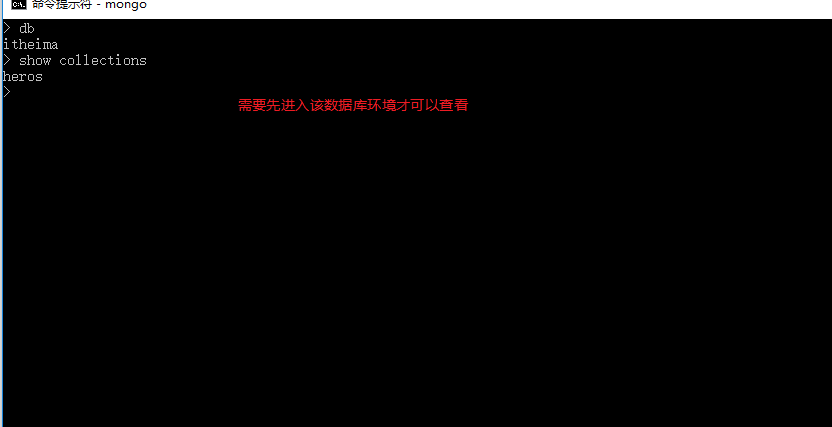

# 终端演示数据库增删改查

* 增删改查具体操作可以通过这个网站查询到，比较详细:<http://www.yiibai.com/mongodb/mongodb_quick_guide.html>

* [1.1-mongodb常用命令](#1.1)
* [1.2-增删改查命令行演示](#1.2)

## <h2 id=1.1>1.1-mongodb常用命令</h2>

- `show dbs`
  - 查看当前服务实例上所有的数据库
- `use [数据库名称]`
  - 这个命令表示切换到指定的数据库(可以理解为创建数据库，但不是真正的创建)
    * mongodb操作数据库是一个动态的过程，该命令表示切换到该数据库下工作，只有往数据库中真正的插入一条数据，mongodb才会真正创建并且保存这个数据库
  - 如果没有，也不会创建
  - 如果已经有了，则表示切换到这个数据库对该数据库进行操作
  - 连接到数据库之后，默认有一个变量叫做：db，终端默认把 db 赋值给了 test
- `db`
  - 查看当前所处的数据库
- `db.集合名称.insert(数据文档)`
- `show collections`
  - 查看当前数据库中所有的集合
- `db.集合名称.find()`
  - 查询指定集合中所有的数据
  - 可以通过 db.集合名称.find().pretty() 美化输出格式
  - 默认是查询所有，可以通过：db.集合名称.find({查询条件}) 按条件查询集合中的数据
- `db.集合名称.update({更新条件}, {要更新的字段})`
    * 如果没有指定更新条件（某一个字段属性），则表示将整个对象数据进行更新替换
    - 更新指定集合数据
- `db.集合名称.remove({删除条件})`
  - 删除指定集合中的数据
- `db.[集合名称].drop()`
    * 删除整个集合中所有数据
- `db.dropDatabase()`
    * 删除当前所在的数据库（慎用）

## <h2 id=1.2>1.2-增删改查命令行演示</h2>

* ***首先要确保mongodb数据服务是开启状态，否则无法连接数据库***
    * `mongodb`终端开启之后不要关闭，最小化

* 0.连接数据库服务
    * `mongo`

* 1.查看当前所有数据库
    * mongodb默认有两个数据库`admin`和`local`，我们一般不使用

* 2.创建数据库
    * 终端命令:`use [数据库名称]`
    * 当我们使用`use [数据库名称]`，实际上只是帮我们动态创建了一个数据库环境，如果我们没有往该数据库插入数据的话，该数据库不会被保存，终端一旦关闭，数据库就没有了

* 3.创建集合（相当于创建表格）
    * 创建集合与创建数据库一样也是动态过程，所以我们需要往表格中插入一条数据，表格才会生效
    * 终端命令:`db.[集合名称].insert([json格式数据对象])`，例如：db.heros.insert({'name':'李白','gender':'男','age':18})
        * 键的单引号可以省略
        * 多条数据使用中括号包裹`[{},{}]`
        * 为什么这里是db.[集合名称],而不是[数据库名称].[集合名称]呢？主要是因为当我们`user [数据库名称]`切换到该数据库下之后，db表示的就是该数据库

* 4.查看当前数据库所有集合(相当于查看某数据库中有几个表)
    * 终端命令:`show collections`

* 5.查询数据
    * 终端命令:`db.集合名称.find({查询条件})`
        * 美化输出命令:`db.集合名称.find().pretty()`

* 6.条件查询演示
    * 类似于angular中的fillter过滤器
    * `db.heros.find({name:李白})`
        * 更多条件查询可以参考这篇文章:<http://www.cnblogs.com/stephen-liu74/archive/2012/08/03/2553803.html>

* 7.更新数据（修改数据）
    * 终端命令:`db.集合名称.update({更新条件}, {要更新的字段})`
        * ***通过前面的更新条件找到该条数据，然后使用后面的字段完全替换***

* ***如果想要只更新某一个属性的值，其他属性值不变，我们可以使用`$set`属性来找到具体想要修改的属性***

* 8.删除数据
    * 终端语句:`db.集合名称.remove({删除条件})`

* 9.删除集合
    * 终端语句:`db.[集合名称].drop()`
        * 会以bool值的形式告诉你是否删除成功

* 10.删除数据库
    * 终端语句:`db.dropDatabase()`
        * 会以bool值的形式告诉你是否删除成功

