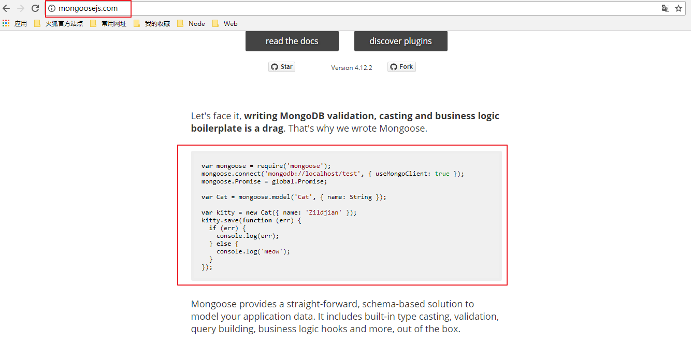
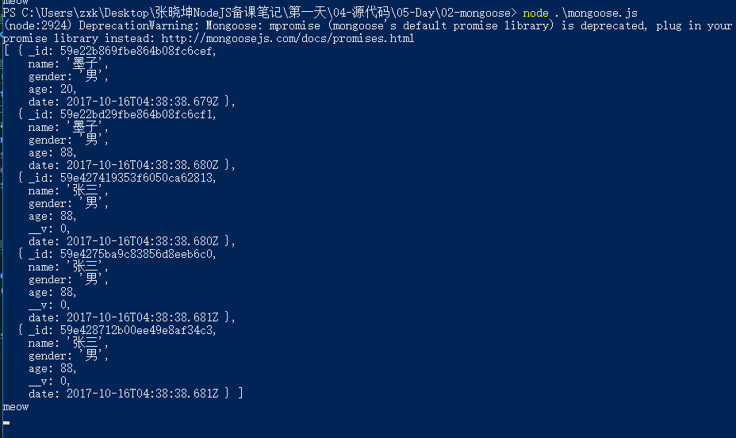

# mongoose使用

* ***上一小节，我们使用了MongoDB官方提供的NodeJS的驱动包来实现了在NodeJS中使用MongoDB的功能，实际上在nodejs中使用mongodb与终端使用的差别并不大***
    * ***在实际开发中，考虑到一些复杂的业务逻辑，要想使用原生的`mongodb`框架，我们必须要自己来封装一套能够快速实现增删查改的API***
        * ***自己封装也是可以的，只是时间会比较长***
    * ***目前在npm社区，大家在开发中使用的比较多的就是基于`mongodb`封装的第三方框架`mongoose`，它的功能非常的强大***

* [1-1.mongoose快速入门](#1.1)
* [1.2-mongoose存储流程详细讲解](#1.2)
* [1.3-mongoose与mongodb与传统关系型数据库对比](#1.3)

## mongoose相比mongodb的优势

* ***mongoos是mongodb中一个基于ORM（object relationship mapping：对象关系映射，这是一种将面向对象思维结合到数据库的编程思想）的库***
    * ORM的好处：我们无心关心数据库，只需要操作对象即可（对象自身即可实现增删改查）

* 基于ORM的存储方式的优化
    * Schema：自定义数据存储结构
        * mongodb本身没有这个功能
    * Model：对象模型
        * 相当于mongodb中的集合
    * Document：又称之为实体Entity，相当于mongodb中的Document（关系型数据库中的记录，每一行的数据）

# <h2 id=1.1>1-1.mongoose快速入门</h2>

* npm网址:<https://www.npmjs.com/package/mongoose>
* github网址：<https://github.com/Automattic/mongoose>
* monggse官网;<http://mongoosejs.com/>

* 1.mongoose官网是这么介绍自己的：Mongoose is a MongoDB object modeling tool designed to work in an asynchronous environment.
    * mongoose是基于mongodb封装的在异步环境中工作的对象模型工具
        * （1）异步环境：提高性能
        * （2）对象模型工具：一种全新的ORM思维去操作数据库

* 2.安装mongoose
    * `npm install mongoose`

* 3.快速入门
    * ***官方文档提供的代码复制粘贴即可***



```javascript

//导入模块
var mongoose = require('mongoose');

//1.连接数据库  useMongoClient: true表示是一个新的客户端 false表示是当前客户端  一般不写 第一次连接默认就是新的客户端
mongoose.connect('mongodb://localhost/itheima', { useMongoClient: true });

//2.创建schema（schema的作用是确定你的数据存储结构）

var heroSchema = mongoose.Schema({
	name : String,
	gender : String,
	age : {type:Number,min:1,max:100},//指定一个年龄属性，数据类型为数字，最小值为1，最大值为100
	date : {type:Date,default:Date.now}//指定一个时间属性，数据类型为时间，默认值为当前时间
});

//2.创建Model   第一个参数是模型的名称（相当于集合mongodb中的collections,mongodb会自动将该字段变成小写复数形式heros）  第二个参数是schema（执行该集合下的数据存储结构）
var heroModel = mongoose.model('hero',heroSchema);

//3.创建实体Entity（相当于mongodb中的一条记录，每一条记录都是一个对象）
//Model只是定义了集合的名称和数据存储结构，而该集合下的每一条记录都可以理解为是Model的一个实例对象
var kitty = new heroModel({name:'张三',gender:'男',age:88});
//4.添加到数据库
kitty.save(function (err) {
  if (err) {
    console.log(err);
  } else {
    console.log('meow');
  }
});

//5.查询数据库（在mongosse中增删改查操作主要是由model来执行）

heroModel.find(function(err,docs){
	if (err) {
		throw err;
	}
	console.log(docs);
});

```

* `__v`是mongoose的版本锁，我们无需关心，也可以通过`new Schema({…},{versionKey:false});`去掉（不建议）



## <h2 id=1.2>1.2-mongoose存储流程详细讲解</h2>

* ***初次接触mongoose可能会觉得它与mongodb的存储方式有一定的区别，实际上他们之前的存储方式是一样的，只不过mongoose套了一层ORM的马甲而已***
    * 所有非关系型数据库的存储方式都是我们之前讲解的
        * 数据库（database）
            * 集合（collections）
                * 文档（document）

* ***mongodb使用的特点***
    * 1.操作数据库的CRUD（增删改查）都是db对象，这无法体现js面向对象编程的特性
    * 2.添加数据时直接使用`db.collection('heros').insert({ name: '张飞', gender: '男', age: 23 })`
        * db表示数据库，heros表示集合，json格式对象表示文档
        * ***这种方式存在一个非常大的弊端就是数据库中的文档数据没有规范化（假如该数据库中要求名字name是必须要有的，那么我们直接给该数据库插入一个对象只有一个属性年龄age也可以插入）***

* ***mongoose关于ORM特性的三大名词解释（一定要记住！！！）***
    * Schema：模式，该对象的主要作用是约束数据库的文档结构（例如上面实例中，一旦我们确定英雄具有三个属性name、gender、age，当我们插入数据时只赋值age，这个模型一样具有name和gender属性）
        * 这种方式在实际开发中非常实用，例如一个网站的用户数据具有图像，当用户没有上传图像时，我们可以直接通过Schema来设置默认图像
        * Schema相当于关系型数据库中表的列column
    * Model：模型，模型相当于mongodb中的集合，创建模型时我们需要指定该模型的名称和Schema
        * Model相当于mongodb中的集合collections
        * Model相当于js中的calss类
        * Model相当于关系型数据库中的表
        * ***mongoose的增删改查都是通过model来完成的***
    * Entity：实体，实体相当于mongodb中的文档，也就是关系型数据中的每一行记录
        * 实体相当于mongodb中的文档document
        * 实体相当于关系型数据库中的行
        * 实体相当于js中的类对象
        * 实体也可以操作数据库的增删改查，它与Model的区别是实体只能操作自己，而Model可以操作该集合（表）下所有文档

* ***了解了mongoose的三大名词之后，mongoose的使用流程就变得很清晰了***
    * 1.导入模块
    * 2.连接数据库
    * 3.创建Schema：定义你的数据文档结构
    * 4.创建Model：创建集合
    * 5.创建Entity：创建文档（集合model的一个实例对象）
    * 6.保存到数据库
        * mongosee底层帮我们关闭了数据库，所以使用时开发者无需关闭


## <h2 id=1.3>1.3-mongoose与mongodb与传统关系型数据库对比</h2>

* ***其实无论是关系型数据库还是mongodb还是mongoose，他们的数据存储结构都是一致的，只是叫法不一致而已***
    * ***mongoose这种直接操作model模型就可以改变数据库数据的方式就叫做ORM对象关系映射***

* 数据库（三者都叫数据库）
    * 表（关系型）、集合（mongodb）、模型（mongoose）
        * 列（关系型）、Schema（mongoose）、mongodb中在插入式动态指定
            * 行/记录（关系型）、文档document（mongodb）、实体entity（mongoose）


