# MongoDB数据库可视化工具Robomongo使用

* ***到目前的数据库学习中，我们查看数据库都是通过终端命令来查看的，实际上`MongoDB`数据库有一个可视化的工具叫做`Robomongo`,它能够以优美界面的形式来操作我们的数据库***
    * ***之所以没有早点祭出神器唉，主要是为了能够让大家多多熟悉一些关于mongodb的终端命令，希望大家能理解我的良苦用心***
    * ***类似于musql的navicat可视化工具***

* [1.1-安装](#1.1)
* [1.2-基本使用](#1.2)

* robomongo官网地址:<https://robomongo.org/>
    * robomongo有两个版本，下哪个都可以(在第五天其他资料总已经有下载好的Studio 3T版本)
    * Robo 3T:基础免费版
        * 基本够用
    * Studio 3T：专业版
        * 收费版本

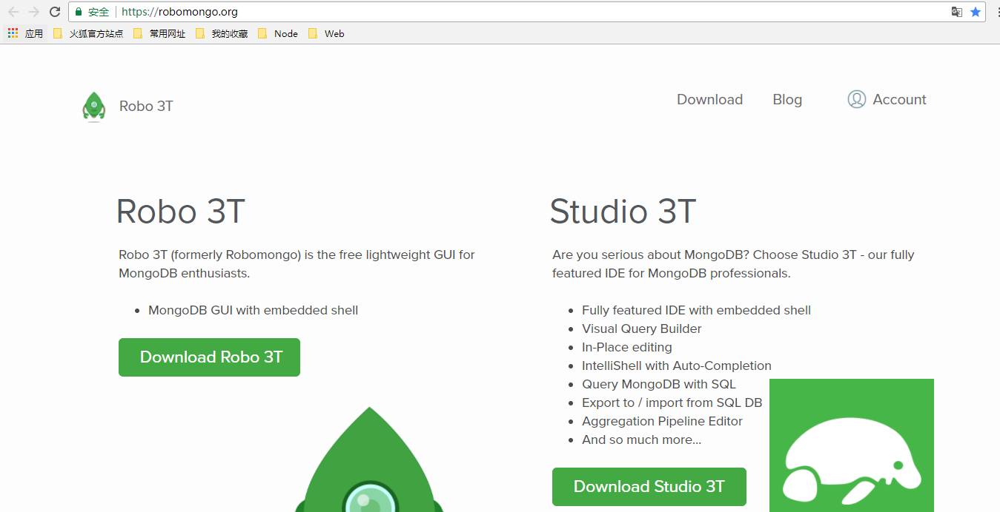

## <h2 id=1.1>1.1-安装</h2>

* 1.双击安装包一路next

* 2.打开安装好的文件夹中的`Robo 3T.exe`

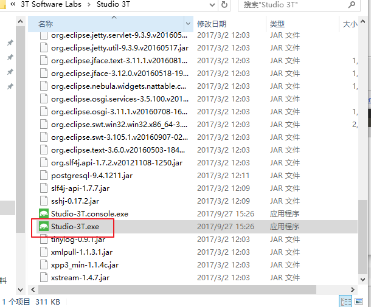

* 3.选择操作方式
    * 左边是界面操作，右边是代码操作

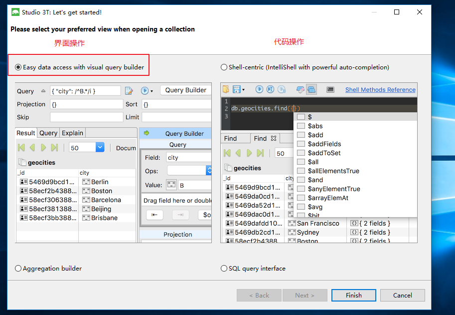

* 4.连接数据库
    * ***其实它只是一个可视化工具，相当于把我们代码以界面的形式呈现，但是数据库该有的流程还是要有***
    * ***连接之前确保我们的mongod数据库服务是开启状态***

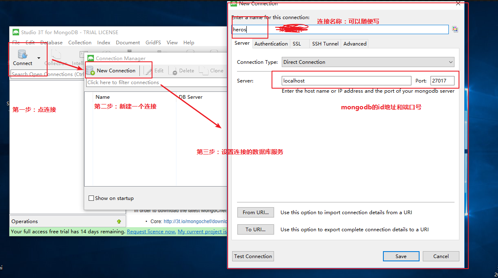

* 5.选择我们刚才创建的连接

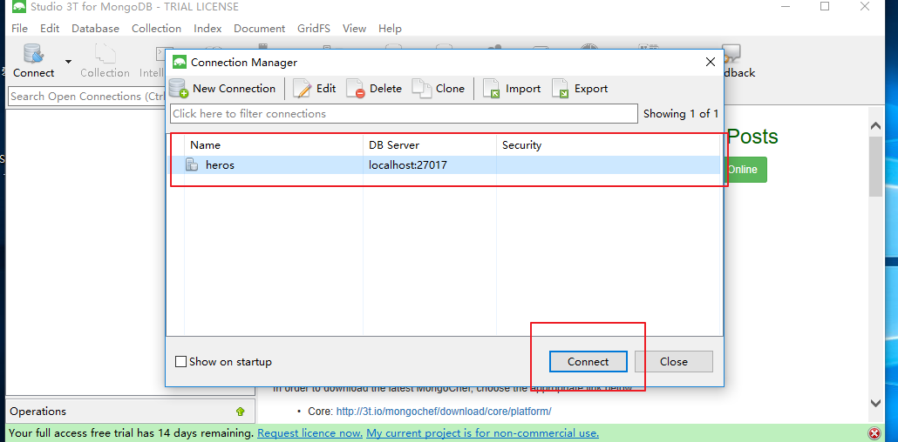

* 6.连接成功之后就可以查看我们的mongodb数据库了

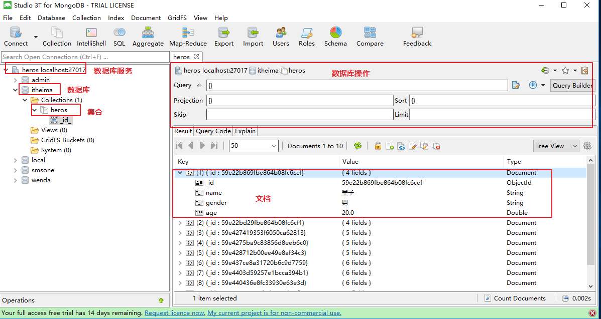

## <h2 id=1.2>1.2-基本使用</h2>

* ***这里只是简单介绍一下，我们学习的重心还是使用代码操作数据库，`robomongo`只充当更加直观查看我们代码效果的作用***

* 1.增删改查操作

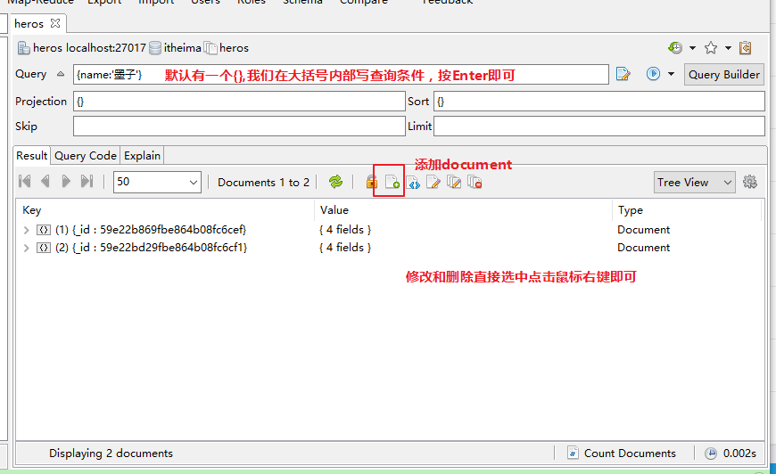

* 2.修改显示样式

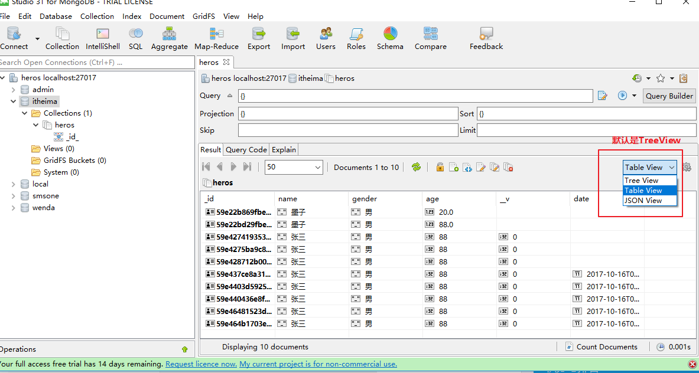

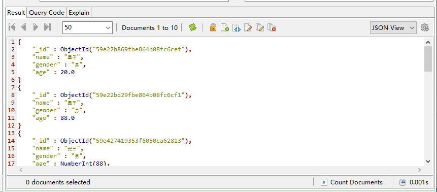

* 3.查看源码

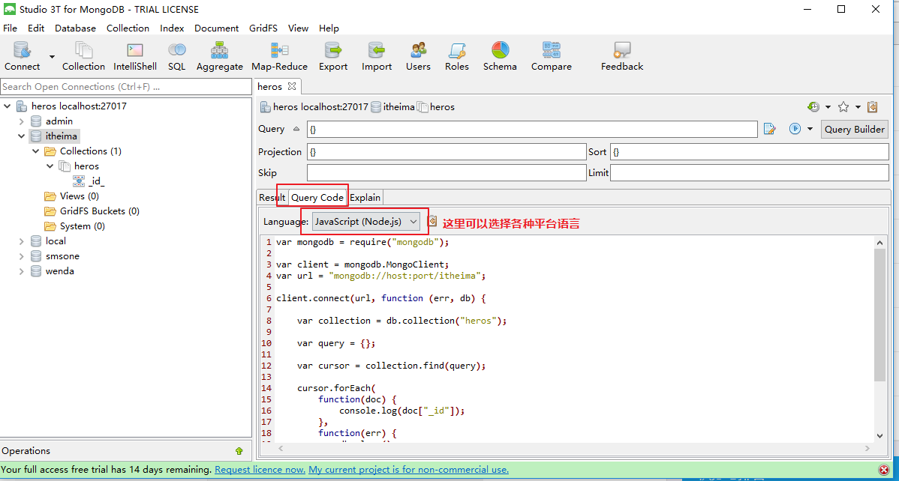

* 4.细节注意
    * 当我们通过代码修改数据库之后，软件并不会自动刷新，需要我们手动点击刷新按钮

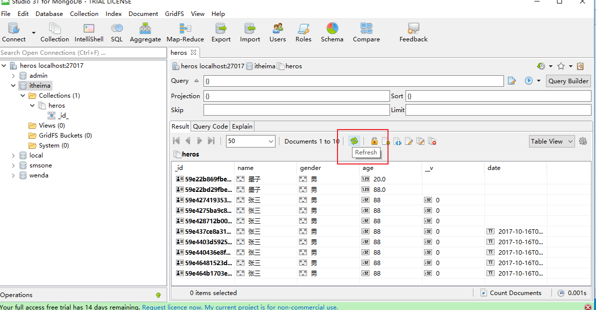

    

