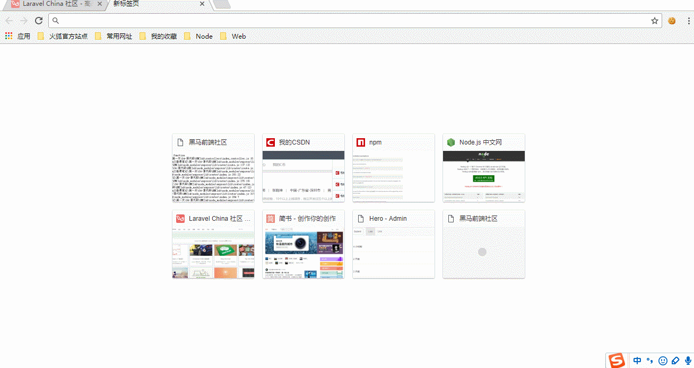
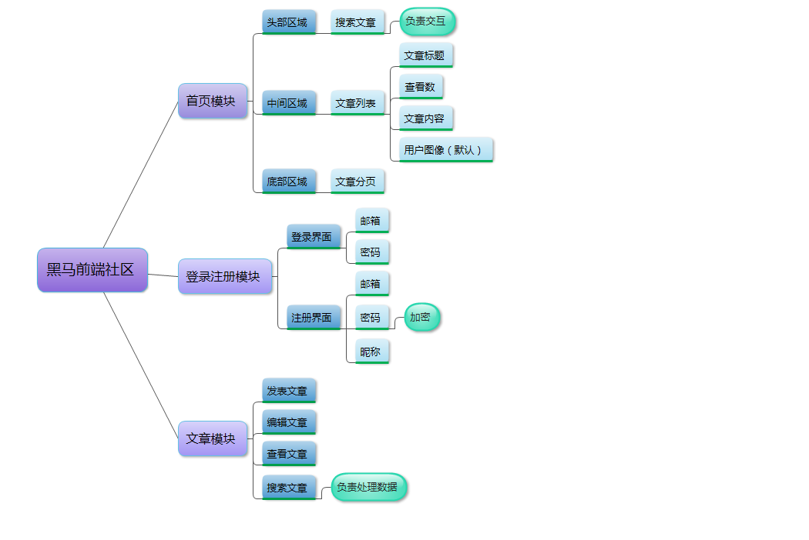
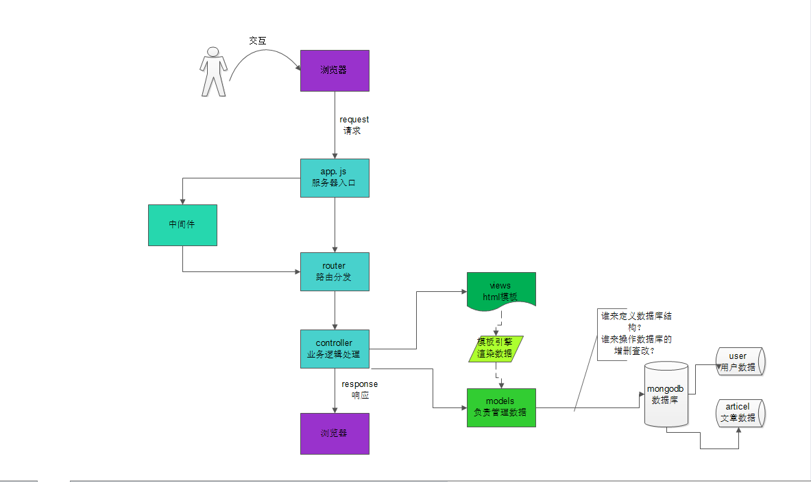
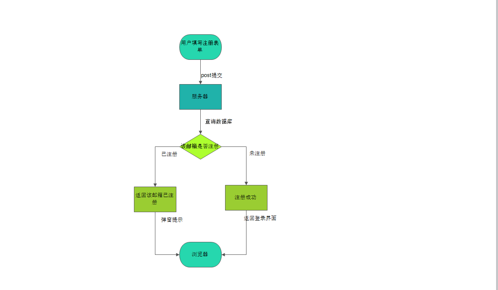
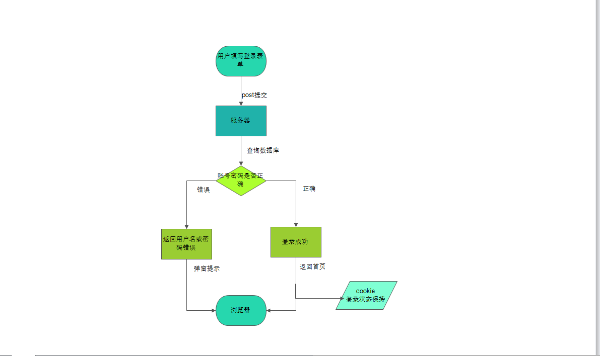
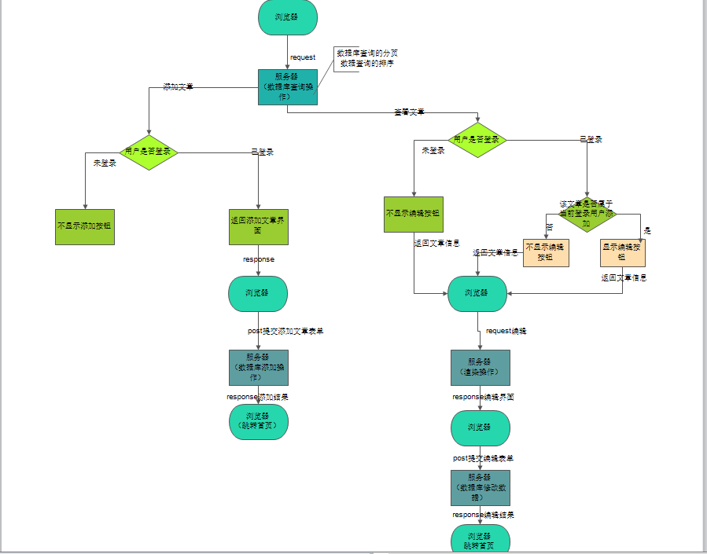
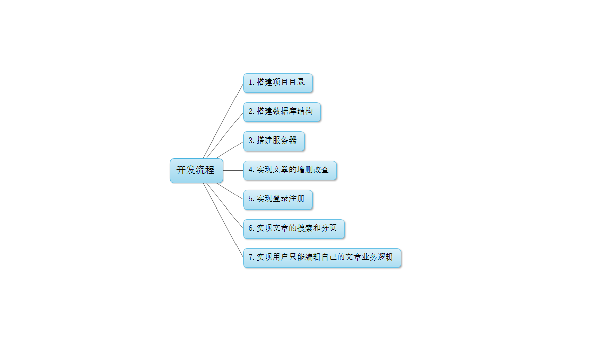

# 综合项目案例-Laravel社区开发

* 到目前为止，我们已经掌握了使用NodeJS和MongoDB来部署服务器和数据库的能力，实际上服务端的开发主要就是服务器根据客户端的请求来进行数据的增删查改。

* 为了能够让大家更加深入的了解服务端开发知识，为将来的就业提供更有力的支撑，本阶段我们仿照一个社区网站来搭建一个社区论坛平台

* [1.1-需求示例效果演示](#1.1)
* [1.2-软件开发流程介绍](#1.2)
* [1.3－需求分析](#1.3)
* [1.4-需求设计](#1.4)
* [1.5-编码阶段](#1.5)
* [1.6-测试阶段](#1.6)

## <h2 id=1.1>1.1-需求示例效果演示</h2>

* 原型网站:<https://laravel-china.org/>

* 课堂网站示例:
    * ***该案例既综合了服务端开发最基本的数据库操作，同时又锻炼了服务端开发一些常见的技术点及逻辑处理能力***

## <h2 id=1.2>1.2-软件开发流程介绍</h2>

* ***当拿到一个完整的项目需求时，如果单纯只做某一个小功能，可能需要哪些技术点和大概的流程都能够清晰知道，但是一进入到真正编码开发时就毫无思路，这是很多IT人员都会面临的一个问题***
    * ***没有培养自身一套完整的开发思维体系，主要是对软件开发流程的不了解导致***

* 目前中国的软件开发采用的是国标`GB-8567-88`的标准，这一套标准整体上将软件开发分为四个流程
    * （1）需求分析阶段
        * 作为一名开发人员，我们所敲的每一行代码最终的目的都是为了实现需求，如果连需求都没有整理清楚，开发时必然会出现种种问题
        * 需求分析还有一个好处就是可以整理出一套完整的软件迭代的文档
            * 一个产品不可能只开发一个版本，通常会不定期的更新版本，修改或增加一些功能，如果有一套完整的需求文档则可以记录该软件的每一次版本信息
    * （2）需求计划阶段
        * 当确定好需求之后，我们并不是立马就开始敲代码，而是详细的分析需求的每一个功能点，设计好一个非常高效便于维护的架构
            * 企业中，需求计划阶段通常项目经理会进行分工，评估工作量，出计划表格确定每一个阶段的开发周期
        * 在需求计划阶段，服务端人员要做的一件事就是整理需求的业务逻辑流程图，以及代码的架构设计
    * （3）编码阶段
        * 明确的知道了软件的需求，并且有了一个良好的架构设计，敲代码是一件非常轻松的事情（咖啡+music）
        * 在软件开发生命周期中，编码阶段通常只占50%的时间
            * 例如一个网站服务器开发周期为三个月（60个工作日）：需求分析8个工作日（15%-20%），需求计划15个工作日（20-30%），编码阶段30个工作日（50%）
    * （4）测试阶段
        * 国外有一个知名架构师有一套测试时间计算公式（具体不记得），大概的意思是：需求计划阶段时间与测试时间成反比

##　<h2 id=1.3>1.3－需求分析</h2>

* 需求分析的方式笔者通常采用软件架构的粒度分析方式
    * 粒度：原意是指颗粒的大小，对于软件来说就是一个抽象到具体的过程（功能越抽象，粒度越大，功能越具体，粒度越小）
    * 步骤
        * （1）根据界面（在移动端通常指手机窗口，属于MVC的C层，在前端通常指网页窗口，属于MVC的V）来进行模块划分
        * （2）以模块为单位分析模块的具体功能

## <h2 id=1.4>1.4-需求设计</h2>

* 分析完需求之后，接下来我们需要根据需求来设计我们的软件架构
    * 软件架构是多方位的（这里只从全栈的角度考虑，实际开发还要考虑UI设计、iOS端、安卓端等）
        * （1）前后端交互流程
        * （2）具体模块的业务逻辑
        * （3）服务器接口文档设计
        * （4）项目的目录结构

* 1.前后端交互流程

* 2.具体模块的业务逻辑

* （1）注册流程

* （2）登录流程

* （3）文章增删查改流程

## <h2 id=1.5>1.5-编码阶段</h2>

* 编码阶段主要是根据需求设计阶段所确定的架构来确定实现功能的步骤

* 1.搭建项目框架
    * （1）目录结构
    * （2）MVC职责分离
    * （3）服务器搭建

* 2.设计数据库的结构
    * ***根据业务需求，分析数据库的集合数量以及集合的Schema数据结构非常重要***
    * 没有数据的支持，一切都是空谈
* 3，搭建服务器
    * 使用express快速搭建服务器平台
* 4.实现文章的增删改查
    * ***社区类应用不需要登录也可以查看文章，所以这里应该优先实现文章的增删改查，而不是登录注册功能***
        * ***具体的业务具体分析，掌握这种思维技巧很重要***
            * ***这里本应优先实现文章的增删查改，但是需求没有删除功能（要实现也很简单），另外由于添加功能是登录之后才有的，所以我们暂时将搜索功能改为增加功能***
* 5.实现登录注册功能
    * （1）注册
    * （2）登录
    * （3）用户登录状态保持（cookie）
* 6.实现查找和分页功能
* 7.实现用户只能编辑自己添加的文章业务逻辑

## <h2 id=1.6>1.6-测试阶段</h2>

* ***实际开发中会有专门的测试人员来测试我们的功能，这里课堂上只能大家一起边开发边测试***

