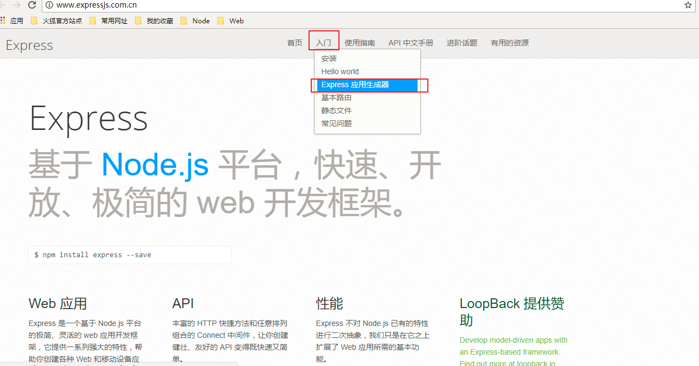
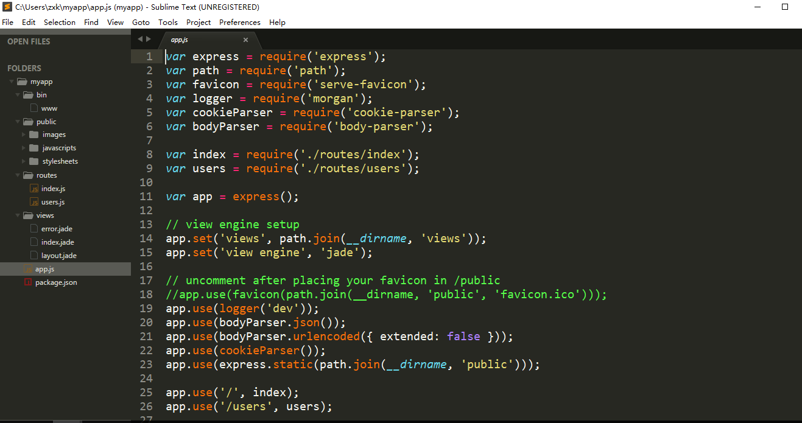

# Express脚手架简介

* Express官网有一个入门级的快速搭建node服务端项目的工具，也就是Express脚手架:<http://www.expressjs.com.cn/>
    * ***一般这种脚手架工具适合初学者使用，有经验的开发人员对项目的目录搭建都有自己独特的见解,要么不使用脚手架，要么在脚手架的基础上做一些修改***

* 官方教程:<http://www.expressjs.com.cn/starter/generator.html>

* 1.全局安装Express生成器
    * 终端命令：`npm install express-generator -g`

* 2.cd到想要创建express应用的目录，执行创建应用命令
    * `express [文件名]`

* 3.创建完毕后的目录如下
    * （1）express脚手架搭建的应用很简单，我们需要在该基础上添加一些文件夹
    * （2）express脚手架搭建的应用默认会帮我们导入很多模块，实际上有一些框架我们的应用可能根本用不上，需要适当删除
    * （3）与其使用脚手架快速搭建项目目录之后根据自己的实际需求做一些修改操作，在时间成本上其实不许我们自己从头搭建项目目录

