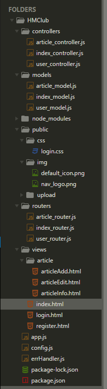

# 项目目录结构搭建

* ***上一了解我们学习了如何使用express脚手架来快速搭建项目目录，但是在实际开发中一般很少有人使用，主要原因如下***
    * 1.搭建目录本身并不是一件复杂的事情，使用脚手架搭建节约不了多少时间，并且在不是非常熟悉的情况下我们还需要分析代码
    * 2.express脚手架只是一个工具，它不了解我们真正的需求，所以还需要一定的修改
    * 3.让人觉得你连目录都需要借助功能，没有啥实力

* ***根据项目需求计划阶段所搭建的前后端交互流程，我们搭建项目目录结构就会变得非常清晰***
    * ***使用字体大小来区分目录的层级结构，使用颜色来区分文件夹和文件***

* HMClub
    * app.js      :服务器入口
    * config.js   :全局配置模块
    * errHandler.js   :全局错误模块
        * 将服务器的响应返回的错误码和错误信息放到一个文件中便于维护和调试
    * routers      :路由文件夹，负责将url请求分达到具体的MVC中
        * index_router.js      :首页url路由
        * article_router.js      :文章url路由
        * user_router.js      :首页url路由
    * <h3>MVC：处理业务逻辑</h3>
     * controllers      ：控制器文件夹，1.接收路由分化的具体url，处理业务逻辑（M层与V层之间的沟通） 2.响应返回数据给浏览器
        * index_controller.js      :首页业务逻辑
        * article_controller.js      :文章业务逻辑
        * user_controller.js      :用户业务逻辑
    * models      ：模型文件夹，负责管理数据库模型 
        * index_model.js      :首页模型
        * article_model.js      :文章模型
        * user_model.js      :用户模型
    * views      ：视图文件夹，html模板 
        * article      :文章html模板
            * articleAdd.html      :添加文章
            * articleInfo.html      :查看文章
            * articleEdit.html      :编辑文章
        * index.html      :首页
        * login.html      :登录
        * register.html      :注册
    * public：开放公共资源，express需要挂载的静态资源
        * css：布局样式
        * img：图片资源
        * upload：用户上传资源
    * node_modules:第三方模块

