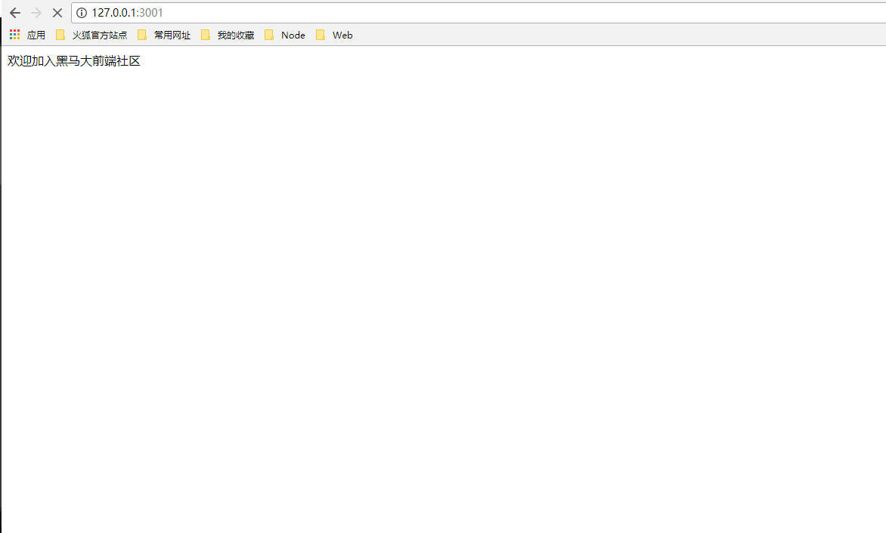

# 服务器平台搭建

* [1.1-服务器入口`app.js`搭建](#1.1)
* [1.2-errHandler.js作用](#1.2)
* [1.3-搭建路由模块，实现路由分发](#1.3)
* [1.4-搭建controllers模块，接收路由分发的请求](#1.4)
* [1.5-效果演示](#1.5)

* ***先搭建整体结构，在具体实现代码***
    * 先定义接口，再实现接口，这是一种很重要的编程思路
        * 优先定义接口可以让你在代码实现时思路更加的清晰

* ***使用的第三方***
	* express
	* mongoose
	* jquery
	* bootstrap
	* express-art-template
	* moment

* 步骤分析
    * 1.搭建`app.js`入口
        * 配置文件和错误处理文件可以根据暂时需求适当添加，后期逐步添加
    * 2.搭建路由模块，实现路由分发
    * 3.搭建controllers模块，接收路由分发的请求
        * （1）读取models模型数据
        * （2）模板引擎渲染到views
    * 4.搭建views界面模板
        * ***为了节省课堂时间，将更多的学习精力放在服务器开发上，老师已经提前在bootstrap官网上找到了合适的组件***
            * bootstrap官方组件库:<http://v3.bootcss.com/components/>

## <h2 id=1.1>1.1-服务器入口`app.js`搭建</h2>

* ***思路分析***
    * 导入模块
    * 1.创建服务器
    * 2.挂载静态资源
        * ***注意nodejs资源路径问题***
    * 3.配置模板引擎
    * 4.配置中间件
        * 暂时忽略，后面讲解
    * 5.配置路由
        * 路由分发一般在最后处理
    * 6.开启服务器监听端口号

```javascript

var express = require('express');
var path = require('path');
var template = require('art-template');
var fs = require('fs');

//1.创建服务器
var app = express();

//2.挂载静态资源

console.log(path.join(__dirname,'./node_modules'));
app.use('/node_modules',express.static(path.join(__dirname,'node_modules/')));
app.use('/public',express.static(path.join(__dirname,'public/')));


//3.配置模板引擎

app.set('views', path.join(__dirname, './views'));
app.engine('html',require('express-art-template'));
app.set('view engine','html');


//4.配置中间件


//5.配置路由

// 自动加载 routes 目录中的所有的路由模块

//同步方法读取目录中所有文件（思考为什么不能是异步？）
// var files = fs.readdirSync('./routers/');
// files.forEach(function (item) {
//   app.use(require('./routers/' + item));
// });

//快速测试服务器是否畅通
app.get('/',function(req,res){
	console.log(req.url);

	if(req.url === '/'){
		fs.readFile('./views/index.html','utf8',function(err,data){
			if(err){
				throw err;
			}
			console.log(data);
			res.send(data);
		});
	}

});

//6.开启服务器监听
app.listen(3001,function(err){
	console.log('欢迎加入黑马俱乐部');
});

```

## <h2 id=1.2>1.2-errHandler.js作用</h2>

* ***在之前的学习中，当服务器操作出现错误时，我们返回给客户端通常是这样的***
    * 1.这种方式会造成大量的代码冗余（很多地方都会重复）
    * 2.这种方式非常不便于维护，因为服务器的报错原因会有很多种，而且还会经常增改

```javascript

    //express自带的res.json方法能直接返回一个json对象
    res.json({
		err_code : 500,
		err_message : message
	});

```

* ***使用errHandler.js将报错内容作为一个单独的模块，既可以减少代码冗余也非常便于维护***

```javascript

//将所有的错误编码集中管理，便于维护

/*状态码
0：请求成功
500：请求失败
1000：登录成功
1001：用户名或密码错误
2000：注册成功
2001：邮箱已注册
9999：服务器维护中
*/


module.exports = function(code,err){

	var errData;
	var message;

	switch(code){
		case 0:
			message = '请求成功';
			break;
		case 500:
			message = err || '请求失败';
			break;
		case 1000:
			message = '登录成功';
			break;
		case 1001:
			message = '用户名或密码错误';
			break;
		case 2000:
			message = '注册成功';
			break;
		case 2001:
			message = '该邮箱已注册';	
			break;
		case 9999:
			message = '服务器维护';
			break;

		default:
			message = '未知错误';
			break;
	}
	
	errData = {
		err_code : code,
		err_message : message
	};

	return errData;
};

```

## <h2 id=1.3>1.3-搭建路由模块，实现路由分发</h2>

* 1.***article_router.js***

```javascript

var express = require('express');

//创建express路由容器
var router = express.Router();

var articleController = require('../controllers/article_controller.js');

router
  .get('/article/add', articleController.showArticleAdd)//添加界面
  .post('/article/add', articleController.doArticleAdd)//添加文章
  .get('/article/info', articleController.showArticleInfo)//查看文章
  .get('/article/edit', articleController.showArticleEdit)//编辑界面
  .post('/article/edit', articleController.doArticleEdit);//提交编辑

//导出路由容器
module.exports = router;

```

* 2.***index_router.js***

```javascript

var express = require('express');

//创建express路由容器
var router = express.Router();
//导入要分发的控制器
var indexController = require('../controllers/index_controller.js');

router
  .get('/', indexController.showIndex)//首页列表
  .get('/pageIndex',indexController.showIndex)//分页列表
  .get('/search',indexController.showSearchIndex);//搜索
//导出路由容器

module.exports = router;

```

* 3.***user_router.js***

```javascript

var express = require('express');

//创建express路由容器
var router = express.Router();

//导入要分发的控制器
var userController = require('../controllers/user_controller.js');

router
  .get('/login', userController.showLogin)//登录界面
  .post('/login', userController.doLogin)//用户登录
  .get('/register', userController.showRegister)//注册界面
  .post('/register', userController.doRegister)//用户注册
  .get('/logout', userController.logout);//用户注销

//导出路由容器
module.exports = router;

```

## <h2 id=1.4>1.4-搭建controllers模块，接收路由分发的请求</h2>

* ***暂时先定义接口，不具体实现***

* 1.***article_controller.js***

```javascript

//文章数据库模型
var articleModel = require('../models/index_model.js').Article;//数据库的创建由index_model管理
//错误处理
var errHandler = require('../errHandler.js');
//文件读写
var fs = require('fs');

var controller = module.exports;

//显示添加文章
controller.showArticleAdd = function(req,res){
	
};

//接收文章数据并添加到数据库
controller.doArticleAdd = function(req,res){
	
};

//查看文章
controller.showArticleInfo = function(req,res){

};

//显示编辑文章
controller.showArticleEdit = function(req,res){


};

//接收编辑文章数据并修改数据库
controller.doArticleEdit = function(req,res){


};

```

* 2.***index_controller.js***

```javascript

var articleModel = require('../models/index_model.js').Article;

//错误处理
var errHandler = require('../errHandler.js');

var controller = module.exports;


//首页文章列表
controller.showIndex = function(req,res){

	
};

//文章分页
controller.showPageIndex = function(req,res){

};

//搜索文章
controller.showSearchIndex = function(req,res){
	
};

```

* 3.***user_controller.js***

```javascript

var userModel = require('../models/index_model.js').User;

var errHandler = require('../errHandler.js');

var index_controller = require('../controllers/index_controller.js');

var controller = module.exports;

//显示登录界面
controller.showLogin = function(req,res){

	

};

//登录
controller.doLogin = function(req,res){

};

//显示注册界面
controller.showRegister = function(req,res){


};

//注册
controller.doRegister = function(req,res){


};

//注销，退出登录
controller.logout = function(req,res){

};

```

## <h2 id=1.5>1.5-效果演示</h2>




