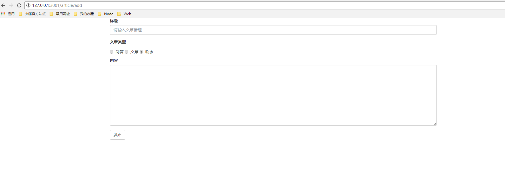
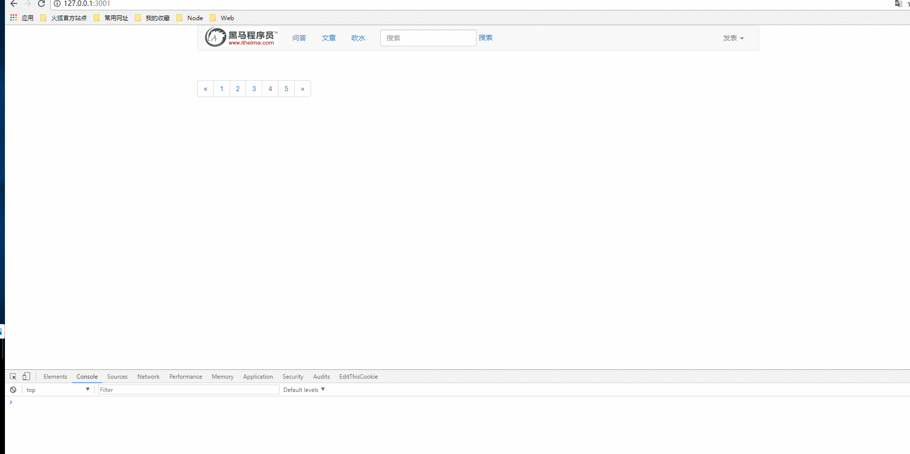

# 完成添加文章功能

* 流程分析
    * 1.浏览器点击发表文章，跳转添加文章界面
        * url已经在首页中添加
    * 2.服务器接收添加文章get请求，返回静态html界面
    * 3.用户编写文章，将表单数据post提交到服务器
    * 4.服务器存储文章到数据库，返回存储结果
    * 5.添加成功后浏览器跳转到首页

* [1.1-articleAdd.html静态模板](#1.1)
* [1.2-服务器接收添加文章get请求，返回静态html界面](#1.2)
* [1.3-用户编写文章，将表单数据post提交到服务器](#1.3)
* [1.4-服务器存储文章到数据库，返回存储结果](#1.4)
* [1.5-效果演示](#1.5)

## <h2 id=1.1>1.1-articleAdd.html静态模板</h2>



```javascript

```

## <h2 id=1.2>1.2-服务器接收添加文章get请求，返回静态html界面</h2>

* ***article_contoller.js***

```javascript

//显示添加文章
controller.showArticleAdd = function(req,res){
	
	res.render('article/articleAdd.html');
};

```

## <h2 id=1.3>1.3-用户编写文章，将表单数据post提交到服务器</h2>

* ***articleAdd.html***

```javascript

<script>
  $('#form').on('submit', function (e) {
    e.preventDefault();
    $.ajax({
      url: '/article/add',
      type: 'post',
      data: $(this).serialize(),
      dataType: 'json',
      success: function (data) {
        console.log(data);
        if (data.err_code === 0) {
          //返回上一页并刷新
          self.location = document.referrer;
        }
      }
    });
  });
</script>

```

## <h2 id=1.4>1.4-服务器存储文章到数据库，返回存储结果</h2>

* ***article_controller.js***

```javascript

//接收文章数据并添加到数据库
controller.doArticleAdd = function (req, res) {
    /**步骤思路
    1.获取表单数据
    2.持久化到数据库
    3.发送响应信息
    */
    //1原生接收post数据，这种我们截取到的是key=value&key=value的形式，并不能马上使用，还需进一步处理
    console.log(req.url);
    var reqdata = '';
    //1.1开始接收post提交数据
    req.on('data', function (data) {
        reqdata += data;
    });

    //1.2完成接收post提交数据
    req.on('end', function () {
        console.log(reqdata + typeof reqdata);

        reqdata = decodeURI(reqdata);
        //1.3使用querystring解析post请求参数
        var obj = querystring.parse(reqdata);

        //2 持久化到数据库
        //2.1 创建实体
        var articleEntity = new articleModel({
            title: obj.title,
            content: obj.content,
            article_type: obj.articleType,
        });

        console.log(articleEntity);
        //2.2 将实体保存到数据库
        articleEntity.save(function (err) {
            if (err) {
                console.log('添加失败');
                return res.json(errHandler(500, err));
            }
            console.log('添加成功');
            //3 响应返回
            return res.json(errHandler(0));
        });

    });

};
	

```

## <h2 id=1.5>1.5-效果演示</h2>



