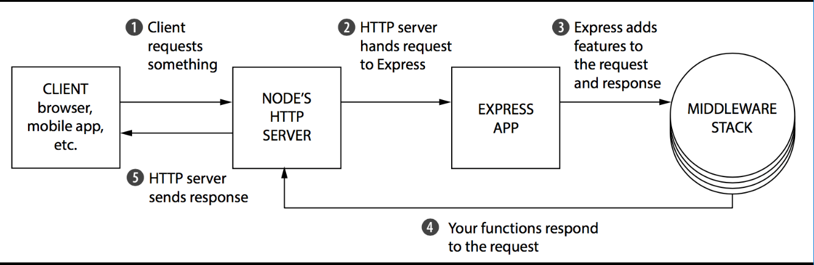
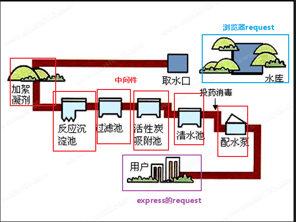
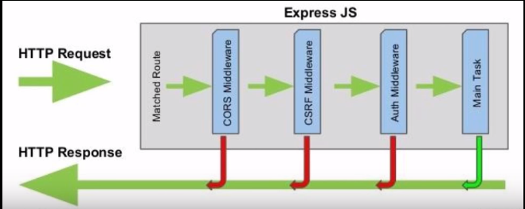
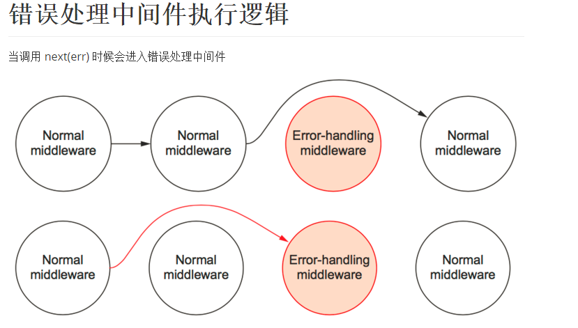

# Express中间件使用

* [1.1-为什么要有中间件？](#1.1)
* [1.2-什么是中间件？](#1.2)
* [1.3-中间件的工作原理](#1.3)
* [1.4-中间件特点总结](#1.4)
* [1.5-中间件的种类](#1.5)
* [1.6-编写一个解析post请求的中间件](#1.6)
* [1.7-给项目配置post解析中间件body-parser](#1.7)
* [1.8-给项目配置网站图标中间件serve-favicon](#1.8)


## 前言

* 一个Express应用实际上就是由多个中间件组成的，换一句话说，你在Express应用中所看到的一切都是中间件，例如：
    * 浏览器请求事件：app.get()、app.post()
    * express路由：express.Router()
    * 挂在静态资源: express.static( '../node_modules')
    * 配置模板引擎



## <h2 id=1.1>1.1-为什么要有中间件？</h2>

* 1.如果没有中间件
    * nodejs原生的接收服务器的请求只有一个方法`service.on('request',function(req,res){})`,非常不便于维护
    * 当我们需要解析request请求的参数时（get参数使用url模块，post请求使用querystring模块），每一个请求我们都需要去解析，造成代码冗余

* 2.中间件的作用
    * 把一个大的request事件，变成很多小的函数来处理，使代码更加便于维护
    * 能够一次性给所有的request和response添加方法或者属性，避免了代码冗余的同时也使得开发更加的方便

## <h2 id=1.2>1.2-什么是中间件？</h2>

* ***下图是一个自来水净化的过程，这张图可以更好的理解什么是中间件***



* 水库的水并不是直接取出来就送到用户的家中使用，而是经过一些净化过滤处理之后才送到用户的家中，在这个过程中水还是水，本质上还是同一个东西，但是却多了一些东西
    * 水库中原始的水可以理解为是浏览器的原始请求request
    * 最终用户喝到的水可以理解为是express最终获取的请求request
    * 而过滤中的一些加絮凝剂、过滤池等操作就是中间件，可以理解为给我们原始的请求request添加了一些属性或者方法（如post参数解析之后的对象等）


## <h2 id=1.3>1.3-中间件的工作原理</h2>

* 中间件本质就是一个函数，在这个函数中能做什么？
    - 执行任何代码。
    - 修改请求和响应对象。
    - 终结请求-响应客户端。
    - 调用堆栈中的下一个中间件。

1. 这个函数通常有 3 个参数，req、res、next
2. 错误处理中间件有 4 个参数，err, req, res, next
3. 中间件按照注册顺序，依次判断是否匹配，如果匹配则执行；如果不匹配则继续判断后续注册的中间件是否匹配。【即便注册了多个中间件，执行的时候也只会根据匹配的路由来执行相应的中间件，不是所有注册的中间件每次请求都会全部被执行！
4. 如果当前中间件没有结束用户请求（结束服务器响应）（res.end()），那么就要调用 next() ，否则请求就会挂起



```javascript

var express = require('express');

var app = express();

/**1.中间的本质上就是一个函数，这个函数有三个参数

function(req,res,next){}
	* req:请求对象
	* res:响应对象
	* next:是可选参数，表示下一个中间件。

2.express中有三种形式的API可以添加或调度中间件（app.use，app.get,app.post）
	app.use(function(req,res){});任何的请求路径和请求方法都会进入该中间件
		* 只有use才可以省略第一个参数，get和post不可以
	app.use('请求路径',function(req,res){});指定请求路径的任何请求方法都会进入该中间件
*/


//添加一个中间件处理环节
/**在中间件中我们可以做四件事
	* 1.执行任何代码
	* 2.修改请求对象和响应对象
		* 添加属性或者方法
	* 3.终结请求-响应客户端
	* 4.调用堆栈中的下一个中间件
*/
app.use(function(req,res,next){
	console.log('进入了第一个中间件');
	//修改请求对象
	req.body = 'body';
	req.xuningji = function(){
		console.log('添加了絮凝剂');
	};
	//一.在一个中间件执行过程中，后面的环节可以获取前面环节添加的属性和方法，前面的环节是无法获取后面环节添加的属性和方法
	console.log(req.filter);

	//调用堆栈的下一个中间件
	next();

	//二.只要在某一个中间件中没有结束响应，则会一直按照顺序匹配，直到栈堆的底部
	//res.send('结束了');
});

app.get('/',function(req,res,next){
	console.log('进入了第二个中间件');

	//中间件堆栈的后面可以获取前面中间件添加的属性和方法
	req.xuningji();
	console.log(req.body);

	//添加属性
	req.filter = '进行了过滤操作';

	//三.如果不调用next，则终止中间件匹配。此时应该结束响应，否则浏览器会一直转圈等待服务器响应
	next();
});


//四.调用next()并不一定是执行下一个中间件，而是执行能匹配到的中间件
//只有请求方法为get，请求路径为index的请求才会进入该中间件
app.get('/index',function(req,res,next){
	console.log('进入了第3个中间件');
	//五.一个中间件环节是对相同的请求路径而言的，不同的请求路径是一个新的中间件环节，无法获取其他中间件定义的属性和方法
	console.log(req.filter);

	res.foo = 'foo';
	next();
});

app.use('/index',function(req,res,next){
	console.log('进入了第4个中间件');
	console.log(res.foo);
	next();
});

//如果一个匹配的中间件也没找到，那么 express 中有一个兜底的中间件（就是那个 Can not GET /）
//替换中间件末尾的 can not found 请求路径
app.use('/',function(req,res){
	res.send('404 not found' +  req.url);
});

app.listen(9999,function(){
	console.log('服务器启动成功');
});

/**中间件特点总结

1.根据注册顺序，依次判断匹配(判断是否匹配注册时的路由，如果匹配，那么执行该中间件。如果不匹配则，进行判断下一个注册的中间件注册时的路由是否匹配)并执行
	* 中间件会从最先开始注册的那个开始执行，执行的时候先判断是否匹配路由，如果匹配才会执行对应的中间件代码
	* 只要在某一个中间件中没有结束响应，则会一直按照顺序匹配，直到栈堆的底部
	* 调用next()并不一定是执行下一个中间件，而是执行能匹配到的中间件
	* 执行完毕该中间件时，如果有调用 next() 那么继续找下一个匹配的中间件，如果找到了就执行，找不到继续向后找
2.如果当前中间件没有结束请求（res.end())，那么当前中间件应该调用 next() 方法将控制流转到下一个中间件，最后一个中间件通常不需要调用 next() 方法，而是直接终止请求
	* 如果不调用next，则中间件匹配就会终止。此时应该结束响应，否则浏览器会一直转圈等待服务器响应

3.中间件会从最先开始注册的那个开始执行，然后按照栈堆顺序匹配。后面注册的中间件可以获取前面注册的中间件的属性和方法，而前面的中间件无法获取后面中间件添加的属性和方法

4.每一个请求都是一个独立的中间件环节，不同的请求之间的中间件无法获取彼此添加的属性和方法
	* 如果想要给所有的请求都添加属性和方法，可以在中间件的第一个环节使用aa.use(function(req,res,next){})
		* 任何请求方法请求路径都会执行该中间件

5.如果一个匹配的中间件也没找到，那么 express 中有一个兜底的中间件（就是那个 Can not GET /）

*/

```

## <h2 id=1.4>1.4-中间件特点总结</h2>

* 1.根据注册顺序，依次判断匹配(判断是否匹配注册时的路由，如果匹配，那么执行该中间件。如果不匹配则，进行判断下一个注册的中间件注册时的路由是否匹配)并执行
    * 中间件会从最先开始注册的那个开始执行，执行的时候先判断是否匹配路由，如果匹配才会执行对应的中间件代码
    * 只要在某一个中间件中没有结束响应，则会一直按照顺序匹配，直到栈堆的底部
    * 调用next()并不一定是执行下一个中间件，而是执行能匹配到的中间件
    * 执行完毕该中间件时，如果有调用 next() 那么继续找下一个匹配的中间件，如果找到了就执行，找不到继续向后找
* 2.如果当前中间件没有结束请求（res.end())，那么当前中间件应该调用 next() 方法将控制流转到下一个中间件，最后一个中间件通常不需要调用 next() 方法，而是直接终止请求
	* 如果不调用next，则中间件匹配就会终止。此时应该结束响应，否则浏览器会一直转圈等待服务器响应

* 3.中间件会从最先开始注册的那个开始执行，然后按照栈堆顺序匹配。后面注册的中间件可以获取前面注册的中间件的属性和方法，而前面的中间件无法获取后面中间件添加的属性和方法

* 4.每一个请求都是一个独立的中间件环节，不同的请求之间的中间件无法获取彼此添加的属性和方法
	* 如果想要给所有的请求都添加属性和方法，可以在中间件的第一个环节使用aa.use(function(req,res,next){})
		* 任何请求方法请求路径都会执行该中间件

* 5.如果一个匹配的中间件也没找到，那么 express 中有一个兜底的中间件（就是那个 Can not GET /）

## <h2 id=1.5>1.5-中间件的种类</h2>

* 1. 应用程序级中间件(最常见的)
    - 通过 app 对象来挂载的中间件
    - app.use()、app.get()、app.post()、...
    * ***路径可以理解是一个具名资源的路径，以`/`区分，例如`/user`和`/usera`不是同一个路径,中间件不能匹配***

```javascript

var app = express();

// 没有挂载路径的中间件，应用的每个请求都会执行该中间件
app.use(function (req, res, next) {
  console.log('Time:', Date.now());
  next();
});

// 挂载至 /user 的中间件，任何指向 /user/:id 的请求都会执行它
app.use('/user', function (req, res, next) {
  console.log('Request Type:', req.method);
  next();
});

// 路由和句柄函数(中间件系统)，处理指向 /user/:id 的 GET 请求
app.get('/user', function (req, res, next) {
  res.send('USER');
});

```

* 2. 路由级中间件
    - 通过 router 对象来挂载的中间件
    - router.use()、router.get()、router.post()、......

```javascript

var router = express.Router();

```

* 3. 错误处理中间件
    - 必须写4个参数 err、req、res、next
    - 错误处理中间件一般定义在所有中间件的最后
    - 在错误处理中间件中如果不调用 next(err), 那么必须要结束请求。一般错误处理中间件就是最后一个中间件了，所以需要 res.end()
    - 错误处理一般用来处理服务器内部错误，我们也可以不写，而是根据具体业务逻辑来返回报错内容



```javascript

app.use(function(err,req,res,next) {
  console.log("Error happens",err);
});

```

* 4. 内置中间件
    - express.static
        * express.static 是 Express 唯一内置的中间件。它基于 serve-static，负责在 Express 应用中提托管静态资源。

* 5. 第三方中间件
    * 类似于npm第三方模块，但是只能用于express
        * express官网提供了许多第三方中间件，用法文档写的都很详细
    * -第三方中间件列表-中文:<http://www.expressjs.com.cn/resources/middleware.html>
    *  第三方中间件列表-英文:<http://expressjs.com/en/resources/middleware.html>

## <h2 id=1.6>1.6-编写一个解析post请求的中间件</h2>

```javascript

var querystring = require('querystring');

module.exports = function (req, res, next) {


	//1,判断是否时post请求
	if(req.method === 'POST'){

		var reqdata = '';
		 //开始接收post提交数据
		req.on('data',function(data){
		reqdata += data;
	});

	//完成接收post提交数据
	req.on('end',function(){
		//转变为字符串
		reqdata = decodeURI(reqdata);
		//将字符串解析为对象
		req.body = querystring.parse(reqdata);
  	  	next();
  	});

	}else{
		next();
	}
};

```

* ***使用***

```javascript

//导入定义模块
var  hmbodyParser = require('./hmbody-parser.js');
//添加自定解析post请求中间件
app.use(hmbodyParser);

```

## <h2 id=1.7>1.7-给项目配置post解析中间件body-parser</h2>

* express官网提供了许多封装好的中间件，为我们的nodejs开发提供了非常大的便利，使用起来也很方便
    * body-parse的github地址:<https://github.com/expressjs/body-parser>

* ***第三方中间件都需要使用npm安装，可以理解为是一种特殊的第三方模块***
    * `npm install body-parser`

```javascript

//post解析中间件
var  bodyParser = require('body-parser');
// 配置解析表单中间件 POST 请求体数据中间件
// 该中间件会为 req 请求对象提供一个 body 属性用来获取表单 POST 请求体数据
app.use(bodyParser.urlencoded({ extended: false }));

```

* ***使用body-parser注意事项***
	* 1.使用body-parser中间件之后，如果一个请求中有post提交的数据，可以直接使用req.body获取
	* 2.body-parser只能接收文本数据，如果是文件还需要单独处理（formidable）

* ***article_controller.js***

```javascript

//接收文章数据并添加到数据库
controller.doArticleAdd = function (req, res) {
    /**步骤思路
    1.获取表单数据
    2.持久化到数据库
    3.发送响应信息
    */

    //1.使用body-parser中间件之后，如果一个请求中有post提交的数据，可以直接使用req.body获取
    //body-parser只能接收文本数据，如果是文件还需要单独处理（formidable）
    var body = req.body;
    //2 持久化到数据库
    //2.1 创建实体
    var articleEntity = new articleModel({
        title: body.title,
        content: body.content,
        article_type: body.articleType
    });

    console.log(articleEntity);
    //2.2 将实体保存到数据库
    articleEntity.save(function (err) {
        if (err) {
            console.log('添加失败');
            return res.json(errHandler(500, err));
        }
        console.log('添加成功');
        //3 响应返回
        return res.json(errHandler(0));
    });

};

```

## <h2 id=1.8>1.8-给项目配置网站图标中间件serve-favicon</h2>

* serve-favicon也是express官方提供的中间件，可以为我们的网站自动添加图标
    * <https://github.com/expressjs/serve-favicon>
    * 安装：`npm install serve-favicon`

```javascript

//网站图标中间件
var favicon = require('serve-favicon');
//配置网站图标中间件  参数是我们的路径
app.use(favicon(path.join(__dirname, 'public', 'hmclub.ico')));

```