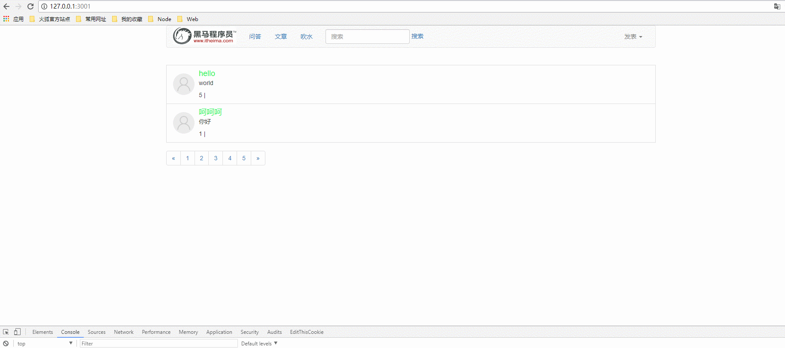

# 完成编辑文章功能

* 流程分析
    * 1.用户点击浏览器文章详情内的编辑按钮，跳转到文章编辑界面
    * 2.服务器获取get请求参数，查询数据库并返回编辑界面模板
    * 3.用户编辑文章后post提交编辑数据
      * 编辑一次，查看数+1
    * 4.服务器修改数据库并返回修改结果
    * 5.浏览器跳转到首页

* [1.1-用户点击浏览器文章详情内的编辑按钮，跳转到文章编辑界面](#1.1)
* [1.2 服务器获取get请求参数，查询数据库并返回编辑界面模板](#1.2)
* [1.3 用户编辑文章后post提交编辑数据](#1.3)
* [1.4-服务器修改数据库并返回修改结果](#1.4)
* [1.5-效果演示](#1.5)

## <h2 id=1.1>1.1-用户点击浏览器文章详情内的编辑按钮，跳转到文章编辑界面</h2>

* 1.***articleEdit.html模板***
  * ***html模板接收文章的id和查看数，但是不显示

```html

<!DOCTYPE html>
<html lang="en">

<head>
  <meta charset="UTF-8">
  <title>黑马前端社区</title>
  <link rel="stylesheet" href="/node_modules/bootstrap/dist/css/bootstrap.css">
</head>

<body>
  <div class="container-wrap">
    <div class="container">
      <form id="form">
        <!-- 接收文章id和查看数但是不显示 -->
        <input type="hidden" id="article_id" name="id" value="{{  article.id }}">
        <input type="hidden" id="article_id" name="visits" value="{{  article.visits }}">
        <div class="form-group">
          <label for="exampleInputEmail1">标题</label>
          <input type="text" name="title" class="form-control" id="exampleInputEmail1" placeholder="请输入文章标题" value="{{ article.title }}">
        </div>
        <div class="form-group">
          <label for="exampleInputPassword1">内容</label>
          <textarea class="form-control" name="content" cols="30" rows="10">{{ article.content }}</textarea>
        </div>
        <button type="submit" class="btn btn-default">编辑保存</button>
      </form>
    </div>
  </div>
  <div class="footer"></div>
  <script src="/node_modules/jquery/dist/jquery.js"></script>
  <script src="/node_modules/bootstrap/dist/js/bootstrap.js"></script>

</body>

</html>

```

## <h2 id=1.2>1.2 服务器获取get请求参数，查询数据库并返回编辑界面模板</h2>

* ***article_controller.js***

```javascript

 //显示编辑文章
controller.showArticleEdit = function(req,res){

	/*
	1.获取请求参数
	2.根据参数查询数据库
	3.响应返回查询结果
	*/

	console.log(req.query);

	var body = req.query;

	var id = body.id;
	console.log(id);
	articleModel.findById(id,function(err,doc){
		

		if (err) {
			console.log('查看失败');
			return res.json(errHandler(500,err));
			
		}
		console.log('查看成功');
		console.log(doc);

		//返回编辑文章模板
		return res.render('article/articleEdit.html',{
			article:doc,
		});
	});

};

```

## <h2 id=1.3>1.3 用户编辑文章后post提交编辑数据</h2>

* ***articleEdit.html***

```html

 <script>
    //post提交表单数据
    $('#form').on('submit', function (e) {
      e.preventDefault();
      $.ajax({
        url: '/article/edit',
        type: 'post',
        data: $(this).serialize(),
        dataType: 'json'
      }).then(function (data) {
        //成功之后跳转首页
        if (data.err_code === 0) {
          window.location.href = '/';
        }
      });
    });
  </script>

```

## <h2 id=1.4>1.4-服务器修改数据库并返回修改结果</h2>

* ***article_controller.js***

```javascript

//接收编辑文章数据并修改数据库
controller.doArticleEdit = function (req, res) {
    /**
    1.获取表单数据
    2.持久化到数据库
    3.发送响应信息
    */
    //1.获取表单数据
    //使用body-parse中间件之后，如果浏览器是post提交数据，服务端可以通过req.body来接收，得到的是一个对象
    var body = req.body;
    //编辑一次，也算一次访问数+1
    var visits = body.visits;
    visits++;

    //持久化到数据库
    var articleEntity = new articleModel({
        title: body.title,
        content: body.content,
        _id: body.id,
        visits: visits,
        user_id: body.user_id
        // article_type:body.articleType 编辑不能修改文章类型
    });

    console.log('articleEntity' + articleEntity);
    //编辑修改数据
    articleModel.update({
        _id: articleEntity.id
    }, articleEntity, function (err, doc) {
        if (err) {
            console.log('编辑失败');
            return res.json(errHandler(500, err));
        }
        console.log('编辑成功' + JSON.stringify(doc));
        return res.json(errHandler(0));
    });
};

```

## <h2 id=1.5>1.5-效果演示</h2>

