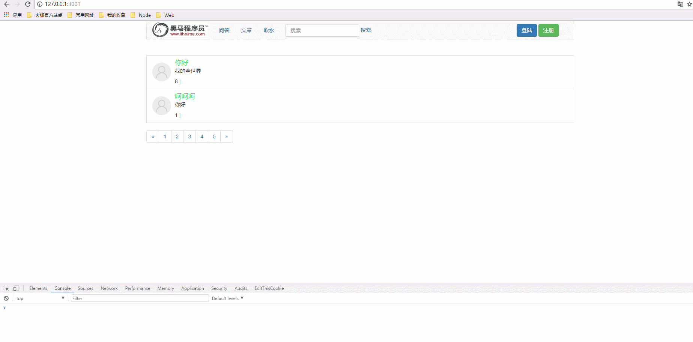

# 完成用户注册功能

* [1.1-register.html模板](#1.1)
* [1.2-修改index.html模板显示登录注册按钮](#1.2)
* [1.3-用户点击注册按钮服务器返回注册界面](#1.3)
* [1.4-用户post提交注册表单](#1.4)
* [1.5-服务器接收注册表单并保存到数据库](#1.5)
* [1.6-效果演示](#1.6)

* ***流程思路分析***
    * 1.浏览器点击注册按钮，跳转到注册界面
    * 2.服务器接收注册表单post数据
    * 3.服务器判断该用户是否能注册
    * 4.如果不能，则返回浏览器弹窗显示原因
        * 如果能，则返回浏览器跳转到登录界面

## <h2 id=1.1>1.1-register.html模板</h2>

```html

<!DOCTYPE html>
<html lang="zh-CN">

<head>
  <meta charset="utf-8">
  <meta http-equiv="X-UA-Compatible" content="IE=edge">
  <meta name="viewport" content="width=device-width, initial-scale=1">
  <title>注册</title>
  <link rel="stylesheet" href="/node_modules/bootstrap/dist/css/bootstrap.css">
  <link rel="stylesheet" href="/public/css/login.css">
</head>

<body>
  <div class="container">
    <form class="form-signin" id="form">
      <h2 class="form-signin-heading">欢迎加入我们</h2>
      <input name="email" type="email" class="form-control" placeholder="邮箱" required autofocus>
      <input name="password" type="password" class="form-control" placeholder="密码" required>
      <input name="nickname" type="text" id="inputPassword" class="form-control" placeholder="昵称" required>
      <div class="checkbox">
        <label>
          <input type="checkbox" value="remember-me"> 记住我
        </label>
      </div>
      <button class="btn btn-lg btn-primary btn-block" type="submit">提交注册</button>
    </form>
  </div>
  <script src="/node_modules/jquery/dist/jquery.js"></script>
</body>

</html>

```

## <h2 id=1.2>1.2-修改index.html模板显示登录注册按钮</h2>

* ***index.html***

```html

<ul class="nav navbar-nav navbar-right">	
    <li>
        <form class="navbar-form navbar-left">
            <a href="/login" class="btn btn-primary">登陆</a>
            <a href="/register" class="btn btn-success">注册</a>
        </form>
    </li>

    <!-- 登录成功之后才可以发表和注销 -->
    <!-- <li class="dropdown">				
        <a href="#" class="dropdown-toggle" data-toggle="dropdown" role="button" aria-haspopup="true" aria-expanded="false">发表 <span class="caret"></span></a>
        <ul class="dropdown-menu">
            <li><a href="/article/add">问答</a></li>
            <li><a href="/article/add">文章</a></li>
            <li><a href="/article/add">吹水</a></li>
        </ul>
    </li>
    <li class="dropdown">				
        <a href="#" class="dropdown-toggle" data-toggle="dropdown" role="button" aria-haspopup="true" aria-expanded="false"><span style="color: #F80ED9;font-size:20px"></span><span class="caret"></span></a>
        <ul class="dropdown-menu">
            <li><a href="/logout">注销</a></li>
            
        </ul>
    </li> -->			            	
</ul>

```

## <h2 id=1.3>1.3-用户点击注册按钮服务器返回注册界面</h2>

***user_controller.js***

```javascript

//显示注册界面
controller.showRegister = function(req,res){

	res.render('register.html');
};

```

## <h2 id=1.4>1.4-用户post提交注册表单</h2>

* ***register.html***

```html

<script>

    $('#form').on('submit', function (e) {
      e.preventDefault();

       //提交注册表单
      $.ajax({
        url: '/register',
        type: 'post',
        data: $('#form').serialize(),
        dataType: 'json'
      }).then(function (data) {

        var err_code = data.err_code;
        if (err_code === 2000) {
            //暂时先跳转回首页
          window.location.href = '/';
        } else if (err_code === 2001) {
          window.alert(data.err_message);
        }
      });
    });
    
  </script>

```

## <h2 id=1.5>1.5-服务器接收注册表单并保存到数据库</h2>

```javascript

//注册
controller.doRegister = function(req,res){

	/**1.获取表单数据
	2.验证该邮箱是否以注册   
	3 将数据保存到数据库
	4.响应返回
	*/

	//获取表单数据
	var body = req.body;
	//查询数据库验证该邮箱是否已注册
	userModel.findOne({email:body.email},function(err,doc){
		if (err) {
			return res.json(errHandler(500,err));
		}
		if(doc){
			//邮箱已存在
			return res.json(errHandler(2001));
		}

		//写入数据库
		var userEntity = new userModel({
			email : body.email,
			nickname : body.nickname,
			password : body.password
		});

		userEntity.save(function(err,docs){
			if(err){
				return res.json(errHandler(500,err));
			}
            //注册成功
			return res.json(errHandler(2000));

		});

	});

};

```

## <h2 id=1.6>1.6-效果演示</h2>




