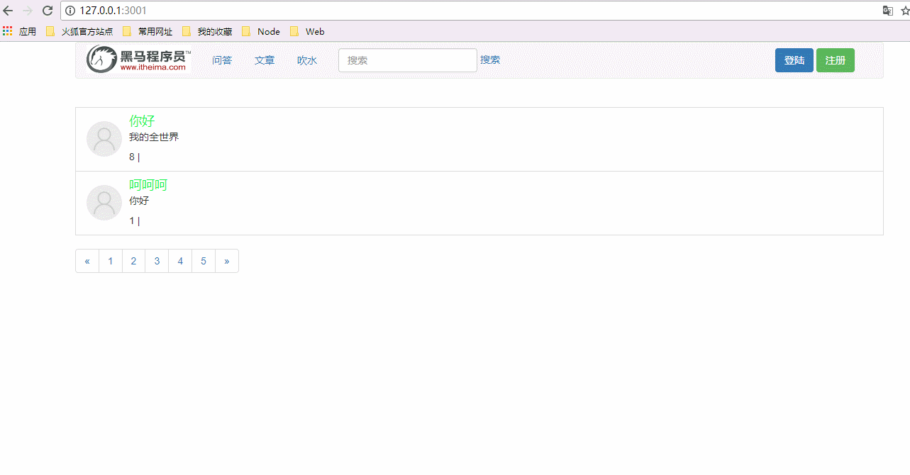

# 完成用户登陆功能

* [1.1-浏览器点击登陆，提交表单数据](#1.1)
* [1.2-服务器接收post数据，通过邮箱查询数据库匹配密码](#1.2)
* [1.3-效果演示](#1.3)

* 步骤思路分析
    * 1.浏览器点击登陆，post提交登陆表单
    * 2.服务器接收post数据
    * 3.服务器查询数据库根据邮箱匹配密码
    * 4.服务器返回登陆结果
    * 5.浏览器接收结果并回到首页

## 登陆界面html模板

```html

<!DOCTYPE html>
<html lang="zh-CN">
<head>
  <meta charset="utf-8">
  <meta http-equiv="X-UA-Compatible" content="IE=edge">
  <meta name="viewport" content="width=device-width, initial-scale=1">
  <title>登录</title>
  <script src="/node_modules/jquery/dist/jquery.js"></script>
  <link rel="stylesheet" href="/node_modules/bootstrap/dist/css/bootstrap.css">
  <link rel="stylesheet" href="/public/css/login.css">
</head>

<body>
  <div class="container">
    <form class="form-signin" id="form">
      <h2 class="form-signin-heading">欢迎登录</h2>
      <input type="email" name="email" class="form-control" placeholder="邮箱" required autofocus>
      <input type="password" name="password" class="form-control" placeholder="密码" required>
      <div class="checkbox">
        <label>
          <input type="checkbox" value="remember-me"> 记住我
        </label>
      </div>
      <button class="btn btn-lg btn-primary btn-block" type="submit">登录</button>
    </form>
  </div>
</body>

</html>
  

```

## <h2 id=1.1>1.1-浏览器点击登陆，提交表单数据</h2>

* ***login.html***

```html

<script>
  $('#form').on('submit', function (e) {
    e.preventDefault();
    $.ajax({
      url: '/login',
      type: 'post',
      data: $('#form').serialize(),
      dataType: 'json',
      success: function (data) {
        var err_code = data.err_code;
        if (err_code === 1000) {
          //登陆跳转回首页
          window.location.href = '/';
        } else if (err_code === 1001) {
          window.alert(data.err_message);
        } else {
          window.alert(data.err_message);
        }
      }
    });

  });
</script>

```

## <h2 id=1.2>1.2-服务器接收post数据，通过邮箱查询数据库匹配密码</h2>

* ***user_controller.js***

```javascript

//显示登录界面
controller.showLogin = function(req,res){

	res.render('login.html');

};

//登录
controller.doLogin = function (req, res) {

    /**1.获取表单数据
    2.查询数据库匹配邮箱得到密码
    3.验证用户邮箱和密码 
    4.响应返回
    */
    //1.获取表单数据
    var body = req.body;


    //2.查询数据库验证邮箱
    userModel.findOne({
        email: body.email
    }, function (err, doc) {
        if (err) {
            return res.json(errHandler(500, err));
        }
        if (!doc) {
            return res.json(errHandler(1001));
        }
        //3.根据邮箱验证密码
        if (body.password === doc.password) {
            //登陆成功
            return res.json(errHandler(1000));
        } else {
            //登陆失败（服务器知道用户到底是邮箱错误还是密码错误，但是一般不告诉客户端）
            return res.json(errHandler(1001));
        }
    });
};

```

## <h2 id=1.3>1.3-效果演示</h2>

