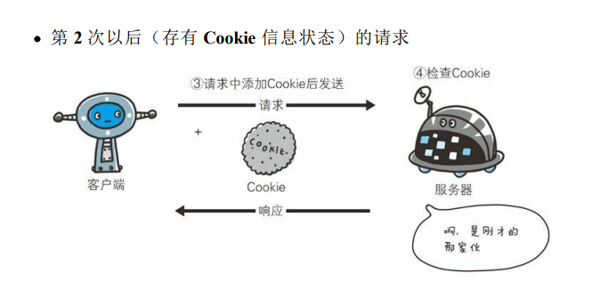

# Cookie介绍

* [1.1-什么是Cookie？](#1.1)
* [1.2-Cookie的工作原理](#1.2)
* [1.3-Cookie的与session的关系](#1.3)
* [1.4-举个栗子你就知道cookie和session的区别了](#1.4)
* [1.5-Cookie与sessionstorage和localstorage的区别](#1.5)

* ***第七天课程资料中有一本电子书：《图解HTTP》，里面对cookie的描述很到位，可以参考学习下***
    * ***谷歌浏览器快速查看cookie的插件也在课程资料中***

* ***1.cookie的本质就是一个包含多个键值对的json字符串***
* ***2.cookie的作用就是保持用户（浏览器）的状态（通常为登陆状态）***
    * cookie最经典的应用场景就是浏览器的免登录功能（第一次登陆之后，下一次访问该网页无需登录）

## <h2 id=1.1>1.1-什么是Cookie？</h2>

* 1.cookie的定义：Cookie，有时也用其复数形式 Cookies，指某些网站为了辨别用户身份、进行 session 跟踪而储存在用户本地终端上的数据（通常经过加密）
    * Cookie最早是网景公司的前雇员Lou Montulli在1993年3月的发明
    * Cookie是由服务器端生成，发送给User-Agent（一般是浏览器），浏览器会将Cookie的key/value保存到某个目录下的文本文件内，下次请求同一网站时就发送该Cookie给服务器（前提是浏览器设置为启用cookie）。Cookie名称和值可以由服务器端开发自己定义，对于JSP而言也可以直接写入jsessionid，这样服务器可以知道该用户是否是合法用户以及是否需要重新登录等，服务器可以设置或读取Cookies中包含信息，借此维护用户跟服务器会话中的状态。

* 2.cookie的状态管理
    * HTTP 是无状态协议，它不对之前发生过的请求和响应的状态进行管理。也就是说，无法根据之前的状态进行本次的请求处理。
        * 任何浏览器都可以访问服务器，服务器根本不知道到底是哪一个用户访问自己
    * 假设要求登录认证的 Web 页面本身无法进行状态的管理（不记录已登录的状态），那么每次跳转新页面不是要再次登录，就是要在每次请求报文中附加参数来管理登录状态。
        * 不可否认，无状态协议当然也有它的优点。由于不必保存状态，自然可减少服务器的 CPU 及内存资源的消耗。从另一侧面来说，也正是因为 HTTP 协议本身是非常简单的，所以才会被应用在各种场景里。


## <h2 id=1.2>1.2-Cookie的工作原理</h2>

* 1.当一个用户第一次访问浏览器时，服务器会生成一个cookie，并且在响应头中添加cookie后返回给浏览器
* 2.浏览器会自动将cookie保存在下次，当下一次访问同一服务器时会自动将cookie放入请求头中发给服务器，这样服务器就可以识别用户
    * （1）每一个服务器都有自己的cookie（cookie的域名识别）
    * （2）cookie是由服务器生成的
        * 虽然浏览器本身也可以添加cookie，但是保持用户状态的cookie一定是由服务器生成的（seesion）
    * （3）浏览器访问同一域名的请求时会自动将cookie发给服务器，我们开发人员无需编写任何代码
        * 如果有则发送，没有则不发
        * cookie是在请求头中的




```javascript

// 只要在响应头中加入 Set-Cookie 字段，客户端会把这个数据放到一个文件中然后保存到客户端电脑上
//服务器响应头添加cookie发给浏览器
  res.writeHead(200, {
    'Content-Type': 'text/plain; charset=utf-8',
    "Set-Cookie": 'userid=123456'
  })

```

## <h2 id=1.3>1.3-Cookie的与session的关系</h2>

* cookie的本质就是一个字符串，通常我们会以`key=value`的形式来记录用户状态，而seesion可以理解为就是这个键值对中的某一个键值对，下图可以很好的说明cookie与session之间的关系
    * 其实session本身只是一个抽象的概念：在cookie中添加一个键值对专用于记录用户登陆状态的这种思想。
        * 你可以使用任何键值对来表示这种登陆状态，只是大家一个规范喜欢把这个键值对的键叫做`session`，不同的网站会有不同的名称，但是一般都会有`session`这个单词


## <h2 id=1.4>1.4-举个栗子你就知道cookie和session的区别了</h2>

* 在下图看病过程中，用户相当于浏览器，医院相当于服务器
    * 1.用户第一次去医院看病时，是空手去的，医院并不知道你是谁，你要干什么
        * 浏览器第一次访问服务器，由于http是无状态协议，所以服务器无法识别用户
    * 2.看完病之后，医生会给你一个病历本或者就诊卡，上面记录了你的一些个人信息，如姓名、年龄、症状等，每一个病历本都有一个病历号，医生将你的信息录入医院管理系统之后就把病历本给你的（病历本不是你和医院一人一份，而是你一个人持有）
        * 服务器在响应头中添加cookie（病历本），并且保存用户的session（病历号）
            * cookie是放在浏览器保存的，session是服务器和浏览器同时保存
    * 3.下一次我们再去同一医院时，就会带上我们的病历本，此时医生只需要根据你的病历号查询医院管理系统就知道上一次给你记录的个人信息
        * 浏览器下一次访问相同域名的服务器时会自动带上cookie，服务器获取cookie中的session就可以知道用户的登陆状态
            * 这里说的服务器不保存cookie是指不会以cookie的方式去保存，服务器会有一个专门的数据库来保存cookie上的信息（病人管理系统），也就是说医院的病人管理系统虽然记录了你的病历本上的数据，但它不是病历本（cookie）


## <h2 id=1.5>1.5-Cookie与sessionstorage和localstorage的区别</h2>

* ***三者之间有着本质的区别***

* 0.应用场景区别
    * cookie用于记录用户登录状态，从而实现免登录功能
    * sessionStorage和localStorage的作用主要是浏览器本地存储，它们的用法主要有两个
        * （1）例如京东：在用户不登录的情况下，可以将商品放到购物车（保存到本地）
        * （2）例如百度脑图：在用户断网的情况下，可以将用户的操作数据保存到本地，等用户连上网就上传到服务器
            * 这种方式称之为离线缓存：只有用户离线才会保存到本地，如果在线则不保存，并且本地数据一旦成功保存到服务器之后就会删除

* 1.数据传递角度
    * cookie在浏览器和服务器间来回传递
    * sessionStorage和localStorage不会自动把数据发给服务器，仅在浏览器本地保存

* 2.大小限制区别
    * cookie数据还有路径（path）的概念，可以限制cookie只属于某个路径（域名）下。存储大小限制也不同，cookie数据不能超过4k，同时因为每次http请求都会携带cookie，所以cookie只适合保存很小的数据，如会话标识（session）
    * sessionStorage和localStorage 虽然也有存储大小的限制，但比cookie大得多，可以达到5M或更大

* 3.有效期区别
    * cookie的有效期服务器会验证，如果过期服务器不识别，认为是无效cookie
    * sessionStorage和localStorage没有有效期概念，它们只保存在本地

* 4.作用域区别
    * localStorage：又称为本地存储，始终有效，窗口或浏览器关闭也一直保存，因此用作持久数据
    * sessionStorage：又称为会话存储，仅在当前浏览器窗口关闭前有效，自然也就不可能持久保持
        * 通常为了能让sessionStorage持久保持，会将sessionStorage保存在localStorage中
            * sessionStorage与localStorage之间的关系就像是session与cookie之间的关系
    * cookie只在设置的cookie过期时间之前一直有效，即使窗口或浏览器关闭
        * cookie的作用域是由服务器设置的有效期决定的

