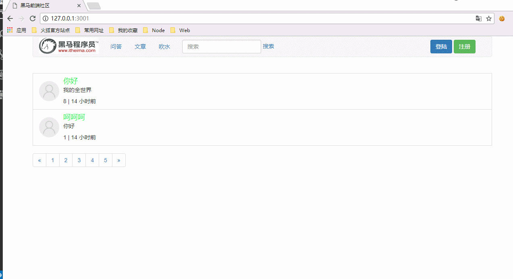

# 使用Cookie实现用户登陆状态保持

* [1.1-配置`cookie-session`中间件](#1.1)
* [1.2-用户登陆成功之后，服务器将用户信息写入cookie响应返回](#1.2)
* [1.3-用户访问首页时，服务器获取cookie数据](#1.3)
* [1.4-首页模板接收服务器用户信息展示界面](#1.4)
* [1.5-用户退出登陆时，服务器清除用户cookie](#1.5)
* [1.6-效果演示](#1.6)

* ***步骤思路分析***
    * （1）在app.js中配置`cookie-session`中间件
    * （2）用户登陆成功之后，服务器将用户信息写入cookie响应返回
        * 此时cookie会自动保存在浏览器本地，下次请求相同域名时则会自动添加
        * `cookie-session`会自动帮我们加密用户数据，而且每一次加密结果都不一样
    * （3）用户访问首页时，服务器获取cookie数据
        * 如果有cookie，则表示用户已经登陆，直接返回用户信息
        * 如果没有cookie，则表示用户未登陆
            * `cookie-session`会自动帮我们判断有效期和解密
    * （4）首页模板接收服务器用户信息展示界面
    * （5）用户退出登陆时，服务器清除用户cookie
        * 虽然此时浏览器本地仍然保存着cookie但是服务器已经不识别了，只有重新登陆才会识别
            * 利用的时cookie的加密机制，每一次生成加密钥匙都不一样

## <h2 id=1.1>1.1-配置`cookie-session`中间件</h2>

* 1.npm安装`cookie-session`
    * `npm install cookie-session`

* 2.express配置中间件

* ***app.js***

```javascript

var express = require('express');
var path = require('path');
var template = require('art-template');
var fs = require('fs');
//post解析中间件
var  bodyParser = require('body-parser');
//cookieSession中间件
var cookieSession = require('cookie-session');

//1.创建服务器
var app = express();

//2.挂载静态资源

console.log(path.join(__dirname,'./node_modules'));
app.use('/node_modules',express.static(path.join(__dirname,'./node_modules/')));

app.use('/public',express.static(path.join(__dirname,'./public/')));


//3.配置模板引擎

app.set('views', path.join(__dirname, './views'));
app.engine('html',require('express-art-template'));
app.set('view engine','html');


//4.配置中间件

// 配置解析表单中间件 POST 请求体数据中间件
// 该中间件会为 req 请求对象提供一个 body 属性用来获取表单 POST 请求体数据
app.use(bodyParser.urlencoded({ extended: false }));

// 配置cookie中间件
app.use(cookieSession({
  name: 'session',
  keys: ['key1', 'key2'],//加密钥匙(cookieSession会自动帮我们的数据加密，使用的是该加密钥匙，如果修改字符串则密文也会修改)
  // Cookie Options  
  maxAge: 24 * 60 * 60 * 1000 // 24 hours cookie的有效期  一般为一天 单位是毫秒
}));


//5.配置路由

// 自动加载 routes 目录中的所有的路由模块

//同步方法读取目录中所有文件（思考为什么不能是异步？）
var files = fs.readdirSync('./routers/');
files.forEach(function (item) {
  app.use(require('./routers/' + item));
});


//6.开启服务器监听
app.listen(3001,function(err){
	console.log('欢迎加入黑马俱乐部');
});

```

## <h2 id=1.2>1.2-用户登陆成功之后，服务器将用户信息写入cookie响应返回</h2>

* ***user_controller.js***

```javascript

//登录
controller.doLogin = function (req, res) {

    /**1.获取表单数据
    2.查询数据库匹配邮箱得到密码
    3.验证用户邮箱和密码 
    4.响应返回
    */
    //1.获取表单数据
    var body = req.body;


    //2.查询数据库验证邮箱
    userModel.findOne({
        email: body.email
    }, function (err, doc) {
        if (err) {
            return res.json(errHandler(500, err));
        }
        if (!doc) {
            return res.json(errHandler(1001));
        }
        //3.根据邮箱验证密码
        if (body.password === doc.password) {

            //当用户登录时，将用户的信息写入cookie，这里中间件会自动帮我们加密，我们只管用即可
            //类似于往cookie中添加一个新的键值对，存进去是什么键，就用什么键来取
            req.session.user = doc;
            
            //登陆成功
            return res.json(errHandler(1000));
        } else {
            //登陆失败（服务器知道用户到底是邮箱错误还是密码错误，但是一般不告诉客户端）
            return res.json(errHandler(1001));
        }
    });
};

```

## <h2 id=1.3>1.3-用户访问首页时，服务器获取cookie数据</h2>

* ***index_controller.js***

```javascript

var articleModel = require('../models/index_model.js').Article;
//错误处理
var errHandler = require('../errHandler.js');
//时间转换模块
var moment = require('moment');

//设置语言为中文
moment.locale('zh-cn');

var controller = module.exports;


//首页文章列表
controller.showIndex = function(req,res){

	/**1.查询数据库文章集合所有数据
	2.模板引擎渲染
	3.响应返回
	*/

	//查询所有数据
	articleModel.find(function(err,docs){

		console.log('查询到的所有文章' + docs);

		docs.forEach(function(item){
			console.log('item' + item);
			console.log(item.updatedAt.getTime());
			//新增一个属性用于网页显示时间（该属性只用于现实不会对数据库结构有影响，也不建议修改mongoose数据）
		  item.lastUpdateTime = moment(item.updatedAt.getTime()).startOf('second').fromNow();
	     });

		//读取用户cookie
		var user = req.session.user;
		//将模板引擎渲染好的数据返回浏览器客户端
		res.render('index.html',{
			articles:docs,
			user : user
		});
	});
	
};

```

## <h2 id=1.4>1.4-首页模板接收服务器用户信息展示界面</h2>

* ***index.html***

```html

<ul class="nav navbar-nav navbar-right">	
    ,{,{, if(!user) ,},},
    <li>
        <form class="navbar-form navbar-left">
            <a href="/login" class="btn btn-primary">登陆</a>
            <a href="/register" class="btn btn-success">注册</a>
        </form>
    </li>
    {{ else }}
    <li class="dropdown">				
        <a href="#" class="dropdown-toggle" data-toggle="dropdown" role="button" aria-haspopup="true" aria-expanded="false">发表 <span class="caret"></span></a>
        <ul class="dropdown-menu">
            <li><a href="/article/add">问答</a></li>
            <li><a href="/article/add">文章</a></li>
            <li><a href="/article/add">吹水</a></li>
        </ul>
    </li>
    <li class="dropdown">				
        <a href="#" class="dropdown-toggle" data-toggle="dropdown" role="button" aria-haspopup="true" aria-expanded="false"><span style="color: #F80ED9;font-size:20px">{{ user.nickname }} </span><span class="caret"></span></a>
        <ul class="dropdown-menu">
            <li><a href="/logout">注销</a></li>
        </ul>
    </li>
    
    {{ /if }}              		
					
</ul>

```

## <h2 id=1.5>1.5-用户退出登陆时，服务器清除用户cookie</h2>

* ***user_controller.js***

```javascript

//注销，退出登录
controller.logout = function(req,res){

	/**
	清除该用户cookie
	返回首页
	*/
	req.session.user = null;

	index_controller.showIndex(req,res);

};

```

## <h2 id=1.6>1.6-效果演示</h2>


