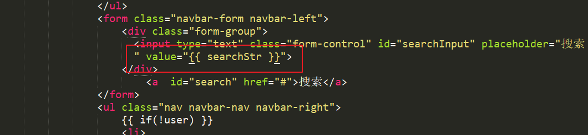

# 实现搜索文章功能

* [1.1-点击首页搜索按钮，浏览器将搜索文本发送给服务器](#1.1)
* [1.2-服务器接收搜索文本查询数据库](#1.2)
* [1.3-index.html接收服务器返回搜索文本](#1.3)

* ***步骤思路分析***
    * 1.点击首页搜索按钮，浏览器将搜索文本发送给服务器
    * 2.服务器接收搜索文本查询数据库
    * 3.服务器返回查询结果
        * ***注意：如果是服务端渲染，由于界面被重新渲染所以搜索文本也会被丢失，需要服务器将搜索文本一并返回***
    * 4.浏览器接收结果

## <h2 id=1.1>1.1-点击首页搜索按钮，浏览器将搜索文本发送给服务器</h2>

* ***index.html***

```html

<script type="text/javascript">

	//封装搜索请求
	function search(e){
		e.preventDefault();
		var searchStr = $('#searchInput').val();
		var href = '/search?searchStr=' + searchStr;
		window.location.href = href;
	}

	//搜索按钮点击事件
	$('#search').on('click',function(e){
		search(e);
	});

	//搜索框输入事件
	 $('#searchInput').bind('keypress',function(event){  
	 	//enter键
        if(event.keyCode == "13")      
        {  
            search(event);  
        }  
    });  

</script>

```

## <h2 id=1.2>1.2-服务器接收搜索文本查询数据库</h2>

* ***index_controller.js***

```javascript

//搜索文章
controller.showSearchIndex = function(req,res){
	/**获取请求数据
	根据搜索文本查询数据库
	响应返回
	*/
	var searchStr = req.query.searchStr;

	console.log('搜索字符' + searchStr);
	var re =new RegExp(searchStr,"i");
	console.log('正则' + re);
	//1.查询数据库数据
	articleModel.find({title: re },function(err,docs){
		console.log('所有数据' + docs);

		docs.forEach(function(item){
			console.log(JSON.stringify(item));
			//新增一个属性用于网页显示时间（该属性只用于现实不会对数据库结构有影响，也不建议修改mongoose数据）
		  item.lastUpdateTime = moment(item.updatedAt.getTime()).startOf('second').fromNow();
      });
		//console.log(docs);

		//读取用户cookie
		var user = req.session.user;

		//2.模板引擎渲染
		res.render('index.html',{
			'articles':docs,
			'user' : user,
			'searchStr' : searchStr//返回搜索文本用于渲染
		});
	});
};

```

## <h2 id=1.3>1.3-index.html接收服务器返回搜索文本</h2>


