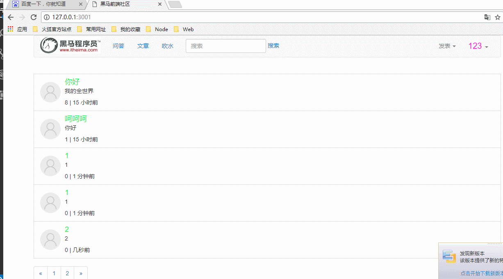

# 实现文章分页按钮

* [1.1-用户进入首页查询文章时，服务器计算分页数量返回浏览器](#1.1)
* [1.2-浏览器渲染分页数量](#1.2)
* [1.3-服务器接收分页请求查询数据并返回客户端浏览器](#1.3)
* [1.4-效果演示](#1.4)

* ***步骤思路分析***
    * ***一般网页分页都是用服务端渲染***
    * 1.用户进入首页查询文章时，服务器计算分页数量返回浏览器
    * 2.浏览器渲染分页数量
    * 3.点击分页按钮，浏览器发送get请求
    * 4.服务器接收请求查询数据并返回客户端浏览器
    * 5.浏览器刷新数据

## <h2 id=1.1>1.1-用户进入首页查询文章时，服务器计算分页数量返回浏览器</h2>

* ***index_controller.js***

```javascript

//首页文章列表
controller.showIndex = function(req,res){

	/**1.查询数据库文章集合所有数据
	2.模板引擎渲染
	3.响应返回
	*/

	//获取页数(默认为1)
	var page = (req.query.page && parseInt(req.query.page)) || 1;

	articleModel.count(function(err,count){//articleModel.count()：查询集合数量
		articleModel.find()//查询数据库所有数据
		.skip((page-1) * 5)//跳过多少条数据
		.limit(5)//查询数量限制
		.sort('-updatedAT')//排序 +-号表示升序和降序
		.exec(function(err,docs){//exec表示执行查询请求（当使用链式语法设置查询参数时才需要使用exec方法）

			console.log('查询到的所有文章' + docs);

			docs.forEach(function(item){
				console.log('item' + item);
				console.log(item.updatedAt.getTime());
				//新增一个属性用于网页显示时间（该属性只用于现实不会对数据库结构有影响，也不建议修改mongoose数据）
			  item.lastUpdateTime = moment(item.updatedAt.getTime()).startOf('second').fromNow();
		     });

			//读取用户cookie
			var user = req.session.user;
			console.log('用户cookie' + JSON.stringify(user));
			//将模板引擎渲染好的数据返回浏览器客户端
			//获取分页数量 余数应该+1
			var pageCount =  Math.ceil(count/5);

			//模板引擎渲染
			res.render('index.html',{
				'articles':docs,
				'user' : user,
				'pageCount' : pageCount
			});
		});
	});
	
};

```

## <h2 id=1.2>1.2-浏览器渲染分页数量</h2>


## <h2 id=1.3>1.3-服务器接收分页请求查询数据并返回客户端浏览器</h2>

* ***index_controller.js***

```javascript

//文章分页
controller.showPageIndex = function(req,res){

	controller.showIndex(req,res);

};

```

## <h2 id=1.4>1.4-效果演示</h2>

