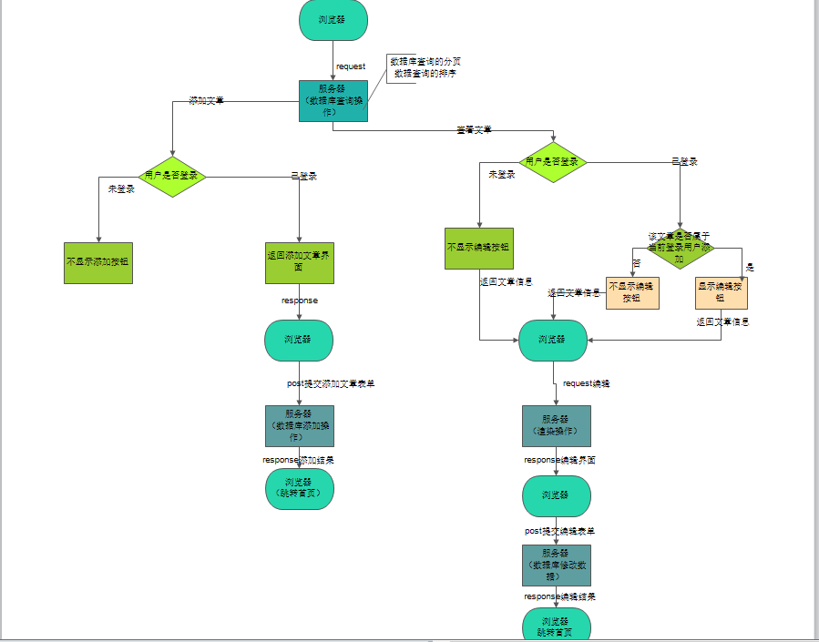
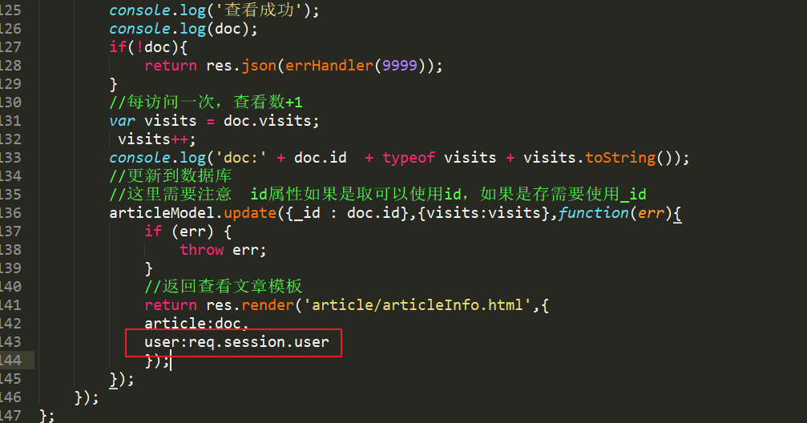
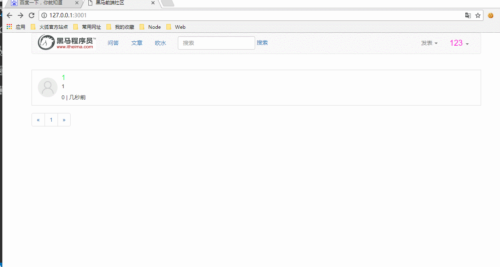

# 完善用户编辑文章功能

* [1.1-浏览器点击查看文章时，服务器返回该文章数据以及从cookie中获取的用户数据](#1.1)
* [1.2-浏览器文章信息html模板判断当前用户是否登陆以及文章id是否与用户id匹配](#1.2)
* [1.3-效果演示](#1.3)

* 用户编辑文章业务逻辑



* ***流程思路分析***
    * 1.用户只有登陆才可以添加文章，此时每一条文章数据应当添加一个属性记录该文章所属用户
    * 2.浏览器点击查看文章时，服务器返回该文章数据以及从cookie中获取的用户数据
    * 3.浏览器文章信息html模板判断当前用户是否登陆
        * 如果登陆，则判断该文章id是否属于该用户添加
        * 如果未登陆则不显示编辑按钮
    * 4.如果有编辑按钮，则点击编辑按钮传入文章id给服务器
        * 此时编辑逻辑与之前的编辑逻辑一致，因为服务器可以根据文章id查询到文章所属用户的id
            * 文章id与用户id之间的关系与关系型数据库的关系基本类似


## <h2 id=1.1>1.1-浏览器点击查看文章时，服务器返回该文章数据以及从cookie中获取的用户数据</h2>

* ***article_controller.js***



```javascript

//查看文章
controller.showArticleInfo = function (req, res) {

    /*
    1.获取请求参数
    2.根据参数查询数据库
    3.文章查看数+1
    4.更新数据库
    3.响应返回结果
    */

    console.log(req.query);
    console.log('查看文章' + JSON.stringify(req.session));

    //如果是get请求，express会自动帮我们解析参数，得到一个query对象
    var body = req.query;

    var id = body.id;
    console.log(id);
    //查询数据库
    articleModel.findById(id, function (err, doc) {

        if (err) {
            console.log('查看失败');
            return res.json(errHandler(500, err));

        }
        console.log('查看成功');
        console.log(doc);
        if (!doc) {
            return res.json(errHandler(9999));
        }
        //每访问一次，查看数+1
        var visits = doc.visits;
        visits++;
        console.log('doc:' + doc.id + typeof visits + visits.toString());
        //更新到数据库
        //这里需要注意  id属性如果是取可以使用id，如果是存需要使用_id
        articleModel.update({
            _id: doc.id
        }, {
            visits: visits
        }, function (err) {
            if (err) {
                throw err;
            }
            //返回查看文章模板
            return res.render('article/articleInfo.html', {
                article: doc,
                user:req.session.user//查看文章时返回用户session，用户html模板判断该用户是否拥有编辑权限
            });
        });
    });
};

```

## <h2 id=1.2>1.2-浏览器文章信息html模板判断当前用户是否登陆以及文章id是否与用户id匹配</h2>

* ***articleInfo.html***

```html

<!DOCTYPE html>
<html lang="en">

<head>
  <meta charset="UTF-8">
  <title>黑马前端社区</title>
  <link rel="stylesheet" href="/node_modules/bootstrap/dist/css/bootstrap.css">
</head>

<body>
    <div class="container-wrap">
      <div class="container">
        <div class="article-title">
          <h2>{{ article.title }} </h2>
        </div>
        <div class="article-content">
          {{ article.content }}
            <hr>
            <p>
              <!-- 如果当前用户已经登录，并且文章id与用户id一致，则表示该文章为该用户所写 -->
                ,{,{,  if(user && user._id === article.user_id) ,},},
                <a href="/article/edit?id={{ article.id }}">编辑</a>
                {{ /if }}
            </p>
        </div>
      </div>
    </div>
    <div class="footer"></div>
    <script src="/node_modules/jquery/dist/jquery.js"></script>
    <script src="/node_modules/bootstrap/dist/js/bootstrap.js"></script>
    </script>
</body>

</html>

```

## <h2 id=1.3>1.3-效果演示</h2>


